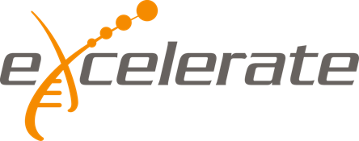

## Schedule

### Monday 27.5.2019
- **09:00-09:45**	Lecture: Introduction and experimental design (Jules Gilet, Åsa Björklund)
- **09:45-10:15** _coffee break_
- **10:15-11:00** Lecture: [QC \& data preprocessing](qc-session/scRNAseq_QC_Asa_Bjorklund_2019.pdf) (Åsa)
- **11:00-12:00** Labs: [QC \& data preprocessing](qc-session/Quality_control.md) (Åsa & Jules)
- **12:00-13:00** _lunch_
- **13:00-13:45** Lecture: Normalisation and removal of confounding factors (Heli Pessa  & Bishwa Ghimire)
- **13:45-14:30** Labs: Normalisation and removal of confounding factors (Heli & Bishwa)
- **14:30-15:00** _coffee break_
- **15:00-15:45** Lecture: Data integration (Ahmed Mahfouz)
- **15:45-17:00** Labs: Data integration (Ahmed)

### Tuesday 28.5.2019
- **09:00-09:45**	Dimensionality reduction I (Paulo Czarnewski)
- **09:45-10:15** _coffee break_
- **10:15-11:00**	Dimensionality reduction II (Paulo)
- **11:00-12:00**	Clustering I (Ahmed Mahfouz)
- **12:00-13:00** _lunch_
- **13:00-15:00** Clustering II (Ahmed Mahfouz)
- **14:30-15:00** _coffee break_
- **15:00-17:00**	 Differential expression (Ståle Nygård and Olga Dethlefsen)

### Wednesday 29.5.2019
- **09:00-11:00**	Cell type identification I (Philip Lijnzaad)
- **09:45-10:15** _coffee break_
- **10:15-11:00**	Cell type identification I (Philip)
- **11:00-12:00**	LeTrajectories/Pseudo-time I (Paulo, Jules)
- **12:00-13:00** _lunch_
- **13:00-14:00**	Trajectories/Pseudo-time II (Paulo, Jules)
- **14:00-14:30**	Spatial transcriptomics I (Jeongbin Park \& Lars Borm)
- **14:30-15:00** _coffee break_
- **15:00-16:00**	Spatial transcriptomics I (Jeongbin Park \& Lars Borm)
- **16:00-17:00** Discussion and questions

### Example links (_will be removed_)
- [Example session tutorial.md](session-example/session-example.md)
- [Example session slides.pdf](session-example/session-example.pdf)

### Lecturers
- [Åsa Björklund](https://nbis.se/about/staff/asa-bjorklund/) (SciLifeLab, NBIS, Sweden), <asa.bjorklund@scilifelab.se>
- [Paulo Czarnewski](https://nbis.se/about/staff/paulo-czarnewski/) (SciLifeLab, NBIS, Sweden), <paulo.czarnewski@scilifelab.se>
- [Ahmed Mahfouz](https://www.lumc.nl/org/radiologie/medewerkers/1201110201322222) (LUMC, Netherlands), <a.mahfouz@lumc.nl>
- [Ståle Nygård](https://www.mn.uio.no/ifi/english/people/aca/staaln/) (UIO, Norway), <staaln@ifi.uio.no>
- [Olga Dethlefsen](https://nbis.se/about/staff/olga-dethlefsen/) (SciLifeLab, NBIS, Sweden), <olga.dethlefsen@nbis.se>
- Jeongbin Park (Charité-Universitätsmedizin Berlin, Germany), <>
- [Lars Borm](https://ki.se/en/people/larbor) (Karolinska Institutet, Sweden), <ars.borm@ki.se>
- Jules Gilet (Institut Curie, France), <jules.gilet@curie.fr>
- [Heli Pessa](https://tuhat.helsinki.fi/portal/en/persons/heli-pessa(1c5905eb-fc9c-4b2e-9a9a-3dacc88c9943).html) (University of Helsinki, Finland), <Heli.Pessa@helsinki.fi>
- Bishwa Ghimire (FIMM, Finland), <bishwa.ghimire@helsinki.fi>
- Philip Lijnzaad (Princess Maxima Center for Pediatric Oncology, Netherlands), <P.Lijnzaad-2@prinsesmaximacentrum.nl>

### Additional information
- Content: eija.korpelainen@csc.fi
- Practicalities: event-support@csc.fi

### Example links (_will be removed_)
- [Example session tutorial.md](session-example/session-example.md)
- [Example session slides.pdf](session-example/session-example.pdf)

## [Back to main](README.md)
