Cell type identification
================

Created by: Philip Lijnzaad

# Overview

In any single-cell experiment where mixed populations are expected, a
very important task is to identify the cell types (and/or cell states)
that are present. In this practical, we will look at two tools for doing
this: SingleR ([Aran et
al. 2019](https://www.nature.com/articles/s41590-018-0276-y)) and
CHETAH ([de Kanter et al., under
review](http://dx.doi.org/10.1101/558908)).

# Datasets

We will try to classify the ovarian ascites data from [Schelker et
al. 2017](https://www.nature.com/articles/s41467-017-02289-3) using, as
a reference, the different reference data sets from both SingleR and
CHETAH.

The `ovarian1200` dataset contains 1200 cells randomly selected from the
3114 single cell data provided by Schelker et al. (which is available
from <https://figshare.com/s/711d3fb2bd3288c8483>). The data come from
the ascites of 4 different ovarian cancer patients and contain a variety
of leukocytes as well as tumor cells.

First load the various packages:

``` r
suppressMessages(require(SingleCellExperiment))
suppressMessages(require(Seurat))
suppressMessages(require(CHETAH))
suppressMessages(require(Matrix))
suppressMessages(require(SingleR))
suppressMessages(require(cowplot))
```

If you have (or downloaded) the ovarian data into folder `data.dir` then
load the `Seurat` object with

``` r
#load expression matrix

data.dir <- "session-celltypeid_files" # or wherever the data is located
file <- paste0(data.dir,"/ovarian1200.rds")
ovarian <- readRDS(file=file)
```

The authors already classified the cells ‘by hand’ using marker genes.
This classfication can be found in the `celltypes` column of the
`meta.data` of the object. Get an overview of this:

``` r
head(ovarian@meta.data)
```

    ##            nGene  nUMI    orig.ident  celltypes nCount_RNA nFeature_RNA
    ## X7873M.1    3563 11796 SeuratProject Macrophage      11796         3563
    ## X7873M.104  2670  7570 SeuratProject Macrophage       7570         2670
    ## X7873M.105  2241  5510 SeuratProject Macrophage       5510         2241
    ## X7873M.106  4705 22636 SeuratProject        CAF      22636         4705
    ## X7873M.110  3169 11690 SeuratProject Macrophage      11690         3169
    ## X7873M.114  4659 20798 SeuratProject Macrophage      20798         4659

``` r
sort(table(ovarian@meta.data$celltypes))
```

    ## 
    ## reg. T cell      B cell         CAF  CD8 T cell          NK   Dendritic 
    ##           0           7           9          10          28          46 
    ##     Unknown       Tumor  CD4 T cell  Macrophage 
    ##          50         117         129         804

Clearly, most of the cells are Macrophages.

We now follow the ‘standard’ [Seurat
workflow](https://satijalab.org/seurat/essential_commands.html#seurat-standard-worflow)
to prepare the data.

``` r
ovarian <- NormalizeData(object = ovarian)
ovarian <- FindVariableFeatures(object = ovarian)
ovarian <- ScaleData(object = ovarian)
```

    ## Centering and scaling data matrix

``` r
ovarian <- RunPCA(object = ovarian, npcs=20)
```

    ## PC_ 1 
    ## Positive:  KRT19, TACSTD2, SLPI, KRT18, LCN2, KRT7, CRYAB, TM4SF1, MAL2, S100A16 
    ##     PXDN, WFDC2, MUC4, CLDN1, C19orf33, KRT18P55, GNG12, CLDN4, UCA1, PERP 
    ##     MDK, KLK6, CNN3, CLDN3, KIAA1522, DCBLD2, TSPAN1, NBL1, CTTN, SCNN1A 
    ## Negative:  FTL, HLA-DRA, LYZ, VCAN, S100A8, VSIG4, FABP5, HLA-DRB1, SPP1, HLA-DPA1 
    ##     MARCO, HLA-DPB1, CTSL, HLA-DQB1, CD36, CCL2, CTSB, TIMP1, C1QA, S100A9 
    ##     EPB41L3, FGR, LGMN, RNASE1, CD300E, SELL, CLEC5A, IFI6, HLA-DQA1, OLR1 
    ## PC_ 2 
    ## Positive:  EGFL6, C1S, C1R, CEMIP, CALB2, SPARC, ANXA8, COL3A1, C4B, C4A 
    ##     ANXA8L1, COL1A2, PTGIS, COL6A1, XXbac-BPG116M5.17, MXRA8, IGFBP4, GJA1, CFB, GRIA2 
    ##     MGP, SOD3, MEDAG, COL5A2, CALD1, RARRES2, CCDC80, ALDH1A2, CD248, PLA2G2A 
    ## Negative:  TACSTD2, LCN2, MUC4, UCA1, MAL2, CAMK2N1, LAD1, CLDN4, SPINT1, VSTM2L 
    ##     MAL, CLDN3, SCNN1A, KLK6, TSPAN1, SPOCK2, CCND1, ELF3, EPCAM, RAB25 
    ##     MUC20, CD24, NTN4, KRT80, PRSS8, KLK7, SMIM22, BHLHE41, PERP, KRT23 
    ## PC_ 3 
    ## Positive:  CTSB, CTSL, FTL, VSIG4, FABP5, MARCO, SPP1, CTSD, TIMP1, PLTP 
    ##     FN1, S100A9, RNASE1, CCL2, VCAN, FTH1, C1QA, ANXA2, S100A8, C1QB 
    ##     C1QC, LGMN, HLA-DRB1, LYVE1, IFI6, HLA-DRA, DAB2, GPNMB, LYZ, EPB41L3 
    ## Negative:  LTB, TRBC2, IL32, IFITM1, TRBC1, MIAT, IL7R, SLC38A1, TRAC, CCL5 
    ##     BCL11B, GZMK, SPOCK2, GZMB, CXCR4, IL2RB, CD2, JCHAIN, FYN, SELL 
    ##     DERL3, GZMA, LILRA4, CCR7, ITM2C, C12orf75, IGKC, CST7, KLRB1, PIM2 
    ## PC_ 4 
    ## Positive:  TUBB2B, UCHL1, MYBL2, UBE2C, CTHRC1, CRABP2, PEG10, TPX2, CKS1B, CDKN2A 
    ##     AURKB, CKB, KIFC1, PRC1, TYMS, TK1, CDCA8, TOP2A, IGFBP2, MEX3A 
    ##     STMN1, NOV, PTTG1, CDK1, MKI67, SMPDL3B, CENPM, CDC20, ANLN, PLAU 
    ## Negative:  VSTM2L, C10orf10, PDZK1IP1, CAMK2N1, LMO7, MUC4, MSLN, MUC21, VWA5A, GPRC5A 
    ##     LCN2, MAL, FXYD3, MESP1, DHRS9, SPOCK2, SAT1, C3, AHNAK, TGM2 
    ##     CD55, KLK11, HOPX, TTC9, MUC20, C1orf116, SNCG, EVPL, GPC1, FAM3C 
    ## PC_ 5 
    ## Positive:  DERL3, GZMB, LILRA4, JCHAIN, SERPINF1, PLD4, IGKC, IRF8, TSPAN13, IRF7 
    ##     TCF4, SCAMP5, CYB561A3, LRRC26, ITM2C, SMPD3, LAMP5, HLA-DPA1, HLA-DRA, CCDC50 
    ##     IGHM, GPM6B, TCL1A, PLAC8, HLA-DPB1, IL3RA, HLA-DQA1, HLA-DRB1, C12orf75, HLA-DQB1 
    ## Negative:  MTRNR2L12, MTRNR2L8, IL32, TRBC2, MIAT, IL7R, TRBC1, BCL11B, MTRNR2L1, CCL5 
    ##     TRAC, MT-ND4L, IFITM1, GZMK, IL2RB, MTRNR2L6, SPOCK2, CD2, MTRNR2L3, GZMA 
    ##     NEAT1, KLRB1, CDKN2A, ITM2A, FYN, CD8A, MTRNR2L11, SIX3, ARL4C, UCHL1

``` r
ovarian <- FindNeighbors(object = ovarian)
```

    ## Computing nearest neighbor graph

    ## Computing SNN

``` r
ovarian <- FindClusters(object = ovarian, resolution=0.5) 
```

    ## Modularity Optimizer version 1.3.0 by Ludo Waltman and Nees Jan van Eck
    ## 
    ## Number of nodes: 1200
    ## Number of edges: 37767
    ## 
    ## Running Louvain algorithm...
    ## Maximum modularity in 10 random starts: 0.8624
    ## Number of communities: 9
    ## Elapsed time: 0 seconds

``` r
## (the default resolution yields too manh clusters)
ovarian <- RunTSNE(object = ovarian)
ovarian <- RunUMAP(object = ovarian, dims=1:20)
p1 <- DimPlot(ovarian, reduction='tsne')
p2 <- DimPlot(ovarian, reduction='umap')
plot_grid(p1, p2)
```

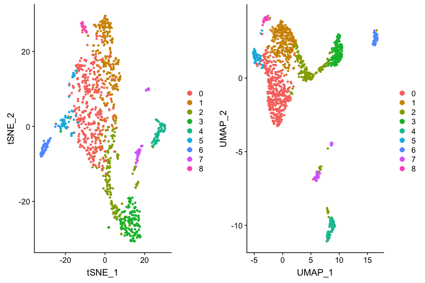<!-- -->

This shows the data with Seurat clustering, but we’re more interested in
the cell types. Let’s see if and how they coincide. For convenience and
flexibility, we define `dim.red` to be our dimension reduction of
choice.

``` r
dim.red <- 'tsne' # or 'umap' or 'pca'
p1 <- DimPlot(ovarian, group.by="seurat_clusters", reduction=dim.red)
p2 <- DimPlot(ovarian, group.by='celltypes', reduction=dim.red)
plot_grid(p1, p2, labels=c('clusters', 'published types'))
```

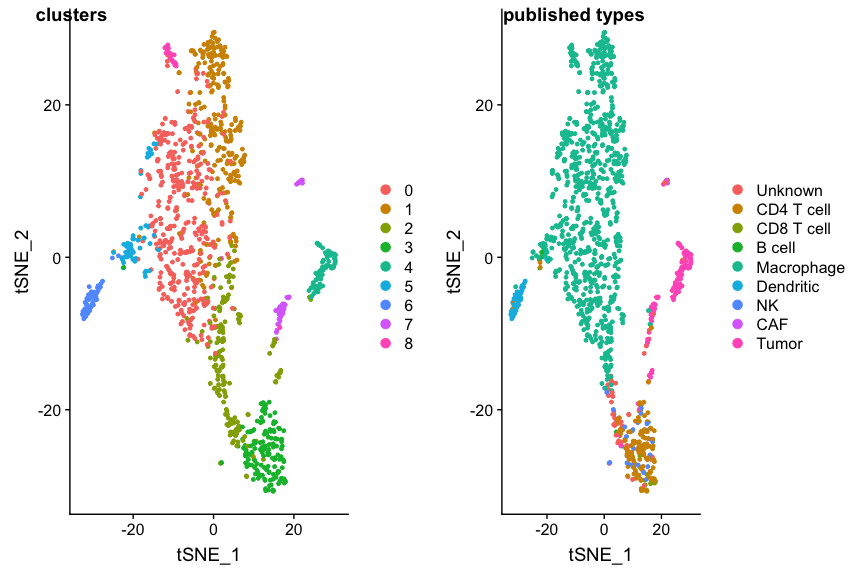<!-- -->

# SingleR

## SingleR reference data sets

We will now do our cell type identification using SingleR. SingleR comes
with a collection of reference data sets. There are two for human:
`hpca`, the Human Primary Cell Atlas (microarray-based), and
`blueprint\_encode`, a combined Blueprint Epigenomics and Encode data
set (RNASeq based) .

For mouse there are also two sets: `immgen`, the Immunological Genome
Project (microarray-based) and `mouse.rnaseq`, a brain specific
reference (RNASeq-based). For details I refer to the
SingleR-specifications vignette.

Each reference data set comes in two ‘flavours’: ‘types’, which are very
fine-grained, detailed types, and ‘main\_types’, which are less coarser
subset of those types.

The SingleR reference data sets are part of the package, and can be
explored easily.

``` r
table(hpca$main_types)
```

    ## 
    ##            Astrocyte                   BM           BM & Prog. 
    ##                    2                    7                    1 
    ##               B_cell                  CMP         Chondrocytes 
    ##                   26                    2                    8 
    ##                   DC Embryonic_stem_cells    Endothelial_cells 
    ##                   88                   17                   64 
    ##     Epithelial_cells         Erythroblast          Fibroblasts 
    ##                   16                    8                   10 
    ##                  GMP          Gametocytes           HSC_-G-CSF 
    ##                    2                    5                   10 
    ##            HSC_CD34+          Hepatocytes        Keratinocytes 
    ##                    6                    3                   25 
    ##                  MEP                  MSC           Macrophage 
    ##                    2                    9                   90 
    ##             Monocyte            Myelocyte              NK_cell 
    ##                   60                    2                    5 
    ## Neuroepithelial_cell              Neurons           Neutrophil 
    ##                    1                   16                    3 
    ##          Neutrophils          Osteoblasts            Platelets 
    ##                   18                   15                    5 
    ##     Pre-B_cell_CD34-     Pro-B_cell_CD34+        Pro-Myelocyte 
    ##                    2                    2                    2 
    ##  Smooth_muscle_cells              T_cells    Tissue_stem_cells 
    ##                   16                   68                   55 
    ##            iPS_cells 
    ##                   42

``` r
table(hpca$types)
```

    ## 
    ##                  Astrocyte:Embryonic_stem_cell-derived 
    ##                                                      2 
    ##                                                     BM 
    ##                                                      8 
    ##                                                 B_cell 
    ##                                                      4 
    ##                              B_cell:CXCR4+_centroblast 
    ##                                                      4 
    ##                               B_cell:CXCR4-_centrocyte 
    ##                                                      4 
    ##                                 B_cell:Germinal_center 
    ##                                                      3 
    ##                                          B_cell:Memory 
    ##                                                      3 
    ##                                           B_cell:Naive 
    ##                                                      3 
    ##                                     B_cell:Plasma_cell 
    ##                                                      3 
    ##                                        B_cell:immature 
    ##                                                      2 
    ##                                                    CMP 
    ##                                                      2 
    ##                               Chondrocytes:MSC-derived 
    ##                                                      8 
    ##                                    DC:monocyte-derived 
    ##                                                     19 
    ##         DC:monocyte-derived:A._fumigatus_germ_tubes_6h 
    ##                                                      2 
    ##                    DC:monocyte-derived:AEC-conditioned 
    ##                                                      5 
    ##                              DC:monocyte-derived:AM580 
    ##                                                      3 
    ##                              DC:monocyte-derived:CD40L 
    ##                                                      3 
    ##                         DC:monocyte-derived:Galectin-1 
    ##                                                      3 
    ##                                DC:monocyte-derived:LPS 
    ##                                                      6 
    ##                           DC:monocyte-derived:Poly(IC) 
    ##                                                      3 
    ##                  DC:monocyte-derived:Schuler_treatment 
    ##                                                      3 
    ##                    DC:monocyte-derived:anti-DC-SIGN_2h 
    ##                                                      3 
    ##                    DC:monocyte-derived:antiCD40/VAF347 
    ##                                                      2 
    ##                           DC:monocyte-derived:immature 
    ##                                                     20 
    ##                             DC:monocyte-derived:mature 
    ##                                                     11 
    ##                      DC:monocyte-derived:rosiglitazone 
    ##                                                      3 
    ##            DC:monocyte-derived:rosiglitazone/AGN193109 
    ##                                                      2 
    ##                                   Embryonic_stem_cells 
    ##                                                     17 
    ##                                Endothelial_cells:HUVEC 
    ##                                                     16 
    ##                Endothelial_cells:HUVEC:B._anthracis_LT 
    ##                                                      2 
    ##           Endothelial_cells:HUVEC:Borrelia_burgdorferi 
    ##                                                      2 
    ##                   Endothelial_cells:HUVEC:FPV-infected 
    ##                                                      3 
    ##                  Endothelial_cells:HUVEC:H5N1-infected 
    ##                                                      3 
    ##                           Endothelial_cells:HUVEC:IFNg 
    ##                                                      1 
    ##                          Endothelial_cells:HUVEC:IL-1b 
    ##                                                      3 
    ##                   Endothelial_cells:HUVEC:PR8-infected 
    ##                                                      3 
    ##                Endothelial_cells:HUVEC:Serum_Amyloid_A 
    ##                                                      6 
    ##                           Endothelial_cells:HUVEC:VEGF 
    ##                                                      3 
    ##                         Endothelial_cells:blood_vessel 
    ##                                                      8 
    ##                            Endothelial_cells:lymphatic 
    ##                                                      7 
    ##                       Endothelial_cells:lymphatic:KSHV 
    ##                                                      4 
    ##                   Endothelial_cells:lymphatic:TNFa_48h 
    ##                                                      3 
    ##                               Epithelial_cells:bladder 
    ##                                                      6 
    ##                             Epithelial_cells:bronchial 
    ##                                                     10 
    ##                                           Erythroblast 
    ##                                                      8 
    ##                                     Fibroblasts:breast 
    ##                                                      6 
    ##                                   Fibroblasts:foreskin 
    ##                                                      4 
    ##                                                    GMP 
    ##                                                      2 
    ##                                     Gametocytes:oocyte 
    ##                                                      3 
    ##                               Gametocytes:spermatocyte 
    ##                                                      2 
    ##                                             HSC_-G-CSF 
    ##                                                     10 
    ##                                              HSC_CD34+ 
    ##                                                      6 
    ##                                            Hepatocytes 
    ##                                                      3 
    ##                                          Keratinocytes 
    ##                                                      3 
    ##                                     Keratinocytes:IFNg 
    ##                                                      2 
    ##                                     Keratinocytes:IL19 
    ##                                                      3 
    ##                                     Keratinocytes:IL1b 
    ##                                                      2 
    ##                                     Keratinocytes:IL20 
    ##                                                      3 
    ##                                     Keratinocytes:IL22 
    ##                                                      3 
    ##                                     Keratinocytes:IL24 
    ##                                                      3 
    ##                                     Keratinocytes:IL26 
    ##                                                      3 
    ##                                      Keratinocytes:KGF 
    ##                                                      3 
    ##                                                    MEP 
    ##                                                      2 
    ##                                                    MSC 
    ##                                                      9 
    ##                                    Macrophage:Alveolar 
    ##                                                      4 
    ##                 Macrophage:Alveolar:B._anthacis_spores 
    ##                                                      3 
    ##                            Macrophage:monocyte-derived 
    ##                                                     26 
    ##                       Macrophage:monocyte-derived:IFNa 
    ##                                                      9 
    ##              Macrophage:monocyte-derived:IL-4/Dex/TGFb 
    ##                                                     10 
    ##             Macrophage:monocyte-derived:IL-4/Dex/cntrl 
    ##                                                      5 
    ##                  Macrophage:monocyte-derived:IL-4/TGFb 
    ##                                                      5 
    ##                 Macrophage:monocyte-derived:IL-4/cntrl 
    ##                                                      5 
    ##                      Macrophage:monocyte-derived:M-CSF 
    ##                                                      2 
    ##                 Macrophage:monocyte-derived:M-CSF/IFNg 
    ##                                                      2 
    ##         Macrophage:monocyte-derived:M-CSF/IFNg/Pam3Cys 
    ##                                                      2 
    ##              Macrophage:monocyte-derived:M-CSF/Pam3Cys 
    ##                                                      2 
    ##                  Macrophage:monocyte-derived:S._aureus 
    ##                                                     15 
    ##                                               Monocyte 
    ##                                                     27 
    ##                                         Monocyte:CD14+ 
    ##                                                      3 
    ##                                         Monocyte:CD16+ 
    ##                                                      6 
    ##                                         Monocyte:CD16- 
    ##                                                      7 
    ##                                         Monocyte:CXCL4 
    ##                                                      2 
    ##                        Monocyte:F._tularensis_novicida 
    ##                                                      6 
    ##                                          Monocyte:MCSF 
    ##                                                      2 
    ##                      Monocyte:S._typhimurium_flagellin 
    ##                                                      1 
    ##                                  Monocyte:anti-FcgRIIB 
    ##                                                      2 
    ##                                Monocyte:leukotriene_D4 
    ##                                                      4 
    ##                                              Myelocyte 
    ##                                                      2 
    ##                                                NK_cell 
    ##                                                      1 
    ##                                   NK_cell:CD56hiCD62L+ 
    ##                                                      1 
    ##                                            NK_cell:IL2 
    ##                                                      3 
    ##                       Neuroepithelial_cell:ESC-derived 
    ##                                                      1 
    ##               Neurons:ES_cell-derived_neural_precursor 
    ##                                                      6 
    ##                                   Neurons:Schwann_cell 
    ##                                                      4 
    ##                      Neurons:adrenal_medulla_cell_line 
    ##                                                      6 
    ##                                             Neutrophil 
    ##                                                      6 
    ##                                 Neutrophil:GM-CSF_IFNg 
    ##                                                      4 
    ##                                         Neutrophil:LPS 
    ##                                                      4 
    ##                    Neutrophil:commensal_E._coli_MG1655 
    ##                                                      2 
    ##                                      Neutrophil:inflam 
    ##                                                      4 
    ##                 Neutrophil:uropathogenic_E._coli_UTI89 
    ##                                                      1 
    ##                                            Osteoblasts 
    ##                                                      9 
    ##                                       Osteoblasts:BMP2 
    ##                                                      6 
    ##                                              Platelets 
    ##                                                      5 
    ##                                       Pre-B_cell_CD34- 
    ##                                                      2 
    ##                                       Pro-B_cell_CD34+ 
    ##                                                      2 
    ##                                          Pro-Myelocyte 
    ##                                                      2 
    ##                          Smooth_muscle_cells:bronchial 
    ##                                                      3 
    ##                    Smooth_muscle_cells:bronchial:vit_D 
    ##                                                      3 
    ##                     Smooth_muscle_cells:umbilical_vein 
    ##                                                      2 
    ##                           Smooth_muscle_cells:vascular 
    ##                                                      5 
    ##                     Smooth_muscle_cells:vascular:IL-17 
    ##                                                      3 
    ##                T_cell:CCR10+CLA+1,25(OH)2_vit_D3/IL-12 
    ##                                                      1 
    ##                T_cell:CCR10-CLA+1,25(OH)2_vit_D3/IL-12 
    ##                                                      1 
    ##                                            T_cell:CD4+ 
    ##                                                     12 
    ##                                      T_cell:CD4+_Naive 
    ##                                                      6 
    ##                             T_cell:CD4+_central_memory 
    ##                                                      5 
    ##                            T_cell:CD4+_effector_memory 
    ##                                                      4 
    ##                                            T_cell:CD8+ 
    ##                                                     16 
    ##                             T_cell:CD8+_Central_memory 
    ##                                                      3 
    ##                            T_cell:CD8+_effector_memory 
    ##                                                      4 
    ##                         T_cell:CD8+_effector_memory_RA 
    ##                                                      4 
    ##                                      T_cell:CD8+_naive 
    ##                                                      4 
    ##                                      T_cell:Treg:Naive 
    ##                                                      2 
    ##                                        T_cell:effector 
    ##                                                      4 
    ##                                     T_cell:gamma-delta 
    ##                                                      2 
    ##                               Tissue_stem_cells:BM_MSC 
    ##                                                      8 
    ##                          Tissue_stem_cells:BM_MSC:BMP2 
    ##                                                     12 
    ##                         Tissue_stem_cells:BM_MSC:TGFb3 
    ##                                                     11 
    ##                    Tissue_stem_cells:BM_MSC:osteogenic 
    ##                                                      8 
    ##                          Tissue_stem_cells:CD326-CD56+ 
    ##                                                      3 
    ##              Tissue_stem_cells:adipose-derived_MSC_AM3 
    ##                                                      2 
    ##                          Tissue_stem_cells:dental_pulp 
    ##                                                      6 
    ##                            Tissue_stem_cells:iliac_MSC 
    ##                                                      3 
    ##                   Tissue_stem_cells:lipoma-derived_MSC 
    ##                                                      2 
    ##                             iPS_cells:CRL2097_foreskin 
    ##                                                      3 
    ##    iPS_cells:CRL2097_foreskin-derived:d20_hepatic_diff 
    ##                                                      3 
    ##             iPS_cells:CRL2097_foreskin-derived:undiff. 
    ##                                                      3 
    ##                           iPS_cells:PDB_1lox-17Puro-10 
    ##                                                      1 
    ##                            iPS_cells:PDB_1lox-17Puro-5 
    ##                                                      1 
    ##                           iPS_cells:PDB_1lox-21Puro-20 
    ##                                                      1 
    ##                           iPS_cells:PDB_1lox-21Puro-26 
    ##                                                      1 
    ##                                  iPS_cells:PDB_2lox-17 
    ##                                                      1 
    ##                                  iPS_cells:PDB_2lox-21 
    ##                                                      1 
    ##                                  iPS_cells:PDB_2lox-22 
    ##                                                      1 
    ##                                   iPS_cells:PDB_2lox-5 
    ##                                                      1 
    ##                              iPS_cells:PDB_fibroblasts 
    ##                                                      1 
    ##         iPS_cells:adipose_stem_cell-derived:lentiviral 
    ##                                                      3 
    ## iPS_cells:adipose_stem_cell-derived:minicircle-derived 
    ##                                                      3 
    ##                           iPS_cells:adipose_stem_cells 
    ##                                                      3 
    ##        iPS_cells:fibroblast-derived:Direct_del._reprog 
    ##                                                      2 
    ##         iPS_cells:fibroblast-derived:Retroviral_transf 
    ##                                                      1 
    ##                                  iPS_cells:fibroblasts 
    ##                                                      1 
    ##                          iPS_cells:foreskin_fibrobasts 
    ##                                                      1 
    ##                       iPS_cells:iPS:minicircle-derived 
    ##                                                      5 
    ##                              iPS_cells:skin_fibroblast 
    ##                                                      2 
    ##                      iPS_cells:skin_fibroblast-derived 
    ##                                                      3

``` r
table(blueprint_encode$main_types)
```

    ## 
    ##        Adipocytes           B-cells      CD4+ T-cells      CD8+ T-cells 
    ##                11                 8                14                 5 
    ##      Chondrocytes                DC Endothelial cells       Eosinophils 
    ##                 2                 1                26                 1 
    ##  Epithelial cells      Erythrocytes       Fibroblasts               HSC 
    ##                18                 7                20                38 
    ##     Keratinocytes       Macrophages       Melanocytes   Mesangial cells 
    ##                 2                25                 4                 2 
    ##         Monocytes          Myocytes          NK cells           Neurons 
    ##                16                 4                 3                 4 
    ##       Neutrophils         Pericytes   Skeletal muscle     Smooth muscle 
    ##                23                 2                 7                16

``` r
table(blueprint_encode$types)
```

    ## 
    ##                    Adipocytes                    Astrocytes 
    ##                             7                             2 
    ##                  CD4+ T-cells                      CD4+ Tcm 
    ##                            11                             1 
    ##                      CD4+ Tem                  CD8+ T-cells 
    ##                             1                             3 
    ##                      CD8+ Tcm                      CD8+ Tem 
    ##                             1                             1 
    ##                           CLP                           CMP 
    ##                             5                            11 
    ##                  Chondrocytes Class-switched memory B-cells 
    ##                             2                             1 
    ##                            DC             Endothelial cells 
    ##                             1                            18 
    ##                   Eosinophils              Epithelial cells 
    ##                             1                            18 
    ##                  Erythrocytes                   Fibroblasts 
    ##                             7                            20 
    ##                           GMP                           HSC 
    ##                             3                             6 
    ##                 Keratinocytes                           MEP 
    ##                             2                             4 
    ##                           MPP                   Macrophages 
    ##                             4                            18 
    ##                Macrophages M1                Macrophages M2 
    ##                             3                             4 
    ##                Megakaryocytes                   Melanocytes 
    ##                             5                             4 
    ##                Memory B-cells               Mesangial cells 
    ##                             1                             2 
    ##                     Monocytes                      Myocytes 
    ##                            16                             4 
    ##                      NK cells                       Neurons 
    ##                             3                             4 
    ##                   Neutrophils                     Pericytes 
    ##                            23                             2 
    ##                  Plasma cells                 Preadipocytes 
    ##                             4                             2 
    ##               Skeletal muscle                 Smooth muscle 
    ##                             7                            16 
    ##                         Tregs          mv Endothelial cells 
    ##                             1                             8 
    ##                 naive B-cells 
    ##                             2

## Using SingleR with other reference data sets

SingleR only needs a single gene expression profile per cell type, which
makes it possible to use bulk-RNAsequencing and even micorarrays as
reference data. The downside is that the variability within cell types
is not represented (although their methods do provide a p-value. Again,
see SingleR’s highly recommend vignettes).

The other method we will look at, CHETAH, needs several (100-200)
single-cell expression profiles for the classification. The advantage is
that the inherent variability is fully account for. CHETAH, originally
developed for working with cancer data has its ‘own’ reference data set

that is based on single-cell data from Head-Neck cancer, melanoma,
breast and colorectal cancer. (For details see
<https://figshare.com/s/aaf026376912366f81b6>) Note that it is easy to
create your own reference data sets for both SingleR and CHETAH.

SingleR can use the CHETAH reference if that has been ‘bulkified’ by
averaging over all cells per reference cell type. We provide this as a
ready-made object (`chetah.ref.singler`).

The layout of the reference data is quite simple: a `list` with the name
of the reference, a big data matrix (genes x celltypes), and the types
per cell, both in a detailed version (`$types`) and the simple version
(`$main_types`) For the CHETAH reference we duplicated the (`$types`)
and the simple version (`$main_types`). (Note that the
`chetah.ref.singler` reference object can only be used by SingleR, not
by CHETAH).

``` r
file <- paste0(data.dir, "/chetah.ref.singler.rds")
chetah.ref.singler <- readRDS(file=file)

# which main type are there:
unique(chetah.ref.singler$main_types)
```

    ##  [1] "B cell"        "Macrophage"    "NK"            "CAF"          
    ##  [5] "Myofibroblast" "Endothelial"   "CD4 T cell"    "CD8 T cell"   
    ##  [9] "reg. T cell"   "Mast"          "Dendritic"     "Plasma"

``` r
# layout of the object:
str(chetah.ref.singler)
```

    ## List of 4
    ##  $ name      : chr "CHETAH reference"
    ##  $ data      : num [1:18588, 1:12] 0.6527 0.0007 0.2441 0.0258 0.6127 ...
    ##   ..- attr(*, "dimnames")=List of 2
    ##   .. ..$ : chr [1:18588] "ELMO2" "CREB3L1" "PNMA1" "MMP2" ...
    ##   .. ..$ : chr [1:12] "B cell" "Macrophage" "NK" "CAF" ...
    ##  $ types     : chr [1:12] "B cell" "Macrophage" "NK" "CAF" ...
    ##  $ main_types: chr [1:12] "B cell" "Macrophage" "NK" "CAF" ...

## Classifying with SingleR

SingleR can classify using several different reference data sets at the
same time; this saves time and memory.

On to the actual classification with SingleR.

``` r
counts <- GetAssayData(ovarian)

singler <- CreateSinglerObject(counts=counts,
  project.name="excelerate course", # choose
  min.genes = 200, # ignore cells with fewer than 200 transcripts
  technology = "CEL-Seq2", # choose
  species = "Human",
  citation = "Schelker et al. 2017", # choose
  ref.list = list(hpca=hpca, bpe=blueprint_encode, snglr_chetah=chetah.ref.singler),
  normalize.gene.length = FALSE,        # needed for full-length platforms (e.g. smartseq)
  variable.genes = "de",  # see vignette
  fine.tune = FALSE, # TRUE would take very long
  reduce.file.size = TRUE, # leave out less-often used fields 
  do.signatures = FALSE,
  do.main.types = TRUE,
  numCores = SingleR.numCores)
```

    ## [1] "Dimensions of counts data: 25462x1200"
    ## [1] "Annotating data with HPCA..."
    ## [1] "Variable genes method: de"
    ## [1] "Number of DE genes:4401"
    ## [1] "Number of cells: 1200"
    ## [1] "Number of DE genes:4401"
    ## [1] "Number of clusters: 10"
    ## [1] "Annotating data with HPCA (Main types)..."
    ## [1] "Number of DE genes:3312"
    ## [1] "Number of cells: 1200"
    ## [1] "Number of DE genes:3312"
    ## [1] "Number of clusters: 10"
    ## [1] "Annotating data with Blueprint_Encode..."
    ## [1] "Variable genes method: de"
    ## [1] "Number of DE genes:3756"
    ## [1] "Number of cells: 1200"
    ## [1] "Number of DE genes:3756"
    ## [1] "Number of clusters: 10"
    ## [1] "Annotating data with Blueprint_Encode (Main types)..."
    ## [1] "Number of DE genes:3183"
    ## [1] "Number of cells: 1200"
    ## [1] "Number of DE genes:3183"
    ## [1] "Number of clusters: 10"
    ## [1] "Annotating data with CHETAH reference..."
    ## [1] "Variable genes method: de"
    ## [1] "Number of DE genes:1682"
    ## [1] "Number of cells: 1200"
    ## [1] "Number of DE genes:1682"
    ## [1] "Number of clusters: 10"
    ## [1] "Annotating data with CHETAH reference (Main types)..."
    ## [1] "Number of DE genes:1682"
    ## [1] "Number of cells: 1200"
    ## [1] "Number of DE genes:1682"
    ## [1] "Number of clusters: 10"

The `ref.list` argument specified a named list with three different
reference data sets: HPCA, blueprint\_encode (‘bpe’) and the bulkified
chetah\_reference (‘snglr\_chetah’). The resulting `singler` object has
complete classifications for each of these reference sets, under the
`$singler` member. The actual types per cell are found in sub-list
`$SingleR.single.main$labels[,1]`.

(side-note: SingleR also automatically classifies per cluster of cells,
but we will not use this type of classification.)

To get a good overview it’s easiest to iterate over all elements of this
list.

``` r
show(names(singler$singler))
```

    ## [1] "hpca"         "bpe"          "snglr_chetah"

``` r
for (ref.set in names(singler$singler) ) {
  types <- singler$singler[[ref.set]]$SingleR.single.main$labels[,1]
  cat("==== ", ref.set, ": ====\n")
  show(sort(table(types), decreasing=TRUE))
}
```

    ## ====  hpca : ====
    ## types
    ##             Monocyte           Macrophage              T_cells 
    ##                  528                  277                  142 
    ##     Epithelial_cells              NK_cell     Pre-B_cell_CD34- 
    ##                  109                   42                   39 
    ##                   DC               B_cell  Smooth_muscle_cells 
    ##                   18                    9                    9 
    ##          Fibroblasts           HSC_-G-CSF Embryonic_stem_cells 
    ##                    7                    5                    3 
    ##          Neutrophils                  GMP              Neurons 
    ##                    3                    2                    2 
    ##            iPS_cells                  MEP            Platelets 
    ##                    2                    1                    1 
    ##     Pro-B_cell_CD34+ 
    ##                    1 
    ## ====  bpe : ====
    ## types
    ##       Macrophages         Monocytes      CD4+ T-cells  Epithelial cells 
    ##               521               301               118               107 
    ##           B-cells      CD8+ T-cells          NK cells                DC 
    ##                50                41                28                 9 
    ##   Mesangial cells       Fibroblasts        Adipocytes       Eosinophils 
    ##                 8                 6                 4                 2 
    ##         Pericytes Endothelial cells               HSC       Neutrophils 
    ##                 2                 1                 1                 1 
    ## ====  snglr_chetah : ====
    ## types
    ##    Macrophage    CD4 T cell   Endothelial        B cell            NK 
    ##           830           139            94            42            28 
    ##           CAF    CD8 T cell     Dendritic Myofibroblast        Plasma 
    ##            20            20            15             9             3

``` r
## For hpca and blueprint_encode also show the 
## detailed cell typings (as opposed to main_types results) : 

for (ref.set in c("hpca", "bpe") ) {
  types <- singler$singler[[ref.set]]$SingleR.single$labels[,1]
  subrefset <- paste(ref.set, "subtypes", sep="_") 
  cat("==== ", subrefset, ": ====\n")
  show(sort(table(types), decreasing=TRUE))
}
```

    ## ====  hpca_subtypes : ====
    ## types
    ##                        Monocyte:leukotriene_D4 
    ##                                            197 
    ##              Macrophage:monocyte-derived:M-CSF 
    ##                                            144 
    ##      Macrophage:monocyte-derived:IL-4/Dex/TGFb 
    ##                                            112 
    ##     Macrophage:monocyte-derived:IL-4/Dex/cntrl 
    ##                                            109 
    ##                     T_cell:CD4+_central_memory 
    ##                                             95 
    ##                                 Monocyte:CD16- 
    ##                                             92 
    ##                       Epithelial_cells:bladder 
    ##                                             57 
    ##                     Epithelial_cells:bronchial 
    ##                                             47 
    ##                                 Monocyte:CD14+ 
    ##                                             36 
    ##                               Pre-B_cell_CD34- 
    ##                                             34 
    ##                    T_cell:CD4+_effector_memory 
    ##                                             29 
    ##         Macrophage:monocyte-derived:M-CSF/IFNg 
    ##                                             28 
    ##            DC:monocyte-derived:AEC-conditioned 
    ##                                             25 
    ##                          Monocyte:anti-FcgRIIB 
    ##                                             23 
    ##                                        NK_cell 
    ##                                             22 
    ##                                 Monocyte:CD16+ 
    ##                                             19 
    ##                                    NK_cell:IL2 
    ##                                             15 
    ##                                    T_cell:CD4+ 
    ##                                             11 
    ##                    Macrophage:monocyte-derived 
    ##                                              9 
    ##                                       Monocyte 
    ##                                              8 
    ##              Monocyte:S._typhimurium_flagellin 
    ##                                              7 
    ##                              T_cell:CD4+_Naive 
    ##                                              7 
    ##                                B_cell:immature 
    ##                                              6 
    ##             Smooth_muscle_cells:vascular:IL-17 
    ##                                              6 
    ##                     DC:monocyte-derived:mature 
    ##                                              4 
    ##      Macrophage:monocyte-derived:M-CSF/Pam3Cys 
    ##                                              4 
    ##                           NK_cell:CD56hiCD62L+ 
    ##                                              4 
    ##                   Smooth_muscle_cells:vascular 
    ##                                              4 
    ##                                    T_cell:CD8+ 
    ##                                              4 
    ##                                   B_cell:Naive 
    ##                                              3 
    ##                      DC:monocyte-derived:AM580 
    ##                                              3 
    ##                             Fibroblasts:breast 
    ##                                              3 
    ##          Macrophage:monocyte-derived:IL-4/TGFb 
    ##                                              3 
    ##            Neutrophil:commensal_E._coli_MG1655 
    ##                                              3 
    ##               iPS_cells:iPS:minicircle-derived 
    ##                                              3 
    ##                                  B_cell:Memory 
    ##                                              2 
    ##            DC:monocyte-derived:anti-DC-SIGN_2h 
    ##                                              2 
    ##           Endothelial_cells:lymphatic:TNFa_48h 
    ##                                              2 
    ##                                     HSC_-G-CSF 
    ##                                              2 
    ##                              T_cell:Treg:Naive 
    ##                                              2 
    ##                       B_cell:CXCR4-_centrocyte 
    ##                                              1 
    ##                             B_cell:Plasma_cell 
    ##                                              1 
    ##                            DC:monocyte-derived 
    ##                                              1 
    ##            DC:monocyte-derived:antiCD40/VAF347 
    ##                                              1 
    ##                                            GMP 
    ##                                              1 
    ##                                            MSC 
    ##                                              1 
    ##                            Macrophage:Alveolar 
    ##                                              1 
    ## Macrophage:monocyte-derived:M-CSF/IFNg/Pam3Cys 
    ##                                              1 
    ##          Macrophage:monocyte-derived:S._aureus 
    ##                                              1 
    ##                                 Monocyte:CXCL4 
    ##                                              1 
    ##                               Osteoblasts:BMP2 
    ##                                              1 
    ##                             T_cell:gamma-delta 
    ##                                              1 
    ##     iPS_cells:CRL2097_foreskin-derived:undiff. 
    ##                                              1 
    ##                   iPS_cells:PDB_1lox-21Puro-26 
    ##                                              1 
    ## ====  bpe_subtypes : ====
    ## types
    ##                   Macrophages                     Monocytes 
    ##                           567                           249 
    ##              Epithelial cells                  CD4+ T-cells 
    ##                           101                            42 
    ##                      CD4+ Tcm                Memory B-cells 
    ##                            41                            34 
    ##                      CD4+ Tem                      NK cells 
    ##                            31                            26 
    ##                      CD8+ Tem                      CD8+ Tcm 
    ##                            21                            13 
    ##               Mesangial cells                         Tregs 
    ##                            13                            12 
    ##                            DC                    Adipocytes 
    ##                            10                             7 
    ##                 naive B-cells                   Fibroblasts 
    ##                             6                             5 
    ##                Macrophages M1                  Plasma cells 
    ##                             4                             4 
    ## Class-switched memory B-cells                           CLP 
    ##                             3                             2 
    ##             Endothelial cells                           HSC 
    ##                             2                             2 
    ##                  CD8+ T-cells                  Chondrocytes 
    ##                             1                             1 
    ##                   Eosinophils                Macrophages M2 
    ##                             1                             1 
    ##                   Neutrophils 
    ##                             1

We will stick to the `main_types` from now on, for brevity. In order to
easily visualize the various classifications in the tSNE plots we have
to add them to `meta.data` slot of the Seurat object:

``` r
for (ref.set in names(singler$singler) ) {
  types <- singler$singler[[ref.set]]$SingleR.single.main$labels[,1]
  ovarian <- AddMetaData(ovarian,
                         metadata=types,
                         col.name=paste0(ref.set,"_type" ) )
}

## Check if this worked and get an impression of the concordance of classification

interesting.columns <- c("celltypes", "hpca_type", "bpe_type", "snglr_chetah_type")

## repeat the following a few times:
random.rows <- sort(sample(ncol(ovarian), size=20))
ovarian@meta.data[ random.rows,  interesting.columns]
```

    ##              celltypes        hpca_type         bpe_type snglr_chetah_type
    ## X7873M.31   Macrophage       Macrophage      Macrophages        Macrophage
    ## X7873M.413  Macrophage         Monocyte      Macrophages        Macrophage
    ## X7873M.455  Macrophage         Monocyte        Monocytes        Macrophage
    ## X7873M.462  Macrophage       Macrophage      Macrophages        Macrophage
    ## X7873M.785  Macrophage       Macrophage      Macrophages        Macrophage
    ## X7882M.547  Macrophage         Monocyte      Macrophages        Macrophage
    ## X7882M.550   Dendritic Pre-B_cell_CD34-          B-cells            B cell
    ## X7882M.582     Unknown          NK_cell     CD4+ T-cells        CD4 T cell
    ## X7882M.746  Macrophage         Monocyte        Monocytes        Macrophage
    ## X7882M.838  Macrophage         Monocyte        Monocytes        Macrophage
    ## X7892M.300  Macrophage         Monocyte      Macrophages        Macrophage
    ## X7892M.447  Macrophage       Macrophage      Macrophages        Macrophage
    ## X7892M.482  Macrophage       Macrophage      Macrophages        Macrophage
    ## X7892M.545  Macrophage         Monocyte      Macrophages        Macrophage
    ## X7990M2.245      Tumor Epithelial_cells Epithelial cells       Endothelial
    ## X7990M2.34  Macrophage       Macrophage      Macrophages        Macrophage
    ## X7990M2.343      Tumor Epithelial_cells Epithelial cells       Endothelial
    ## X7990M2.455 Macrophage         Monocyte        Monocytes        Macrophage
    ## X7990M2.466 Macrophage         Monocyte      Macrophages        Macrophage
    ## X7990M2.82  CD4 T cell          T_cells     CD4+ T-cells        CD4 T cell

Things seem largely concordant, now start plotting them.

``` r
panel.labels <- c('publ','hpca','bpe','chet') #shorthand labels

p1 <- DimPlot(ovarian, group.by="celltypes", label_size=6, reduction=dim.red)
p2 <- DimPlot(ovarian, group.by='hpca_type', label_size=6, reduction=dim.red)
p3 <- DimPlot(ovarian, group.by='bpe_type', label_size=6, reduction=dim.red)
p4 <- DimPlot(ovarian, group.by='snglr_chetah_type', label_size=6, reduction=dim.red)
plot_grid(p1, p2, p3, p4, nrow=2, ncol=2, labels=panel.labels)
```

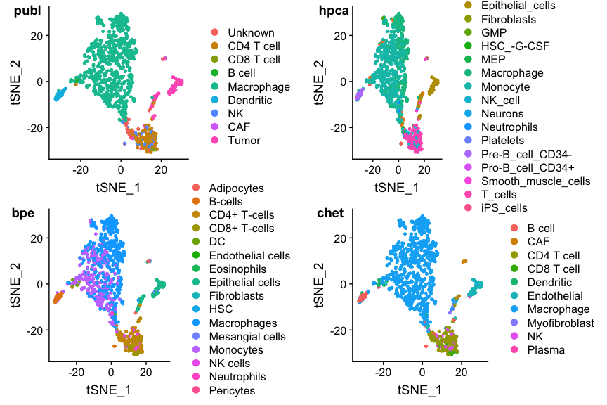<!-- -->

This looks reasonable, but the colors are a bit messy. To see things
better it may be better to highlight the cell type of interest (but note
that the type names differ per reference set\!\!). The Seurat function
`WhichCells` is a bit too limited to find cells by ‘any old meta data’,
so it’s easier to use a little function to automatically find the cells
that have a particular type:

``` r
findCells <- function(obj, column, values, name=NULL) {
  ## Given a Seurat OBJ, return a list with the names of the cells where
  ## the specified meta.data COLUMN equals any of the strings specified
  ## in VALUES (both must be characters or factors). Name of the list member
  ## must be specified using the NAME argument if length(values)>1
  stopifnot(is(obj, "Seurat"))
  stopifnot(is.character(column))
  stopifnot(column %in% names(obj@meta.data))
  col <- obj@meta.data[[column]]
  stopifnot(is.character(col) || is.factor(col))
  values <- unique(values)
  stopifnot(is.character(values) || is.factor(values))
  if (length(values)>1 && is.null(name))
    stop("findCells: specify a name to be used for the selection")
  if(is.null(name))
    name <- values
  stopifnot(is.character(name))
  rem <- setdiff(c(values), col)
  if(length(rem)>0)stop("findCells: requested value(s) never occurs in this column: ", rem)
  l <- list(colnames(obj)[ col %in% values ])
  names(l) <- name
  l
}                                       #findCells

## "Let's look at the macrophages. This is the biggest group
p1 <- DimPlot(ovarian, group.by="celltypes", reduction=dim.red,
               cells.highlight=findCells(ovarian, 'celltypes', 'Macrophage'))
p2 <- DimPlot(ovarian, group.by='hpca_type', reduction=dim.red,
               cells.highlight=findCells(ovarian, 'hpca_type', 'Macrophage'))
p3 <- DimPlot(ovarian, group.by='bpe_type', reduction=dim.red,
               cells.highlight=findCells(ovarian, 'bpe_type', 'Macrophages'))
p4 <- DimPlot(ovarian, group.by='snglr_chetah_type', reduction=dim.red,
               cells.highlight=findCells(ovarian, 'snglr_chetah_type', 'Macrophage'))
plot_grid(p1, p2, p3, p4, nrow=2, ncol=2, labels=paste(panel.labels, "Macrophage"))
```

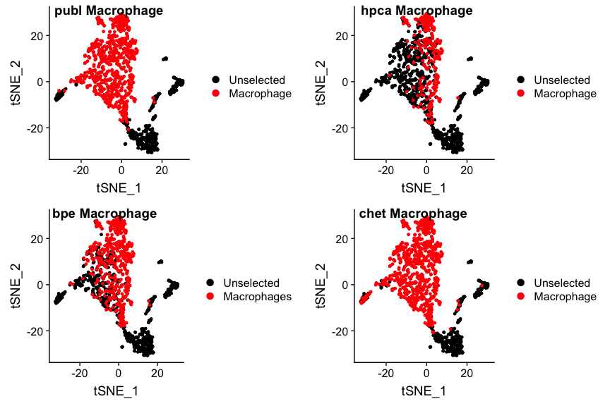<!-- -->

No suprises there really. Note that monocytes (found by HPCA) are
precursors to macrophages, but are called differently. That’s why there
are relatively fewer macrophages in the `hpca` plot.

This ‘missing-things-that-are-too-specific’ is more prominent for the B
cells as identified by SingleR using the four different references:

``` r
p1 <- DimPlot(ovarian, group.by="celltypes", reduction=dim.red,
               cells.highlight=findCells(ovarian, 'celltypes', 'B cell'))
p2 <- DimPlot(ovarian, group.by='hpca_type', reduction=dim.red,
               cells.highlight=findCells(ovarian, 'hpca_type', 'B_cell'))
p3 <- DimPlot(ovarian, group.by='bpe_type', reduction=dim.red,
               cells.highlight=findCells(ovarian, 'bpe_type', 'B-cells'))
p4 <- DimPlot(ovarian, group.by='snglr_chetah_type', reduction=dim.red,
               cells.highlight=findCells(ovarian, 'snglr_chetah_type', 'B cell'))
plot_grid(p1, p2, p3, p4, nrow=2, ncol=2, labels=paste(panel.labels, "B cell"))
```

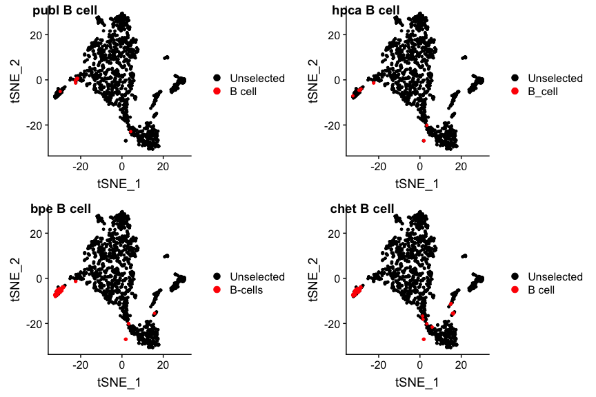<!-- -->

bpe and singlr\_chetah find more B-cells than the original publication,
HPCA roughly the same. The reason is that HPCA has two more B-cell
subtypes which were missed. We can lump them together (`findCells()` can
handle it) by including the ‘Pre-B\_cell\_CD34-’ and
‘Pro-B\_cell\_CD34+’ cells, and calling the combination ‘B-like’ :

``` r
p2 <- DimPlot(ovarian, group.by='hpca_type', reduction=dim.red,
               cells.highlight=findCells(ovarian, 'hpca_type',
                 c('B_cell', 'Pre-B_cell_CD34-', 'Pro-B_cell_CD34+'),
                 name="B-like"))
plot_grid(p1, p2, p3, p4, nrow=2, ncol=2, labels=paste(panel.labels, "all B cell"))
```

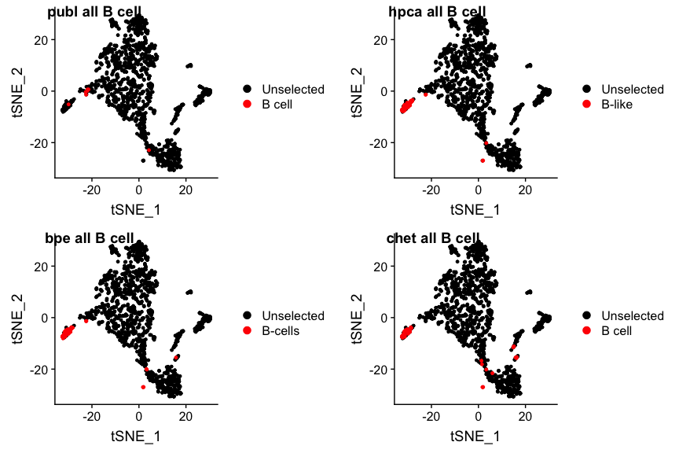<!-- -->

It looks like in the original publication quite a few B(-like) cells
were missed. The opposite may be the case for the dendritic cells: the
publication assigns quite a few of them, which is a bit unusual in that
these tissue-residing cells are relatively rare in fluids such as blood
and ascites. Are the authors right?

``` r
p1 <- DimPlot(ovarian, group.by="celltypes", reduction=dim.red,
               cells.highlight=findCells(ovarian, 'celltypes', 'Dendritic'))
p2 <- DimPlot(ovarian, group.by='hpca_type', reduction=dim.red,
               cells.highlight=findCells(ovarian, 'hpca_type', 'DC'))
p3 <- DimPlot(ovarian, group.by='bpe_type', reduction=dim.red,
               cells.highlight=findCells(ovarian, 'bpe_type', 'DC'))
p4 <- DimPlot(ovarian, group.by='snglr_chetah_type', reduction=dim.red,
               cells.highlight=findCells(ovarian, 'snglr_chetah_type', 'Dendritic'))
plot_grid(p1, p2, p3, p4, nrow=2, ncol=2, labels=paste(panel.labels, "Dendritic"))
```

<!-- -->

I guess the jury is out, but more on that later.

Feel free to play around with a few more cell types. In particular, have
a good look at where the tumor cells are. You will find that there are 4
clusters. I’m pretty sure each cluster derive from a different patient.

### Discrepancies

A nice way to view any discrepancies is to split the cells by one
classification, and color them by another (and perhaps vice versa). If
there are no discrepancies, each sub-plot has cells of one color. (you
can try this by using the same cell typing for both the `split.by` and
`group.by` arguments).

``` r
DimPlot(ovarian, split.by='celltypes', group.by='snglr_chetah_type', reduction=dim.red)
```

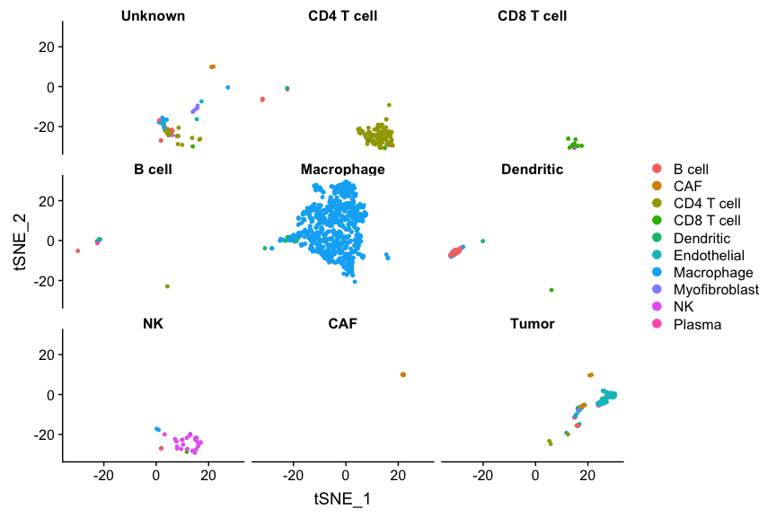<!-- -->

``` r
## and also in reverse:

DimPlot(ovarian, group.by='celltypes', split.by='snglr_chetah_type', reduction=dim.red)
```

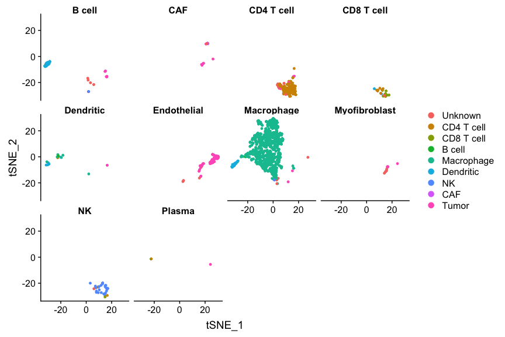<!-- -->

# CHETAH

## CHETAH reference

Our second method, CHETAH, differs from SingleR in that it uses a
reference in which each cell type is represented by a few hundred
single-cells of that type, allowing a well-founded estimate of the
confidence with which a cell type call can be made. We already worked
with a ‘bulkified’ version of this reference in the previous section.

CHETAH is part of Bioconductor, and therefore uses
`SingleCellExperiment` objects, both for the data to be classified (the
‘input’) as well as for the reference data. The latter is simply a
data set that has `celltypes` as one of its `colData()` columns.

Let’s look at this reference.

``` r
file <- paste0(data.dir,"/chetah.ref.rds") 
chetah.ref <- readRDS(file=file)

show(unique(chetah.ref.singler$types)) # the bulkified reference we've used
```

    ##  [1] "B cell"        "Macrophage"    "NK"            "CAF"          
    ##  [5] "Myofibroblast" "Endothelial"   "CD4 T cell"    "CD8 T cell"   
    ##  [9] "reg. T cell"   "Mast"          "Dendritic"     "Plasma"

``` r
show(colData(chetah.ref)) # the CHETAH tumor reference data
```

    ## DataFrame with 6122 rows and 1 column
    ##                                       celltypes
    ##                                     <character>
    ## HN25_P24_B12_S120_comb                   B cell
    ## HN25_P5_E03_S51_comb                     B cell
    ## HNSCC26_P24_A06_S294_comb                B cell
    ## HNSCC25_P2_H06_S90_comb                  B cell
    ## HNSCC28_P12_A04_S196_comb                B cell
    ## ...                                         ...
    ## CY88CD45POS_2_H10_S478_comb              Plasma
    ## CY94CD45POS_1_H04_S184_comb              Plasma
    ## CY88CD45POS_7_C05_S221_comb              Plasma
    ## CY94_CD45NEG_CD90POS_2_B04_S16_comb      Plasma
    ## CY94_CD45NEG_CD90POS_2_E09_S57_comb      Plasma

``` r
show(sort(table(colData(chetah.ref)$celltypes), decreasing=TRUE))
```

    ## 
    ##    CD8 T cell    CD4 T cell        B cell Myofibroblast           CAF 
    ##          1643          1044           769           693           685 
    ##   Endothelial    Macrophage   reg. T cell        Plasma          Mast 
    ##           360           225           225           164           126 
    ##     Dendritic            NK 
    ##           101            87

## Classifying with SingleR

The data to be classified also must be cast as a `SingleCellExperiment`.
You can use Seurat’s `as.SingleCellExperiment()` function for that.
Classifying is a matter of calling `CHETAHclassifier()` with the input
and the reference as arguments (although there are loads of options, see
the man page). Classification takes a bit longer than SingleR

``` r
ovarian.sce <- as.SingleCellExperiment(ovarian)
    
ovarian.sce <-  CHETAHclassifier(input=ovarian.sce,
                                 ref_cells = chetah.ref)
```

    ## Preparing data....

    ## Running analysis...

Let’s explore the results. You’ll notice an extra column
`celltype_CHETAH` in the `colData`, and things are still by and large
concordant, with one exception: CHETAH uses the odd ‘Unassigned’ and
‘Node3’, ‘Node7’ etc. type. The largest group, as expected, is again
Macrophage

(Note: the `snglr_chetah_type` column is the SingleR classification
using the bulkified CHETAH reference, whereas the `celltype_CHETAH`
column is the CHETAH classifcation using the CHETAH reference.)

``` r
names(colData(ovarian.sce))
```

    ##  [1] "nGene"             "nUMI"              "orig.ident"       
    ##  [4] "celltypes"         "nCount_RNA"        "nFeature_RNA"     
    ##  [7] "RNA_snn_res.0.5"   "seurat_clusters"   "hpca_type"        
    ## [10] "bpe_type"          "snglr_chetah_type" "ident"            
    ## [13] "celltype_CHETAH"

``` r
interesting.columns <- c("celltypes", "hpca_type", "bpe_type", "snglr_chetah_type", "celltype_CHETAH")

## repeat the following a few times
random.rows <- sort(sample(ncol(ovarian), size=20))
colData(ovarian.sce)[ random.rows,  interesting.columns]
```

    ## DataFrame with 20 rows and 5 columns
    ##              celltypes   hpca_type     bpe_type snglr_chetah_type
    ##               <factor> <character>  <character>       <character>
    ## X7873M.110  Macrophage    Monocyte  Macrophages        Macrophage
    ## X7873M.121  Macrophage    Monocyte    Monocytes        Macrophage
    ## X7873M.213  Macrophage  Macrophage  Macrophages        Macrophage
    ## X7873M.643  Macrophage  Macrophage  Macrophages        Macrophage
    ## X7882M.285  Macrophage    Monocyte    Monocytes        Macrophage
    ## ...                ...         ...          ...               ...
    ## X7892M.774  Macrophage    Monocyte    Monocytes        Macrophage
    ## X7892M.84   Macrophage  Macrophage  Macrophages        Macrophage
    ## X7990M2.258    Unknown     T_cells CD4+ T-cells        CD4 T cell
    ## X7990M2.280 Macrophage    Monocyte  Macrophages        Macrophage
    ## X7990M2.42          NK      B_cell      B-cells            B cell
    ##             celltype_CHETAH
    ##                 <character>
    ## X7873M.110       Macrophage
    ## X7873M.121       Macrophage
    ## X7873M.213       Macrophage
    ## X7873M.643       Unassigned
    ## X7882M.285       Macrophage
    ## ...                     ...
    ## X7892M.774       Macrophage
    ## X7892M.84        Macrophage
    ## X7990M2.258      Unassigned
    ## X7990M2.280      Macrophage
    ## X7990M2.42           B cell

``` r
show(sort(table(colData(ovarian.sce)$celltype_CHETAH), decreasing=TRUE))
```

    ## 
    ## Macrophage Unassigned CD4 T cell  Dendritic      Node9      Node5 
    ##        706        204         90         34         32         27 
    ##      Node7      Node8         NK CD8 T cell      Node1      Node2 
    ##         27         22         19         15         12          6 
    ##     B cell      Node6      Node3     Plasma 
    ##          2          2          1          1

## CHETAH visualization

Since the CHETAH method is so inherenty dependent on the classification
tree, it has its own routine to visualize both at the same time.

``` r
## There may still be a small bug in CHETAH: if things don't work, 
## please use the following code before continuing
pca.save <- ovarian.sce@reducedDims@listData$PCA
ovarian.sce@reducedDims@listData$PCA <- NULL
ovarian.sce@reducedDims@listData$PCA <- pca.save[,1:2]
## end of workaround

dim.red.u <- toupper(dim.red) # CHETAH uses upper case TSNE, UMAP, etc.
PlotCHETAH(ovarian.sce, redD=dim.red.u)
```

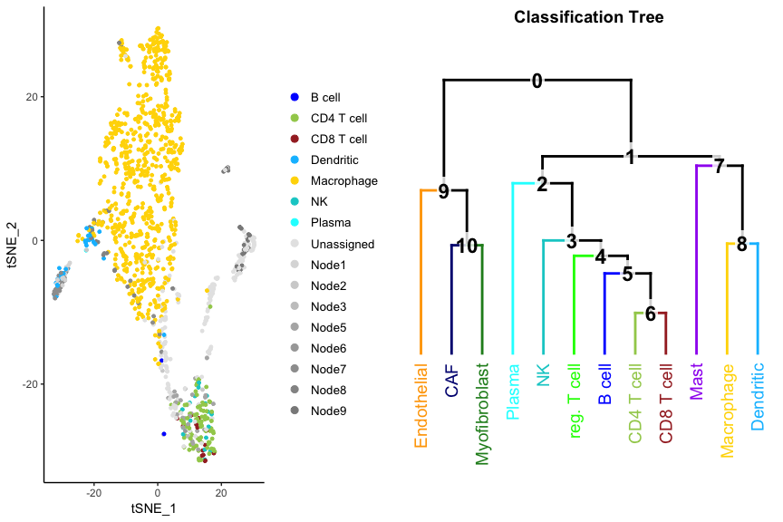<!-- -->

Grey dots are cells that got an intermediate classification, here called
Unassigned, Node1, Node2 etc. You can immediately see the four clusters
that could not be classified: they are the tumor cells. A check with the
author classification confirms this:

``` r
p1 <- DimPlot(ovarian, group.by='celltypes', reduction=dim.red)
p2 <- PlotCHETAH(ovarian.sce, redD=dim.red.u, tree=FALSE, return=TRUE)
plot_grid(p1, p2, ncol=2, labels=c("publ", "chet"))
```

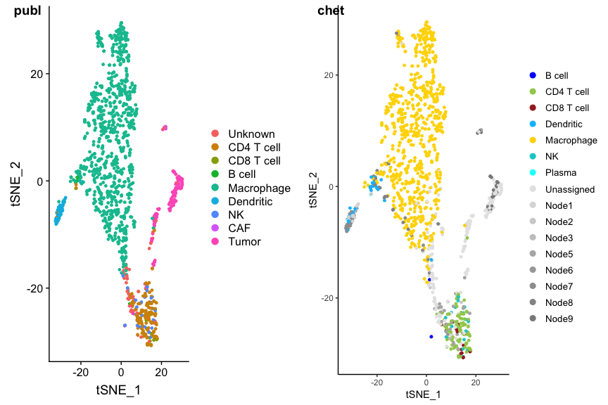<!-- -->

SingleR doesn’t know CHETAH’s intermediate types, so using SingleR with
CHETAH’s reference gives different (and misleading) results:

``` r
p1 <- DimPlot(ovarian, group.by='celltypes', reduction=tolower(dim.red))
p2 <- DimPlot(ovarian, group.by="snglr_chetah_type", reduction=tolower(dim.red))
p3 <- PlotCHETAH(ovarian.sce, redD=dim.red.u, tree=FALSE, return=TRUE)
plot_grid(p1, p2, p3, ncol=3, labels=c("publ", "sng_chet", "chet"))
```

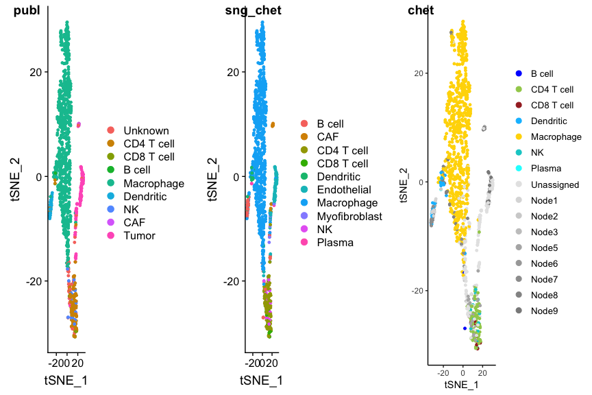<!-- -->

To see the details of the intermediate classifications more clearly you
can invert the color scheme using the `interm` option. The malignant
cells stand out even more clearly this way.

``` r
p2 <- PlotCHETAH(ovarian.sce, redD=dim.red.u, interm=TRUE, tree=FALSE, return=TRUE)
plot_grid(p1, p2, ncol=2, labels=c("publ", "chet"))
```

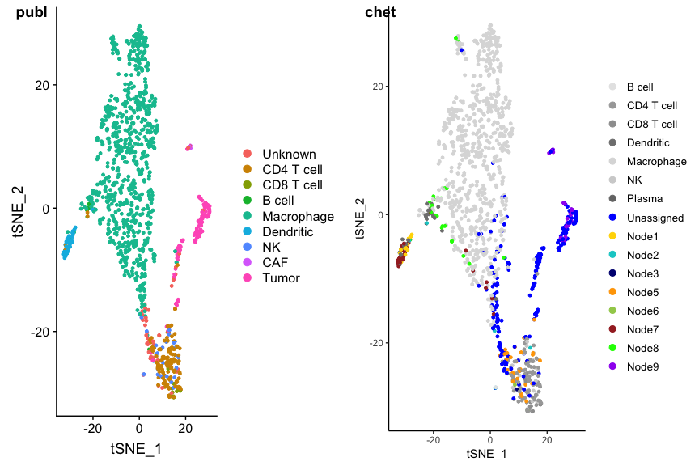<!-- -->

The dendritic cell type calls also look a bit more suspect. We can play
with the classification threshold (the default is 0.1) By setting it to
0, we force all cells to be classified to a final type; no intermediates
will occur then. Adjusting the threshold parameter is done with the
`Classify` function (this is very fast). Play with it. E.g., you’ll see
that the dendritic calls from the original publication may be in fact be
plausible but were missed by SingleR. (But also keep track of what
happens with the types of the tumor cells\!)

``` r
threshold <- 0.0
ovarian.sce <- Classify(ovarian.sce, thresh=threshold)
## note: this overrides previous celltype_CHETAH, but is very fast anyway
p2 <- PlotCHETAH(ovarian.sce, redD=dim.red.u, interm=FALSE, tree=FALSE, return=TRUE)
plot_grid(p1, p2, ncol=2, labels=c("publ", "chet"))
```

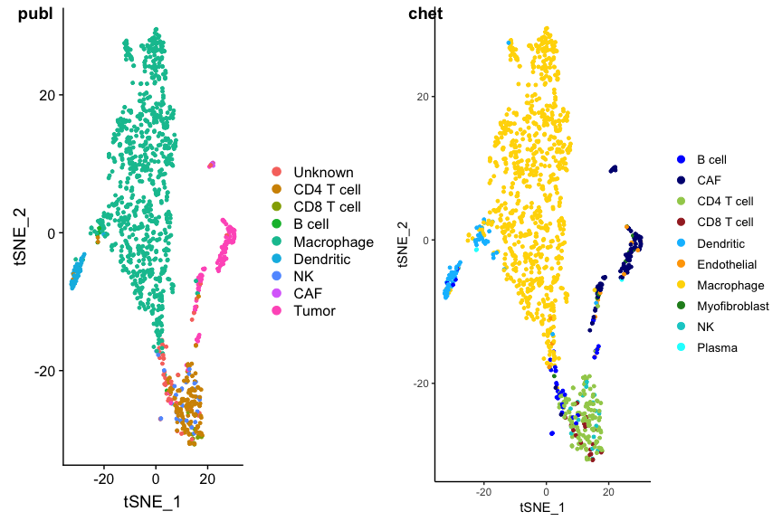<!-- -->

# CHETAHshiny

CHETAH comes with a nice [Shiny](https://shiny.rstudio.com) app that
makes it easy to explore the classification. It makes R start a little
web application that you can interact with in your web browser.

## Launching

When calling `CHETAHshiny()`, it should say something like “Listening on
<http://127.0.0.1:5433>” and automatically launch your web browser. If
not, manually open the URL just given in the web browser yourself. In
RStudio, you may need to click ‘Open in Browser’ on top of the
Rstudio-window. The R session itself will produce copious amounts of
warnings which you can ignore. It can take up to 10 seconds or so to
become active; it may help to click a few of the buttons.

    CHETAHshiny(ovarian.sce, redD=dim.red.u)

## Explanation of the CHETAHshiny interface

The left column / margin shows parameters and thresholds that can be
chosen. The top row shows which views there are. Many of the elements
are clickable or provide info when you hover over them.

## Classification tab

Shows the final classification and, further down, the statistics per
cell type and the classification tree that was used (colors are
consistent).

  - you can zoom in, pan, hover, etc. Single-click a cell type
    adds/removes cells of that type from view. Double-click to show just
    that celltype or return to showing all cells
  - ‘Color the intermediate types’ has the same effect as
    `PlotCHETAH(..., interm=TRUE`, …)
  - The confidence score works as `Classify(..., thresh=some.value,
    ...)`

## Confidence scores tab:

The confidence score of cell in CHETAH represents the amount of evidence
that is available to continue classifying that cell further down the
classificatin tree. `Choose a node` (see the tree at the bottom) shows
only the cells classified to the specified node or more specific
(i.e. further down), and uses color to represent the confidence. The
fainter the color, the less evidence remains to continue making that
cell’s type more specific. The confidence score is, by definition,
positive, but here, negative values and colorscale are used to show
which of the two branches, if any, is to be taken by the cells in that
node. The colorcode is the same as shown in the tree under it. The
Profile score heatmap shows the corresponding profile scores (see below)

Raising the `confidence threshold` results in fewer cells ‘reaching’ the
selected node, so fewer cells will show up.

## Profile score tab:

The profile score in CHETAH represents the similarity of cell in a
particular node to any of the final types. If the confidence score (see
above) is not below the threshold, the branch containing the cell type
having the highest porfile score is taken. The classification tree is
again shown at the bottoom.

Note that the profile score can be negative, but still he the highest in
a particular node. E.g., the Macrophage score of many the macrophages in
Node8 is negative, but mostly less so than the dendritics. If the
confidence score still exceeds the threshold, the branch containing
Macrophage would still be chosen.

This plot always shows all points, regardless of confidence threshold
(and colors are also independent of this).

‘In a boxplot’ panel: unfortunately broken currently.

## Genes used by CHETAH tab:

In each node and for each final type in that node, CHETAH uses the 200
genes that have the maximum absolute difference in expression between
that final type, and the average of all the types in the other branch to
calculate the profiles scores. If you set ‘\# of genes’ in this plot to
200, the heat map will show you the mRNA counts in the input data, of
these 200 genes, for the selected node and cell type. If you select
fewer genes it will show (of these 200 genes) the most highly expressed
genes in the input (this is the default), or if `Genes with max.
difference in the INPUT` is unticked, the 200 genes most highly
expressed in the reference. `Scale Matrix` will normalize the genes for
better visualisation.

The tree is again shown at the bottom.

If you check e.g Node6 (the one that separates CD4 and CD8 cells), you
should appreciate that using marker genes (`CD4` and `CD8A`
respectively; can you spot them?) is not going to work: the data is
noisy, expression is low and the differences in expression of the
classical canonical marker genes is miniscule. You need extra evidence
in the form of extra genes.

(More cells than strictly relevant are shown.)

## Expression per gene tab: obvious

### Session info

``` r
sessionInfo()
```

    ## R version 3.5.1 (2018-07-02)
    ## Platform: x86_64-apple-darwin16.7.0 (64-bit)
    ## Running under: macOS Sierra 10.12.6
    ## 
    ## Matrix products: default
    ## BLAS: /Users/philip/local/Cellar/r/3.5.1/lib/R/lib/libRblas.dylib
    ## LAPACK: /Users/philip/local/Cellar/r/3.5.1/lib/R/lib/libRlapack.dylib
    ## 
    ## locale:
    ## [1] C
    ## 
    ## attached base packages:
    ## [1] parallel  stats4    stats     graphics  grDevices utils     datasets 
    ## [8] methods   base     
    ## 
    ## other attached packages:
    ##  [1] cowplot_0.9.4               SingleR_0.2.2              
    ##  [3] Matrix_1.2-17               CHETAH_1.1.1               
    ##  [5] ggplot2_3.1.1               Seurat_3.0.1               
    ##  [7] SingleCellExperiment_1.4.1  SummarizedExperiment_1.12.0
    ##  [9] DelayedArray_0.8.0          BiocParallel_1.16.6        
    ## [11] matrixStats_0.54.0          Biobase_2.42.0             
    ## [13] GenomicRanges_1.34.0        GenomeInfoDb_1.18.2        
    ## [15] IRanges_2.16.0              S4Vectors_0.20.1           
    ## [17] BiocGenerics_0.28.0        
    ## 
    ## loaded via a namespace (and not attached):
    ##   [1] corrplot_0.84          plyr_1.8.4             igraph_1.2.4.1        
    ##   [4] lazyeval_0.2.2         GSEABase_1.44.0        splines_3.5.1         
    ##   [7] listenv_0.7.0          digest_0.6.18          foreach_1.4.4         
    ##  [10] htmltools_0.3.6        viridis_0.5.1          gdata_2.18.0          
    ##  [13] memoise_1.1.0          magrittr_1.5           doParallel_1.0.14     
    ##  [16] cluster_2.0.9          ROCR_1.0-7             limma_3.38.3          
    ##  [19] globals_0.12.4         annotate_1.60.1        doFuture_0.8.0        
    ##  [22] R.utils_2.8.0          colorspace_1.4-1       blob_1.1.1            
    ##  [25] ggrepel_0.8.1          xfun_0.6               dplyr_0.8.1           
    ##  [28] crayon_1.3.4           RCurl_1.95-4.12        jsonlite_1.6          
    ##  [31] graph_1.60.0           iterators_1.0.10       survival_2.44-1.1     
    ##  [34] zoo_1.8-5              ape_5.3                glue_1.3.1            
    ##  [37] gtable_0.3.0           zlibbioc_1.28.0        XVector_0.22.0        
    ##  [40] kernlab_0.9-27         future.apply_1.2.0     prabclus_2.2-7        
    ##  [43] DEoptimR_1.0-8         scales_1.0.0           pheatmap_1.0.12       
    ##  [46] mvtnorm_1.0-10         edgeR_3.24.3           DBI_1.0.0             
    ##  [49] bibtex_0.4.2           Rcpp_1.0.1             metap_1.1             
    ##  [52] viridisLite_0.3.0      xtable_1.8-4           reticulate_1.12       
    ##  [55] bit_1.1-14             rsvd_1.0.0             mclust_5.4.3          
    ##  [58] SDMTools_1.1-221.1     GSVA_1.30.0            tsne_0.1-3            
    ##  [61] htmlwidgets_1.3        httr_1.4.0             gplots_3.0.1.1        
    ##  [64] RColorBrewer_1.1-2     fpc_2.1-10             modeltools_0.2-22     
    ##  [67] ica_1.0-2              pkgconfig_2.0.2        XML_3.98-1.19         
    ##  [70] R.methodsS3_1.7.1      flexmix_2.3-15         nnet_7.3-12           
    ##  [73] locfit_1.5-9.1         labeling_0.3           tidyselect_0.2.5      
    ##  [76] rlang_0.3.4            reshape2_1.4.3         later_0.8.0           
    ##  [79] AnnotationDbi_1.44.0   pbmcapply_1.4.1        munsell_0.5.0         
    ##  [82] tools_3.5.1            RSQLite_2.1.1          ggridges_0.5.1        
    ##  [85] evaluate_0.13          stringr_1.4.0          yaml_2.2.0            
    ##  [88] bioDist_1.54.0         npsurv_0.4-0           outliers_0.14         
    ##  [91] knitr_1.22             bit64_0.9-7            fitdistrplus_1.0-14   
    ##  [94] robustbase_0.93-4      caTools_1.17.1.2       purrr_0.3.2           
    ##  [97] RANN_2.6.1             dendextend_1.10.0      pbapply_1.4-0         
    ## [100] future_1.12.0          nlme_3.1-139           whisker_0.3-2         
    ## [103] mime_0.6               R.oo_1.22.0            shinythemes_1.1.2     
    ## [106] compiler_3.5.1         plotly_4.9.0           png_0.1-7             
    ## [109] lsei_1.2-0             geneplotter_1.60.0     tibble_2.1.1          
    ## [112] stringi_1.4.3          lattice_0.20-38        trimcluster_0.1-2.1   
    ## [115] pillar_1.3.1           Rdpack_0.11-0          lmtest_0.9-37         
    ## [118] data.table_1.12.2      bitops_1.0-6           irlba_2.3.3           
    ## [121] gbRd_0.4-11            httpuv_1.5.1           R6_2.4.0              
    ## [124] promises_1.0.1         KernSmooth_2.23-15     gridExtra_2.3         
    ## [127] codetools_0.2-16       MASS_7.3-51.4          gtools_3.8.1          
    ## [130] assertthat_0.2.1       withr_2.1.2            sctransform_0.2.0     
    ## [133] GenomeInfoDbData_1.2.0 diptest_0.75-7         grid_3.5.1            
    ## [136] tidyr_0.8.3            class_7.3-15           rmarkdown_1.12        
    ## [139] Rtsne_0.15             singscore_1.2.2        shiny_1.3.2
