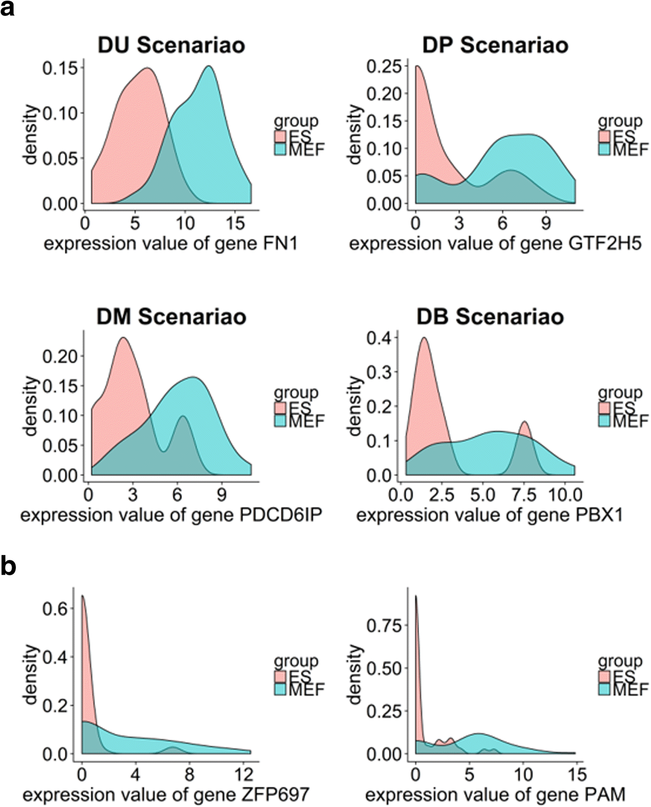
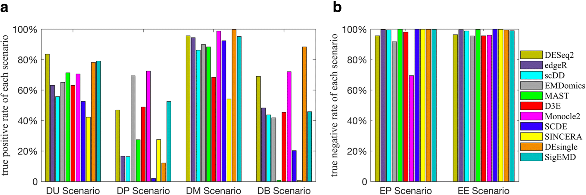
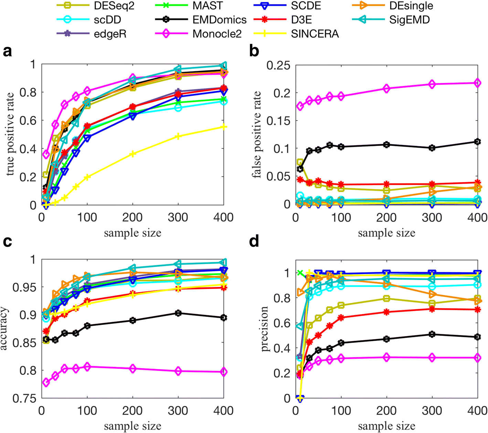
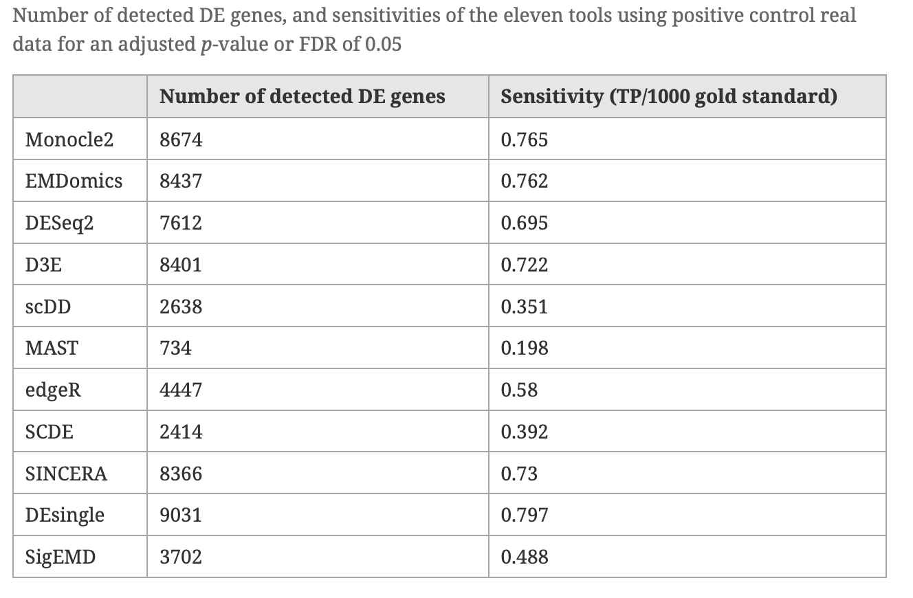
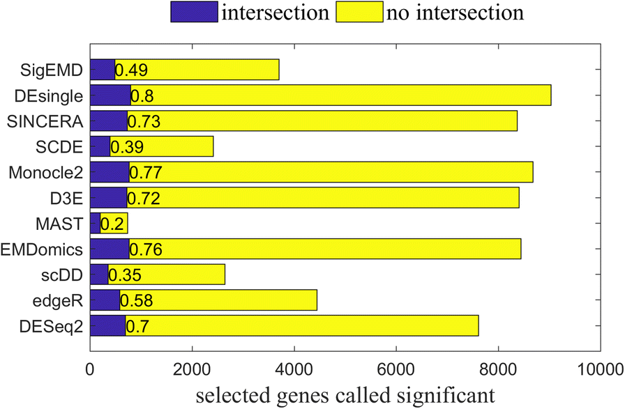
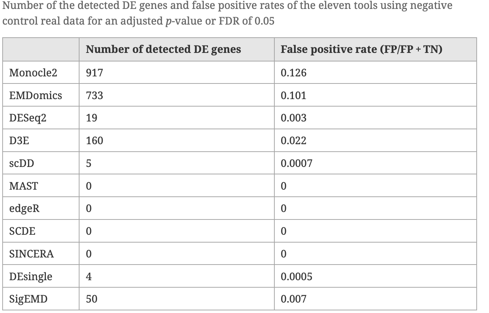
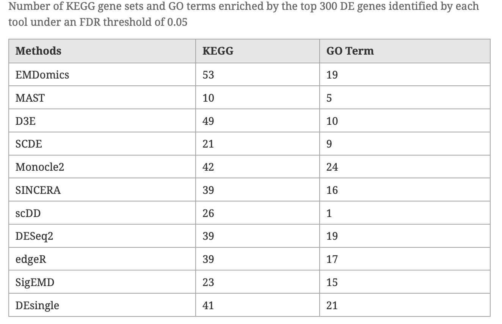
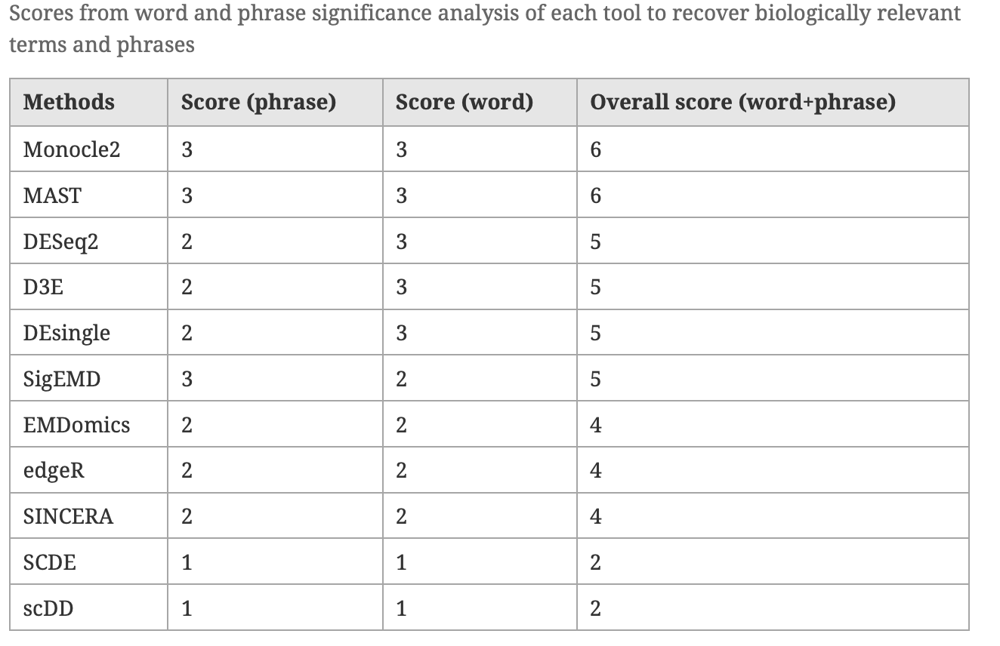

```{r setup, include=FALSE}
knitr::opts_chunk$set(echo = TRUE)
knitr::opts_chunk$set(fig.path="session-de-files/figures/")
```

## Learning objectives
- describe common ways to assess methods' performance
- explain `false positive` and `false negative` errors
- assess method given top DE genes and consistency matrix


-------

## Performance indicators
- known data: using data we know something about to get "positive controls"
- simulated data: null-data sets by re-sampling, modeling data sets based on various distributions
- comparing methods under different scenarios 
- investigating results, i.e. distributions of the detected DEs

## Type I and II errors
<figure>

<figcaption> Fig: Sensitivity and specificity (adapated from Wikipedia) </figcaption>
</figure>


<figure>

<figcaption> Fig: Error types (adapated from Wikipedia) </figcaption>
</figure>

## Comparative study (1)

Comparative analysis of differential gene expression analysis tools for single-cell RNA sequencing data (Wang et al, BMC Bioinformatics 2019)

<figure>

<figcaption> Differential expression scenarios </figcaption>
</figure>


#### Comparison using simulated data

<figure>

<figcaption> ROC curves on simulated data  </figcaption>
</figure>

<figure>

<figcaption> True positive rate and true negative rate for different scenarios (simulated data) </figcaption>
</figure>

<figure>

<figcaption> Effect of sample size (simulated data) </figcaption>
</figure>

#### Comparison using real data

- Dataset provided by Islam et al (Characterization of the single-cell transcriptional landscape by highly multiplex RNA-seq. Genome Res. 2011). The datasets consist of 22,928 genes from 48 mouse embryonic stem cells and 44 mouse embryonic fibroblasts. 
- To assess TPs, already-published top 1000 DE genes that are validated through qRT-PCR experiments was used as a gold standard gene set.
- To assess FPs, resampling of samples was employed (creating artificial groups with no real differences)

<figure>

<figcaption>  </figcaption>
</figure>

<figure>

<figcaption>  </figcaption>
</figure>

<figure>

<figcaption>  </figcaption>
</figure>

<figure>

<figcaption>  </figcaption>
</figure>

<figure>

<figcaption>  </figcaption>
</figure>

Some conclusions from the study:

- In general, tools that show higher sensitivity also show lower specifity.
- Tools developed for scRNAseq data focus on handling zero counts or multimodality but not both
- Methods that can capture multimodality (non-parametric methods), perform better than do the model-based methods designed for handling zero counts 
- Methods developed specifically for scRNAseq data do not show significantly better performance compared to the methods designed for bulk RNAseq data
- Lack of agreement in finding DE genes by these tools and their limitations in detecting true DE genes and biologically relevant gene sets indicate the need for developing more precise methods for differential expression analysis of scRNAseq data

## Comparative study (2)

Bias, robustness and scalability in single-cell differential expression analysis (Sonesson and Robinson, Nature Methods, 2018)


<figure>

<figcaption> Fig: Methods assessment [@Soneson2018]  </figcaption>
</figure>

## Comparing methods in our data

```{r, eval-cmp,  warning=F, message=F, eval=F}

DE <- list()
files <- c("data/mouse_embryo/DE/sc3_kwtest_8cell_vs_16_cell.tab",
           "data/mouse_embryo/DE/scde_8cell_vs_16_cell.tab",
           "data/mouse_embryo/DE/seurat_wilcox_8cell_vs_16_cell.tab",           
           "data/mouse_embryo/DE/seurat_bimod_8cell_vs_16_cell.tab",
           "data/mouse_embryo/DE/seurat_roc_8cell_vs_16_cell.tab",
           "data/mouse_embryo/DE/seurat_t_8cell_vs_16_cell.tab",
           "data/mouse_embryo/DE/seurat_negbinom_8cell_vs_16_cell.tab",
           "data/mouse_embryo/DE/seurat_poisson_8cell_vs_16_cell.tab",
           "data/mouse_embryo/DE/seurat_LR_8cell_vs_16_cell.tab",
           "data/mouse_embryo/DE/seurat_MAST_8cell_vs_16_cell.tab",
           "data/mouse_embryo/DE/seurat_DESeq2_8cell_vs_16_cell.tab")

for (i in 1:11){ 
  DE[[i]]<-read.table(files[i],sep="\t",header=T)
}
names(DE)<-c("SC3","SCDE","seurat-wilcox", "seurat-bimod","seurat-roc","seurat-t","seurat-tobit")

# MAST file has gene names as first column, read in separately
DE$MAST <- read.table("data/mouse_embryo/DE/mast_8cell_vs_16_cell.tab", 
                      sep="\t",header=T,row.names=2)

# get top 100 genes for each test
top.100 <- lapply(DE,function(x) rownames(x)[1:100])

# load a function for plotting overlap
source("data/mouse_embryo/DE/overlap_phyper.R")
# plot overlap and calculate significance with phyper test, as background, 
# set number of genes in seurat.
o <- overlap_phyper(top.100,plot=T,bg=nrow(DE$`seurat-bimod`))
```

Rows and columns are the different gene lists, and in the upper triangle the comparison of 2 datasets is shown with number of genes in common and color according to significance of overlap. Last columns show number of unique genes per list.

#### Significant DE genes

Now we select significant genes from the different tests. In this case we use a cutoff for adjusted p-value at 0.05. 

```{r, eval-sign, warning=F, message=F, eval=F}
# the  p-values from all Seurat functions except wilcox does not 
# seem to be adjusted, so we need to adjust them first.
adjust <- c(4,6,7)
DE[adjust] <- lapply(DE[adjust], function(x) cbind(x,p.adjust(x$p_val)))


# not really a p-value for the ROC test, so skip for now 
# (5th entry in the list)
pval.column <- c(2,8,5,5,5,5,6) # define which column contains the p-value
names(pval.column)<-names(DE)[-5]
sign.genes <- list()
cutP<-0.05
for (n in names(DE)[-5]){
  sg <- which(DE[[n]][,pval.column[n]] < cutP)
  sign.genes[[n]]<-rownames(DE[[n]])[sg]
}

# number of genes per dataset
unlist(lapply(sign.genes,length))

# check overlap again
o <- overlap_phyper(sign.genes,plot=T,bg=nrow(DE$`seurat-bimod`))

# list genes found in all 6 methods
t<-table(unlist(sign.genes))
head(sort(t,decreasing=T),n=10)
```

#### Plotting top DE genes 

Plot onto the tSNE created with Seurat. So we first need to find variable genes, run PCA and tSNE for the Seurat object. 

```{r, eval-plot,  warning=F, message=F, eval=F}
# run a tsne for plotting onto
data <- FindVariableGenes(object = data, mean.function = ExpMean, 
                          dispersion.function = LogVMR, x.low.cutoff = 0.5, 
                          x.high.cutoff = 10, y.cutoff = 0.5)
data <- RunPCA(object = data,do.print=F)
set.seed(1)
data <- RunTSNE(object = data, dims.use = 1:5, do.fast = TRUE,perplexity=10)
# plot first with color by celltype
TSNEPlot(data)

# plot top 9 genes for each method
for (n in names(sign.genes)){
  print(n)
  p <- FeaturePlot(object = data, features.plot = sign.genes[[n]][1:9],  
                   reduction.use = "tsne",no.axes=T,do.return = T)
}

```


#### Violin plots with the top genes

```{r, eval-violi, eval=F}
# plot top 9 genes for each method
for (n in names(sign.genes)){
  print(n)
  p2 <- VlnPlot(object = data, features.plot = sign.genes[[n]][1:9], 
                nCol=3, do.return = T,
                size.x.use = 7, size.y.use = 7, size.title.use = 10)
  print(p2)
}

```

<figure>

<figcaption> Fig: Staying critical </figcaption>
</figure>


------

# [Jump to Schedule](../schedule.md)
# [Back to Introduction](session-de.md)

-------


