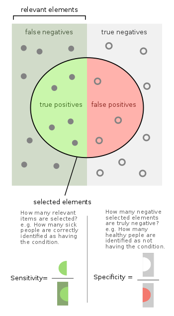
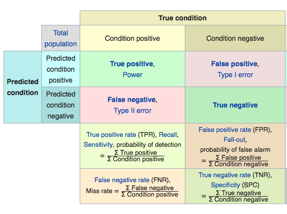
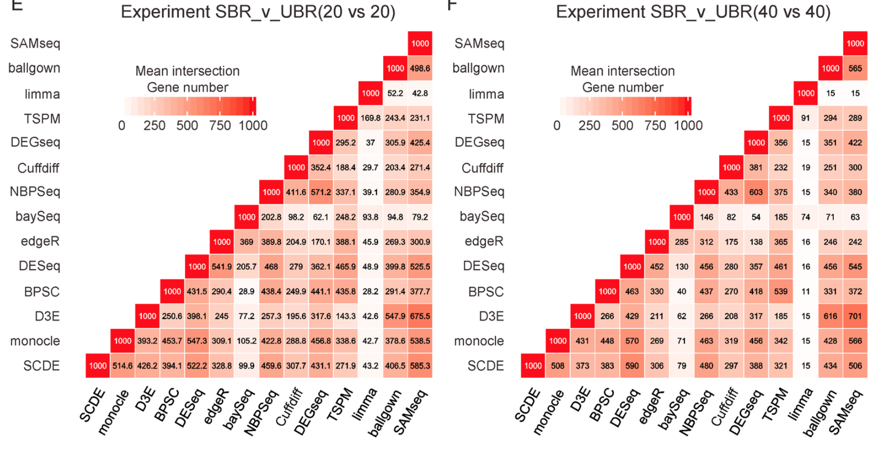
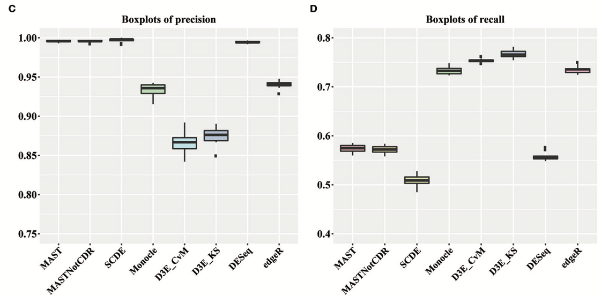
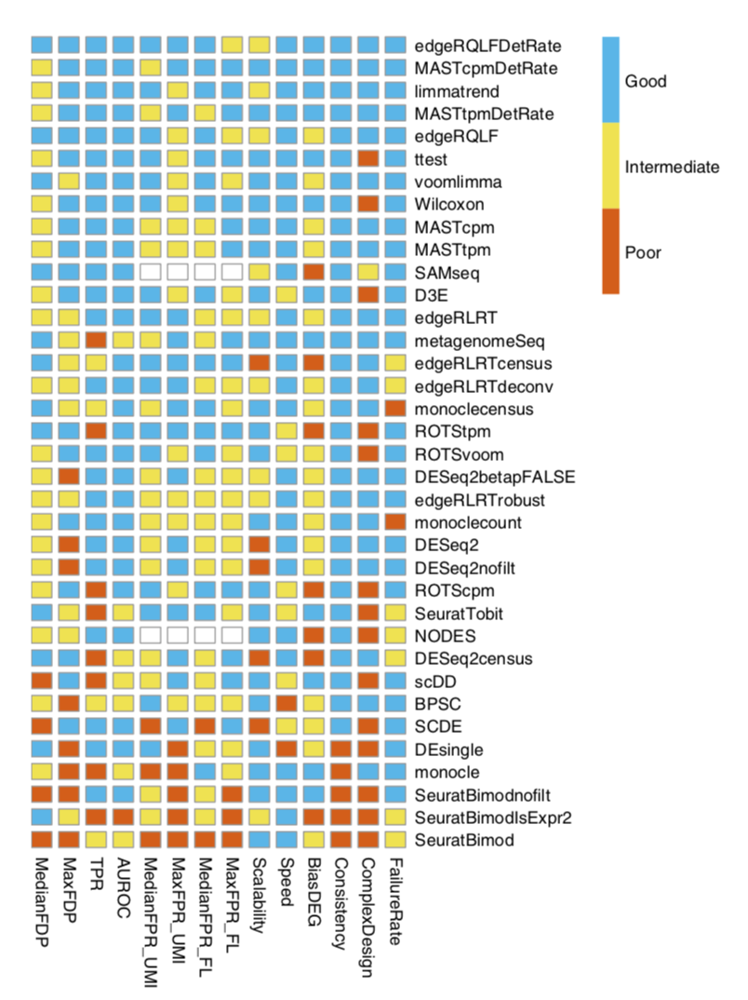

Differential expression methods evaluation
================

## Learning objectives

  - describe common ways to assess methods’ performance
  - explain `false positive` and `false negative` errors
  - assess method given top DE genes and consistency matrix

-----

## Performance indicators

  - known data: using data we know something about to get “positive
    controls”
  - simulated data: null-data sets by re-sampling, modeling data sets
    based on various distributions
  - comparing methods under different scenarios
  - investigating results, i.e. distributions of the detected
DEs

## Type I and II errors

<figure>



<figcaption>

Fig: Sensitivity and specificity \[adapated from Wikipedia\]

</figcaption>

</figure>

<figure>



<figcaption>

Fig: Error types \[adapated from Wikipedia\]

</figcaption>

</figure>

<figure>



<figcaption>

Fig: Precision and recall examples (Dal Molin, Baruzzo, and Di Camillo
2017)

</figcaption>

</figure>

<figure>



<figcaption>

Fig: Methods consistency (Miao and Zhang 2016)

</figcaption>

</figure>

<figure>



<figcaption>

Fig: Methods assessment (Soneson and Robinson 2018)

</figcaption>

</figure>

## Comparing methods

``` r
DE <- list()
files <- c("data/mouse_embryo/DE/sc3_kwtest_8cell_vs_16_cell.tab",
           "data/mouse_embryo/DE/scde_8cell_vs_16_cell.tab",
           "data/mouse_embryo/DE/seurat_wilcox_8cell_vs_16_cell.tab",           
           "data/mouse_embryo/DE/seurat_bimod_8cell_vs_16_cell.tab",
           "data/mouse_embryo/DE/seurat_roc_8cell_vs_16_cell.tab",
           "data/mouse_embryo/DE/seurat_t_8cell_vs_16_cell.tab",
           "data/mouse_embryo/DE/seurat_tobit_8cell_vs_16_cell.tab")

for (i in 1:7){ 
  DE[[i]]<-read.table(files[i],sep="\t",header=T)
}
names(DE)<-c("SC3","SCDE","seurat-wilcox", "seurat-bimod","seurat-roc","seurat-t","seurat-tobit")

# MAST file has gene names as first column, read in separately
DE$MAST <- read.table("data/mouse_embryo/DE/mast_8cell_vs_16_cell.tab", 
                      sep="\t",header=T,row.names=2)

# get top 100 genes for each test
top.100 <- lapply(DE,function(x) rownames(x)[1:100])

# load a function for plotting overlap
source("data/mouse_embryo/DE/overlap_phyper.R")
# plot overlap and calculate significance with phyper test, as background, 
# set number of genes in seurat.
o <- overlap_phyper(top.100,plot=T,bg=nrow(DE$`seurat-bimod`))
```

Rows and columns are the different gene lists, and in the upper triangle
the comparison of 2 datasets is shown with number of genes in common and
color according to significance of overlap. Last columns show number of
unique genes per list.

#### Significant DE genes

Now we select significant genes from the different tests. In this case
we use a cutoff for adjusted p-value at 0.05.

``` r
# the  p-values from all Seurat functions except wilcox does not 
# seem to be adjusted, so we need to adjust them first.
adjust <- c(4,6,7)
DE[adjust] <- lapply(DE[adjust], function(x) cbind(x,p.adjust(x$p_val)))


# not really a p-value for the ROC test, so skip for now 
# (5th entry in the list)
pval.column <- c(2,8,5,5,5,5,6) # define which column contains the p-value
names(pval.column)<-names(DE)[-5]
sign.genes <- list()
cutP<-0.05
for (n in names(DE)[-5]){
  sg <- which(DE[[n]][,pval.column[n]] < cutP)
  sign.genes[[n]]<-rownames(DE[[n]])[sg]
}

# number of genes per dataset
unlist(lapply(sign.genes,length))

# check overlap again
o <- overlap_phyper(sign.genes,plot=T,bg=nrow(DE$`seurat-bimod`))

# list genes found in all 6 methods
t<-table(unlist(sign.genes))
head(sort(t,decreasing=T),n=10)
```

Only 3 genes detected by all 7 methods as DE.

#### Plotting top DE genes

Plot onto the tSNE created with Seurat. So we first need to find
variable genes, run PCA and tSNE for the Seurat object.

``` r
# run a tsne for plotting onto
data <- FindVariableGenes(object = data, mean.function = ExpMean, 
                          dispersion.function = LogVMR, x.low.cutoff = 0.5, 
                          x.high.cutoff = 10, y.cutoff = 0.5)
data <- RunPCA(object = data,do.print=F)
set.seed(1)
data <- RunTSNE(object = data, dims.use = 1:5, do.fast = TRUE,perplexity=10)
# plot first with color by celltype
TSNEPlot(data)

# plot top 9 genes for each method
for (n in names(sign.genes)){
  print(n)
  p <- FeaturePlot(object = data, features.plot = sign.genes[[n]][1:9],  
                   reduction.use = "tsne",no.axes=T,do.return = T)
}
```

#### Violin plots with the top genes

``` r
# plot top 9 genes for each method
for (n in names(sign.genes)){
  print(n)
  p2 <- VlnPlot(object = data, features.plot = sign.genes[[n]][1:9], 
                nCol=3, do.return = T,
                size.x.use = 7, size.y.use = 7, size.title.use = 10)
  print(p2)
}
```

-----

# [Jump to Schedule](../schedule.md)

# [Back to Introduction](session-de.md)

# [Next to Wrap-up](session-de-wrap-up.md)

-----

<div id="refs" class="references">

<div id="ref-DalMolin2017">

Dal Molin, Alessandra, Giacomo Baruzzo, and Barbara Di Camillo. 2017.
“Single-Cell RNA-Sequencing: Assessment of Differential Expression
Analysis Methods.”
<https://www.frontiersin.org/article/10.3389/fgene.2017.00062>.

</div>

<div id="ref-Miao2016">

Miao, Zhun, and Xuegong Zhang. 2016. “Differential expression analyses
for single-cell RNA-Seq: old questions on new data.” *Quantitative
Biology* 4 (4): 243–60. <https://doi.org/10.1007/s40484-016-0089-7>.

</div>

<div id="ref-Soneson2018">

Soneson, Charlotte, and Mark D Robinson. 2018. “Bias, robustness and
scalability in single-cell differential expression analysis.” *Nature
Methods* 15 (February): 255. <https://doi.org/10.1038/nmeth.4612>.

</div>

</div>
