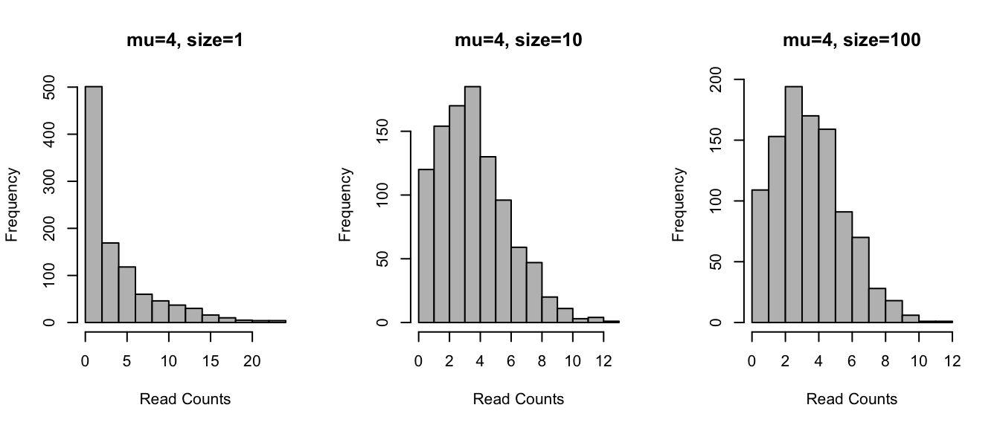

Differential expression methods
================

## Learning objectives

  - describe main classes of methods used
  - understand statistical concepts behind the key scRNA-seq DE methods
  - run the key scRNA-seq DE
methods

-----

## Examples

<figure>


<figcaption>

Figure: Software tools for identifying DE genes using scRNAseq data
(Wang et al. 2019)

</figcaption>

</figure>

#### More more examples

And even more examples in the [Soneson, Charlotte, and Mark D
Robinson](session-de-files/images/methods-Robinson-2018.pdf) (2018)

-----

## Main classes

#### non-parameteric tests

  - generic methods
  - e.g. Wilcoxon rank-sum test, Kruskal-Wallis, Kolmogorov-Smirnov test
  - non-parametric tests generally convert observed expression values to
    ranks & test whether the distribution of ranks for one group are
    signficantly different from the distribution of ranks for the other
    group
  - some non-parametric methods fail in the presence of a large number
    of tied values, such as the case for dropouts (zeros) in single-cell
    RNA-seq expression data
  - if the conditions for a parametric test hold, then it will typically
    be more powerful than a non-parametric test

#### bulk RNA-seq based method

  - developed for bulk RNA-seq
  - e.g. edgeR, DE-seq2
  - compare estimates of mean-expression (sample size), based on
    negative binomial distribution
  - can be assessed by datasets where RNA-seq data has beeen validated
    by RT-qPCR

#### scRNA-seq specific methods

  - developed for scRNA-seq
  - e.g. MAST, SCDE, Monocle, Pagoda, D\(^3\)E etc.
  - large number of samples, i.e. cells, for each group we are comparing
    in single-cell experiments. Thus we can take advantage of the whole
    distribution of expression values in each group to identify
    differences between groups -we usually do not have a defined set of
    experimental conditions; instead we try to identify the cell groups
    by using an unsupervised clustering approach.

#### modeling wise

  - distribution free (non-parameteric)
  - negative binomial
  - zero inflated negative binomial
  - Poisson and negative binomial
  - GLM and
GAM
  - etc.

-----

## Statistical thinking

<figure>


<figcaption>

\(Outcome_i=(Model_i)+error_i\)

</figcaption>

</figure>

#### Normal distribution example

<!-- -->
\(t=\frac{x_1-x_2}{s_p\sqrt{\frac{1}{n_1}+\frac{1}{n_2}}}\)

#### Generic recipe

  - model e.g. gene expression with random error
  - fit model to the data and/or data to the model, estimate model
    parameters
  - use model for prediction and/or inference
  - the better model fits the data the better statistics \\end{block}
    \\end{frame}

## Common distributions

#### Negative binomial (NB)

<!-- --> \[\mu=mu\]
\[\delta^2=mu+mu^2/size\] \(\mu\), mean expression

*size*: and the dispersion, which is inversely related to the variance

NB fits bulk RNA-seq data very well and it is used for most statistical
methods designed for such data. In addition, it has been show to fit the
distribution of molecule counts obtained from data tagged by unique
molecular identifiers (UMIs) quite well (Grun et al. 2014, Islam et
al. 2011).

#### zero inflated NB

<!-- -->
\[\mu=mu*(1-d)\] \[\delta^2=\mu*(1-d)*(1+d*\mu+\mu/size)\]

*d*, dropout rate; dropout rate of a gene is strongly correlated with
the mean expression of the gene. Different zero-inflated negative
binomial models use different relationships between *mu* and *d* and
some may fit *mu* and *d* to the expression of each gene independently.
Implemented in MAST, SCDE.

#### Poisson distribution

<!-- -->
\[\mu=g*a/(a+b)\] \[\delta^2=g^2*a*b/((a+b+1)*(a+b)^2)\]

*a*: the rate of activation of transcription;

*b*: the rate of inhibition of transcription;

*g*: the rate of transcript production while transcription is active at
the locus.

Differential expression methods may test each of the parameters for
differences across groups or only one (often *g*). Implemented in BPSC.

May be further expanded to explicitly account for other sources of gene
expression differences such as batch-effect or library depth depending
on the particular DE algorithm.

-----

## Under the hood

### MAST

  - uses *generalized linear hurdle model*

  - designed to account for stochastic dropouts and bimodal expression
    distribution in which expression is either strongly non-zero or
    non-detectable

  - the rate of expression *Z*, and the level of expression *Y*, are
    modeled for each gene *g*, indicating whether gene *g* is expressed
    in cell *i* (i.e., \(Z_{ig}=0\) if \(y_{ig}=0\) and \(z_{ig}=1\) if
    \(y_{ig}>0\))

  - A *logistic regression model* for the discrete variable *Z* and a
    *Gaussian linear model* for the continuous variable (Y|Z=1):
    \(logit (P_r(Z_{ig}=1))=X_i\beta_g^D\)
    \(P_r(Y_{ig}=Y|Z_{ig}=1)=N(X_i\beta_g^C,\sigma_g^2)\), where \(X_i\)
    is a design matrix

  - Model parameters are *fitted* using an empirical Bayesian framework

  - Allows for a joint estimate of nuisance and treatment effects

  - DE is determined using *the likelihood ratio test*

### SCDE

  - *models* the read counts for each gene using a mixture of a NB,
    negative binomial, and a Poisson distribution
  - *NB distribution* models the transcripts that are amplified and
    detected
  - *Poisson distribution* models the unobserved or background-level
    signal of transcripts that are not amplified (e.g. dropout events)
  - subset of robust genes is used to fit, via *EM* algorithm, the
    parameters to the mixture of models For DE, the posterior
    probability that the gene shows a fold expression difference between
    two conditions is computed using a *Bayesian approach*

### Monocole

  - Originally designed for ordering cells by progress through
    differentiation stages (pseudo-time)
  - The mean expression level of each gene is *modeled with a GAM*,
    generalized additive model, which relates one or more predictor
    variables to a response variable as
    \(g(E(Y))=\beta_0+f_1(x_1)+f_2(x_2)+...+f_m(x_m)\) where Y is a
    specific gene expression level, \(x_i\) are predictor variables, *g*
    is a link function, typically log function, and \(f_i\) are
    non-parametric functions (e.g. cubic splines)
  - The observable expression level Y is then modeled using GAM,
    \(E(Y)=s(\varphi_t(b_x, s_i))+\epsilon\) where
    \(\varphi_t(b_x, s_i)\) is the assigned pseudo-time of a cell and
    \(s\) is a cubic smoothing function with three degrees of freedom.
    The error term \(\epsilon\) is normally distributed with a mean of
    zero
  - The DE test is performed using an *approx. \(\chi^2\) likelihood
    ratio test*

## Live coding session

``` r
x2 <- rnorm(1000, 173, 1)
xfit2<-seq(min(x2),max(x2),length=40) 
yfit2<-dnorm(xfit2,mean=mean(x2),sd=sd(x2)) 
yfit2 <- yfit2*diff(h$mids[1:2])*length(x2) 
```

-----

## ToDo

*working notes, not part of the tutorial, will be removed*

  - improve the session
  - add tutorials / coding sessions

## [Back to main](../README.md)

## [Next to Methods Evaluation](session-de-methods-evaluation.md)

<div id="refs" class="references">

<div id="ref-Soneson2018">

Soneson, Charlotte, and Mark D Robinson. 2018. “Bias, robustness and
scalability in single-cell differential expression analysis.” *Nature
Methods* 15 (February): 255. <https://doi.org/10.1038/nmeth.4612>.

</div>

<div id="ref-Wang2019">

Wang, Tianyu, Boyang Li, Craig E Nelson, and Sheida Nabavi. 2019.
“Comparative analysis of differential gene expression analysis tools
for single-cell RNA sequencing data.” *BMC Bioinformatics* 20 (1): 40.
<https://doi.org/10.1186/s12859-019-2599-6>.

</div>

</div>
