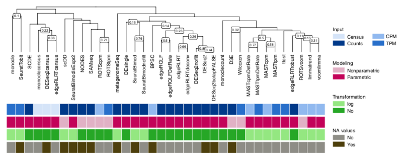
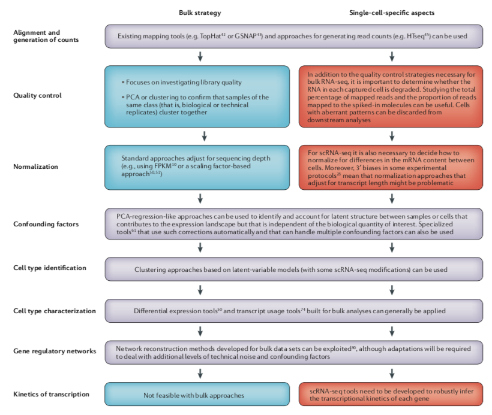
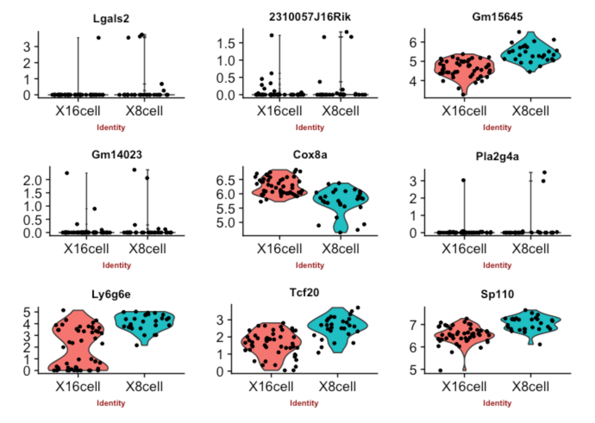

Differential expression wrap-up
================

## Learning objectives

  - identify factors in the scRNA-seq workflow connected to differential
    expression
  - assess how filtering and missing data imputations affect
    differential expresson results
  - identify resoures to learn more about differential expression

-----

## Bigger picture

<figure>

<figcaption>

Fig: Choosing the right method (Soneson and Robinson 2018)

</figcaption>

</figure>

<figure>

<figcaption>

Fig: DE as part of the workflow (Stegle, Teichmann, and Marioni 2015)

</figcaption>

</figure>

<figure>

<figcaption>

Fig: Staying critical

</figcaption>

</figure>

## Live-coding

-----

## ToDo

*working notes, not part of the tutorial, will be removed* - improve the
session

## [Back to main](../README.md)

Soneson, Charlotte, and Mark D Robinson. 2018. “Bias, robustness and
scalability in single-cell differential expression analysis.” *Nature
Methods* 15 (February): 255. <https://doi.org/10.1038/nmeth.4612>.

Stegle, Oliver, Sarah A Teichmann, and John C Marioni. 2015.
“Computational and analytical challenges in single-cell
transcriptomics.” *Nature Reviews. Genetics* 16 (January 2014): 133–45.

