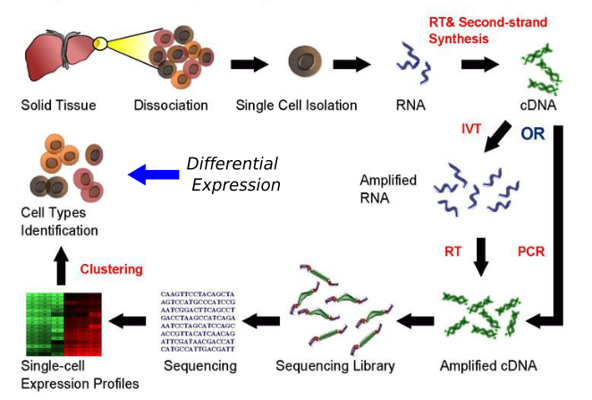
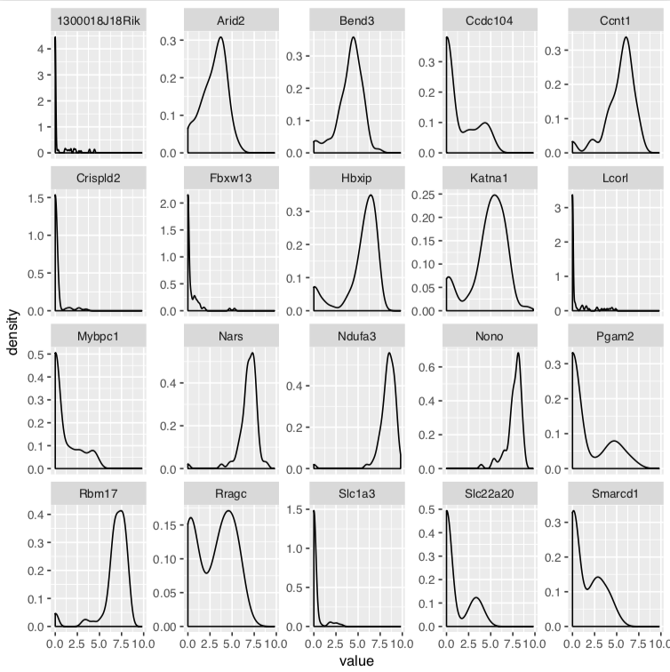

Differential expression
================

*Created by Olga Dethlefsen & Ståle Nygård. The code were adapted from
<https://nbisweden.github.io/workshop-scRNAseq/>, courtesy of Åsa
Björklund*

# Content overview

  - Introduction (\~15 min)
  - [Common methods](session-de-methods.md) (\~30 min)
  - [Methods performance and
    evaluation](session-de-methods-evaluation.md) (\~30 min)
  - [Practicalities & wrap-up](session-de-wrap-up.md) (\~30 min)

-----

# Introduction

## Learning objectives

  - define differential expression DE
  - identify properties of scRNA-seq data influencing DE
  - assess data distributions

-----

## Defining differential expression

#### What does `differential expression` mean to you?

#### Context

<figure>

<figcaption>

Figure: single cell RNA-seq workflow \[adapted from Wikipedia\]

</figcaption>

</figure>

#### DE Definition

  - taking read count data &
  - performing statistical analysis to discover quantitative changes in
    expression levels between experimental groups
  - i.e. to decide whether, for a given gene, an observed difference in
    read counts is significant (greater than what would be expected just
    due to natural random variation)

#### DE is an “old problem”

  - known from bulk RNA-seq and microarray studies
  - in fact building on one of the most common statistical problems, i.e
    comparing groups for statistical differences

#### So why do we need to think about DE?

## Characteristics of scRNA-seq data

  - high noise levels (technical and biological factors)
  - low library sizes
  - low amount of available mRNAs results in amplification biases and
    “dropout events”
  - 3’ bias, partial coverage and uneven depth (technical)
  - stochastic nature of transcription (biological)
  - multimodality in gene expression; presence of multiple possible cell
    states within a cell population (biological)

##### Example distributions

## Live-coding

*Idea: add a small example of looking at the data, distributions, number
of zeros, boxplots comparisons of selected genes*

-----

## ToDo

*working notes, not part of the tutorial, will be removed*

  - rethink and upadate Menti, maybe use google forms instead
  - add live-coding demo at the end
  - improve distribution example plot
  - discuss this part: add more plots? add more text? How to improve?

## [Back to Main](../README.md)

## [Next to Methods](session-de-methods.md)

