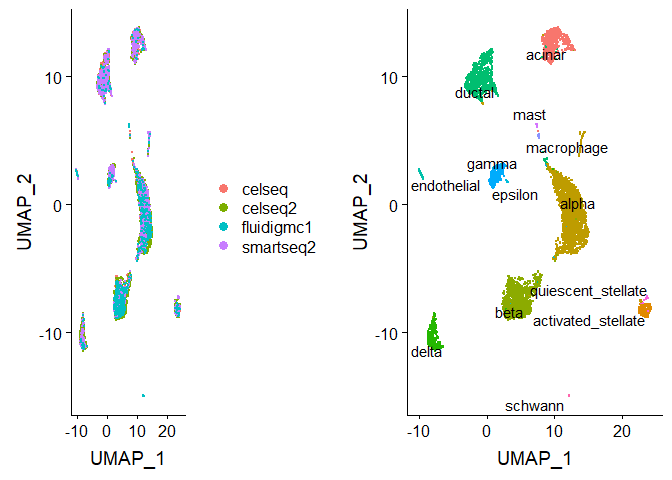
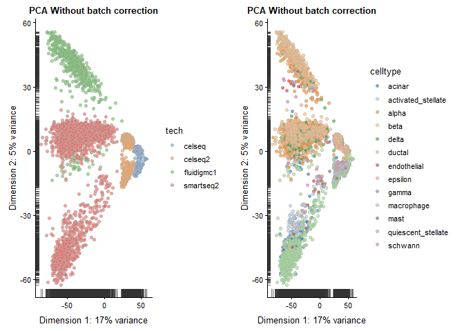
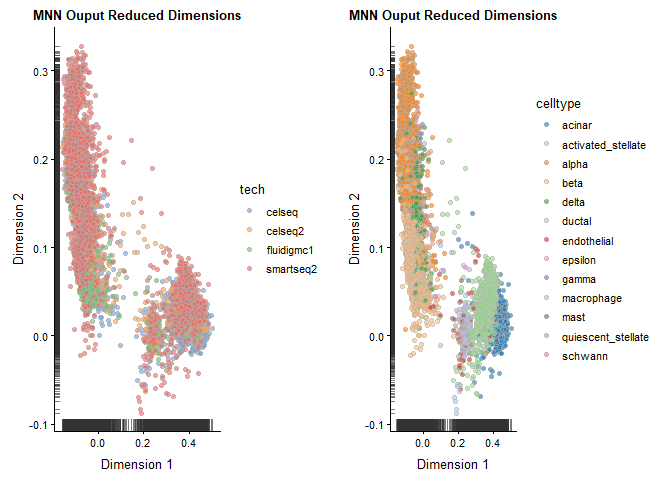

Data Integration
================

Created by: Ahmed Mahfouz

# Overview

In this tutorial we will look at different ways of integrating multiple
single cell RNA-seq datasets. We will explore two different methods to
correct for batch effects across datasets. We will also look at a
quantitative measure to assess the quality of the integrated data.

## Datasets

For this tutorial we will use 3 different human pancreatic islet cell
datasets from four technologies, CelSeq (GSE81076) CelSeq2 (GSE85241),
Fluidigm C1 (GSE86469), and SMART-Seq2 (E-MTAB-5061). The raw data
matrix and associated metadata are available
[here](https://www.dropbox.com/s/1zxbn92y5du9pu0/pancreas_v3_files.tar.gz?dl=1).

Load required packages:

``` r
suppressMessages(require(Seurat))
suppressMessages(require(ggplot2))
suppressMessages(require(cowplot))
suppressMessages(require(scater))
suppressMessages(require(scran))
suppressMessages(require(BiocParallel))
suppressMessages(require(BiocNeighbors))
```

## Seurat (anchors and CCA)

First we will use the data integration ethod presented in [Comprehensive
Integration of Single Cell
Data](https://www.biorxiv.org/content/10.1101/460147v1).

### Data preprocessing

Load in expression matrix and metadata. The metadata file contains the
technology (`tech` column) and cell type annotations (`cell type`
column) for each cell in the four
datasets.

``` r
pancreas.data <- readRDS(file = "session-integration_files/pancreas_expression_matrix.rds")
metadata <- readRDS(file = "session-integration_files/pancreas_metadata.rds")
```

Create a Seurat object with all datasets.

``` r
pancreas <- CreateSeuratObject(pancreas.data, meta.data = metadata)
```

Let’s first look at the datasets before applying any batch correction.
We perform standard preprocessing (log-normalization), and identify
variable features based on a variance stabilizing transformation
(`"vst"`). Next, We scale the integrated data, run PCA, and visualize
the results with UMAP. The integrated datasets cluster by cell type,
instead of by technology

``` r
# Normalize and find variable features
pancreas <- NormalizeData(pancreas, verbose = FALSE)
pancreas <- FindVariableFeatures(pancreas, selection.method = "vst", nfeatures = 2000, verbose = FALSE)
    
# Run the standard workflow for visualization and clustering
pancreas <- ScaleData(pancreas, verbose = FALSE)
pancreas <- RunPCA(pancreas, npcs = 30, verbose = FALSE)
pancreas <- RunUMAP(pancreas, reduction = "pca", dims = 1:30)
p1 <- DimPlot(pancreas, reduction = "umap", group.by = "tech")
p2 <- DimPlot(pancreas, reduction = "umap", group.by = "celltype", label = TRUE, repel = TRUE) + 
    NoLegend()
plot_grid(p1, p2)
```

<!-- -->

We split the combined object into a list, with each dataset as an
element. We perform standard preprocessing (log-normalization), and
identify variable features individually for each dataset based on a
variance stabilizing transformation (`"vst"`).

``` r
pancreas.list <- SplitObject(pancreas, split.by = "tech")

for (i in 1:length(pancreas.list)) {
    pancreas.list[[i]] <- NormalizeData(pancreas.list[[i]], verbose = FALSE)
    pancreas.list[[i]] <- FindVariableFeatures(pancreas.list[[i]], selection.method = "vst", nfeatures = 2000, 
        verbose = FALSE)
}
```

### Integration of 4 pancreatic islet cell datasets

We identify anchors using the `FindIntegrationAnchors` function, which
takes a list of Seurat objects as
input.

``` r
reference.list <- pancreas.list[c("celseq", "celseq2", "smartseq2", "fluidigmc1")]
pancreas.anchors <- FindIntegrationAnchors(object.list = reference.list, dims = 1:30)
```

    ## Computing 2000 integration features

    ## Scaling features for provided objects

    ## Finding all pairwise anchors

    ## Running CCA

    ## Merging objects

    ## Finding neighborhoods

    ## Finding anchors

    ##  Found 3499 anchors

    ## Filtering anchors

    ##  Retained 2821 anchors

    ## Extracting within-dataset neighbors

    ## Running CCA

    ## Merging objects

    ## Finding neighborhoods

    ## Finding anchors

    ##  Found 3515 anchors

    ## Filtering anchors

    ##  Retained 2701 anchors

    ## Extracting within-dataset neighbors

    ## Running CCA

    ## Merging objects

    ## Finding neighborhoods

    ## Finding anchors

    ##  Found 6173 anchors

    ## Filtering anchors

    ##  Retained 4634 anchors

    ## Extracting within-dataset neighbors

    ## Running CCA

    ## Merging objects

    ## Finding neighborhoods

    ## Finding anchors

    ##  Found 2176 anchors

    ## Filtering anchors

    ##  Retained 1841 anchors

    ## Extracting within-dataset neighbors

    ## Running CCA

    ## Merging objects

    ## Finding neighborhoods

    ## Finding anchors

    ##  Found 2774 anchors

    ## Filtering anchors

    ##  Retained 2478 anchors

    ## Extracting within-dataset neighbors

    ## Running CCA

    ## Merging objects

    ## Finding neighborhoods

    ## Finding anchors

    ##  Found 2723 anchors

    ## Filtering anchors

    ##  Retained 2410 anchors

    ## Extracting within-dataset neighbors

We then pass these anchors to the `IntegrateData` function, which
returns a Seurat
object.

``` r
pancreas.integrated <- IntegrateData(anchorset = pancreas.anchors, dims = 1:30)
```

    ## Merging dataset 4 into 2

    ## Extracting anchors for merged samples

    ## Finding integration vectors

    ## Finding integration vector weights

    ## Integrating data

    ## Merging dataset 1 into 2 4

    ## Extracting anchors for merged samples

    ## Finding integration vectors

    ## Finding integration vector weights

    ## Integrating data

    ## Merging dataset 3 into 2 4 1

    ## Extracting anchors for merged samples

    ## Finding integration vectors

    ## Finding integration vector weights

    ## Integrating data

After running `IntegrateData`, the `Seurat` object will contain a new
`Assay` with the integrated (or ‘batch-corrected’) expression matrix.
Note that the original (uncorrected values) are still stored in the
object in the “RNA” assay, so you can switch back and forth.

We can then use this new integrated matrix for downstream analysis and
visualization. Here we scale the integrated data, run PCA, and visualize
the results with UMAP. The integrated datasets cluster by cell type,
instead of by
technology.

``` r
# switch to integrated assay. The variable features of this assay are automatically set during
# IntegrateData
DefaultAssay(pancreas.integrated) <- "integrated"

# Run the standard workflow for visualization and clustering
pancreas.integrated <- ScaleData(pancreas.integrated, verbose = FALSE)
pancreas.integrated <- RunPCA(pancreas.integrated, npcs = 30, verbose = FALSE)
pancreas.integrated <- RunUMAP(pancreas.integrated, reduction = "pca", dims = 1:30)
p1 <- DimPlot(pancreas.integrated, reduction = "umap", group.by = "tech")
p2 <- DimPlot(pancreas.integrated, reduction = "umap", group.by = "celltype", label = TRUE, repel = TRUE) + 
    NoLegend()
plot_grid(p1, p2)
```

<!-- -->

## Mutual Nearest Neighbor (MNN)

AN alternative approach to integrate single cell RNA-seq data is to use
the Mutual Nearest Neighbor (MNN) batch-correction method by [Haghverdi
et al.](https://www.nature.com/articles/nbt.4091).

You can either create a `SingleCellExperiment` (SCE) object directly
from the count matrices, or convert directly from Seurat to SCE.

``` r
celseq.data <- as.SingleCellExperiment(pancreas.list$celseq)
celseq2.data <- as.SingleCellExperiment(pancreas.list$celseq2)
fluidigmc1.data <- as.SingleCellExperiment(pancreas.list$fluidigmc1)
smartseq2.data <- as.SingleCellExperiment(pancreas.list$smartseq2)
```

### Data preprocessing

Find common genes and reduce each dataset to those common
genes

``` r
keep_genes <- Reduce(intersect, list(rownames(celseq.data),rownames(celseq2.data),
                                     rownames(fluidigmc1.data),rownames(smartseq2.data)))
celseq.data <- celseq.data[match(keep_genes, rownames(celseq.data)), ]
celseq2.data <- celseq2.data[match(keep_genes, rownames(celseq2.data)), ]
fluidigmc1.data <- fluidigmc1.data[match(keep_genes, rownames(fluidigmc1.data)), ]
smartseq2.data <- smartseq2.data[match(keep_genes, rownames(smartseq2.data)), ]
```

Calculate quality control characteristics using `calculateQCMetrics()`
to determine cells low quality cells by finding outliers with
uncharacteristically low total counts or total number of features
(genes) detected.

``` r
## celseq.data
celseq.data <- calculateQCMetrics(celseq.data)
low_lib_celseq.data <- isOutlier(celseq.data$log10_total_counts, type="lower", nmad=3)
low_genes_celseq.data <- isOutlier(celseq.data$log10_total_features_by_counts, type="lower", nmad=3)
celseq.data <- celseq.data[, !(low_lib_celseq.data | low_genes_celseq.data)]
## celseq2.data
celseq2.data <- calculateQCMetrics(celseq2.data)
low_lib_celseq2.data <- isOutlier(celseq2.data$log10_total_counts, type="lower", nmad=3)
low_genes_celseq2.data <- isOutlier(celseq2.data$log10_total_features_by_counts, type="lower", nmad=3)
celseq2.data <- celseq2.data[, !(low_lib_celseq2.data | low_genes_celseq2.data)]
## fluidigmc1.data
fluidigmc1.data <- calculateQCMetrics(fluidigmc1.data)
low_lib_fluidigmc1.data <- isOutlier(fluidigmc1.data$log10_total_counts, type="lower", nmad=3)
low_genes_fluidigmc1.data <- isOutlier(fluidigmc1.data$log10_total_features_by_counts, type="lower", nmad=3)
fluidigmc1.data <- fluidigmc1.data[, !(low_lib_fluidigmc1.data | low_genes_fluidigmc1.data)]
## smartseq2.data
smartseq2.data <- calculateQCMetrics(smartseq2.data)
low_lib_smartseq2.data <- isOutlier(smartseq2.data$log10_total_counts, type="lower", nmad=3)
low_genes_smartseq2.data <- isOutlier(smartseq2.data$log10_total_features_by_counts, type="lower", nmad=3)
smartseq2.data <- smartseq2.data[, !(low_lib_smartseq2.data | low_genes_smartseq2.data)]
```

Normalize the data by clalculating size using the `computeSumFactors()`
and `normalize()` functions from `scarn`

``` r
# Compute sizefactors
celseq.data <- computeSumFactors(celseq.data)
celseq2.data <- computeSumFactors(celseq2.data)
fluidigmc1.data <- computeSumFactors(fluidigmc1.data)
smartseq2.data <- computeSumFactors(smartseq2.data)

# Normalize
celseq.data <- normalize(celseq.data)
celseq2.data <- normalize(celseq2.data)
fluidigmc1.data <- normalize(fluidigmc1.data)
smartseq2.data <- normalize(smartseq2.data)
```

Feature selection: we use the `trendVar()` and `decomposeVar()`
functions to calculate the per gene variance and separate it into
technical versus biological components.

``` r
## celseq.data
fit_celseq.data <- trendVar(celseq.data, use.spikes=FALSE) 
dec_celseq.data <- decomposeVar(celseq.data, fit_celseq.data)
dec_celseq.data$Symbol_TENx <- rowData(celseq.data)$Symbol_TENx
dec_celseq.data <- dec_celseq.data[order(dec_celseq.data$bio, decreasing = TRUE), ]

## celseq2.data
fit_celseq2.data <- trendVar(celseq2.data, use.spikes=FALSE) 
dec_celseq2.data <- decomposeVar(celseq2.data, fit_celseq2.data)
dec_celseq2.data$Symbol_TENx <- rowData(celseq2.data)$Symbol_TENx
dec_celseq2.data <- dec_celseq2.data[order(dec_celseq2.data$bio, decreasing = TRUE), ]

## fluidigmc1.data
fit_fluidigmc1.data <- trendVar(fluidigmc1.data, use.spikes=FALSE) 
dec_fluidigmc1.data <- decomposeVar(fluidigmc1.data, fit_fluidigmc1.data)
dec_fluidigmc1.data$Symbol_TENx <- rowData(fluidigmc1.data)$Symbol_TENx
dec_fluidigmc1.data <- dec_fluidigmc1.data[order(dec_fluidigmc1.data$bio, decreasing = TRUE), ]

## smartseq2.data
fit_smartseq2.data <- trendVar(smartseq2.data, use.spikes=FALSE) 
dec_smartseq2.data <- decomposeVar(smartseq2.data, fit_smartseq2.data)
dec_smartseq2.data$Symbol_TENx <- rowData(smartseq2.data)$Symbol_TENx
dec_smartseq2.data <- dec_smartseq2.data[order(dec_smartseq2.data$bio, decreasing = TRUE), ]

# select the most informative genes that are shared across all datasets:
universe <- Reduce(intersect, list(rownames(dec_celseq.data),rownames(dec_celseq2.data),
                                   rownames(dec_fluidigmc1.data),rownames(dec_smartseq2.data)))
mean.bio <- (dec_celseq.data[universe,"bio"] + dec_celseq2.data[universe,"bio"] + 
               dec_fluidigmc1.data[universe,"bio"] + dec_smartseq2.data[universe,"bio"])/4
hvg_genes <- universe[mean.bio > 0]
```

Combine the datasets into a unified SingleCellExperiment.

``` r
# total raw counts
counts_pancreas <- cbind(counts(celseq.data), counts(celseq2.data), 
                         counts(fluidigmc1.data), counts(smartseq2.data))

# total normalized counts (with multibatch normalization)
logcounts_pancreas <- cbind(logcounts(celseq.data), logcounts(celseq2.data), 
                            logcounts(fluidigmc1.data), logcounts(smartseq2.data))

# sce object of the combined data 
sce <- SingleCellExperiment( 
    assays = list(counts = counts_pancreas, logcounts = logcounts_pancreas),  
    rowData = rowData(celseq.data), # same as rowData(pbmc4k) 
    colData = rbind(colData(celseq.data), colData(celseq2.data), 
                    colData(fluidigmc1.data), colData(smartseq2.data)) 
)

# store the hvg_genes from the prior section into the sce object’s metadata slot via:
metadata(sce)$hvg_genes <- hvg_genes
```

Let’s first look at the datasets before applying MNN batch correction.

``` r
sce <- runPCA(sce,
              ncomponents = 20,
              feature_set = hvg_genes,
              method = "irlba")

names(reducedDims(sce)) <- "PCA_naive" 

p1 <- plotReducedDim(sce, use_dimred = "PCA_naive", colour_by = "tech") + 
    ggtitle("PCA Without batch correction")
p2 <- plotReducedDim(sce, use_dimred = "PCA_naive", colour_by = "celltype") + 
    ggtitle("PCA Without batch correction")
plot_grid(p1, p2)
```

<!-- -->

### Integrating datasets using MNN

The mutual nearest neighbors (MNN) approach within the scran package
utilizes a novel approach to adjust for batch effects. The `fastMNN()`
function returns a representation of the data with reduced
dimensionality, which can be used in a similar fashion to other
lower-dimensional representations such as PCA. In particular, this
representation can be used for downstream methods such as clustering.

Prior to running `fastMNN()`, we rescale each batch to adjust for
differences in sequencing depth between batches. The `multiBatchNorm()`
function from the `scran` package recomputes log-normalized expression
values after adjusting the size factors for systematic differences in
coverage between SingleCellExperiment objects. The previously computed
size factors only remove biases between cells within a single batch.
This improves the quality of the correction step by removing one aspect
of the technical differences between
batches.

``` r
rescaled <- multiBatchNorm(celseq.data, celseq2.data, fluidigmc1.data, smartseq2.data) 
celseq.data_rescaled <- rescaled[[1]]
celseq2.data_rescaled <- rescaled[[2]]
fluidigmc1.data_rescaled <- rescaled[[3]]
smartseq2.data_rescaled <- rescaled[[4]]
```

We now run fastMNN. The `BNPARAM` can be specified to specify the
specific nearest neighbors method to use from the BiocNeighbors package.
Here we make use of the `[Annoy
library](https://github.com/spotify/annoy)` via the
`BiocNeighbors::AnnoyParam()` argument. We save the reduced-dimension
MNN representation into the `reducedDims` slot of our `sce` object.

*Optional:* We can enable parallelization via the `BPPARAM` argument,
enabling multicore processing.

``` r
mnn_out <- fastMNN(celseq.data_rescaled, 
                   celseq2.data_rescaled,
                   fluidigmc1.data_rescaled,
                   smartseq2.data_rescaled,
                   subset.row = metadata(sce)$hvg_genes,
                   k = 20, d = 50, approximate = TRUE,
                   # BPPARAM = BiocParallel::MulticoreParam(8),
                   BNPARAM = BiocNeighbors::AnnoyParam())

reducedDim(sce, "MNN") <- mnn_out$correct
```

**NOTE:** fastMNN() does not produce a batch-corrected expression
matrix. Thus, the result from fastMNN() should solely be treated as a
reduced dimensionality representation, suitable for direct plotting,
TSNE/UMAP, clustering, and trajectory analysis that relies on such
results.

Plot the catch-corrected
data.

``` r
p1 <- plotReducedDim(sce, use_dimred = "MNN", colour_by = "tech") + ggtitle("MNN Ouput Reduced Dimensions")
p2 <- plotReducedDim(sce, use_dimred = "MNN", colour_by = "celltype") + ggtitle("MNN Ouput Reduced Dimensions")
plot_grid(p1, p2)
```

<!-- -->

### Session info

``` r
sessionInfo()
```

    ## R version 3.5.3 (2019-03-11)
    ## Platform: x86_64-w64-mingw32/x64 (64-bit)
    ## Running under: Windows 10 x64 (build 17763)
    ## 
    ## Matrix products: default
    ## 
    ## locale:
    ## [1] LC_COLLATE=English_United States.1252 
    ## [2] LC_CTYPE=English_United States.1252   
    ## [3] LC_MONETARY=English_United States.1252
    ## [4] LC_NUMERIC=C                          
    ## [5] LC_TIME=English_United States.1252    
    ## 
    ## attached base packages:
    ## [1] parallel  stats4    stats     graphics  grDevices utils     datasets 
    ## [8] methods   base     
    ## 
    ## other attached packages:
    ##  [1] BiocNeighbors_1.0.0         scran_1.10.2               
    ##  [3] scater_1.10.1               SingleCellExperiment_1.4.1 
    ##  [5] SummarizedExperiment_1.12.0 DelayedArray_0.8.0         
    ##  [7] BiocParallel_1.16.6         matrixStats_0.54.0         
    ##  [9] Biobase_2.42.0              GenomicRanges_1.34.0       
    ## [11] GenomeInfoDb_1.18.2         IRanges_2.16.0             
    ## [13] S4Vectors_0.20.1            BiocGenerics_0.28.0        
    ## [15] cowplot_0.9.4               ggplot2_3.1.1              
    ## [17] Seurat_3.0.0               
    ## 
    ## loaded via a namespace (and not attached):
    ##   [1] Rtsne_0.15               ggbeeswarm_0.6.0        
    ##   [3] colorspace_1.4-1         ggridges_0.5.1          
    ##   [5] dynamicTreeCut_1.63-1    XVector_0.22.0          
    ##   [7] listenv_0.7.0            npsurv_0.4-0            
    ##   [9] ggrepel_0.8.1            codetools_0.2-16        
    ##  [11] splines_3.5.3            R.methodsS3_1.7.1       
    ##  [13] lsei_1.2-0               knitr_1.22              
    ##  [15] jsonlite_1.6             ica_1.0-2               
    ##  [17] cluster_2.0.7-1          png_0.1-7               
    ##  [19] R.oo_1.22.0              HDF5Array_1.10.1        
    ##  [21] sctransform_0.2.0        compiler_3.5.3          
    ##  [23] httr_1.4.0               assertthat_0.2.1        
    ##  [25] Matrix_1.2-15            lazyeval_0.2.2          
    ##  [27] limma_3.38.3             htmltools_0.3.6         
    ##  [29] tools_3.5.3              rsvd_1.0.0              
    ##  [31] igraph_1.2.4.1           gtable_0.3.0            
    ##  [33] glue_1.3.1               GenomeInfoDbData_1.2.0  
    ##  [35] RANN_2.6.1               reshape2_1.4.3          
    ##  [37] dplyr_0.8.0.1            Rcpp_1.0.1              
    ##  [39] gdata_2.18.0             ape_5.3                 
    ##  [41] nlme_3.1-137             DelayedMatrixStats_1.4.0
    ##  [43] gbRd_0.4-11              lmtest_0.9-37           
    ##  [45] xfun_0.6                 stringr_1.4.0           
    ##  [47] globals_0.12.4           irlba_2.3.3             
    ##  [49] gtools_3.8.1             statmod_1.4.30          
    ##  [51] future_1.13.0            edgeR_3.24.3            
    ##  [53] MASS_7.3-51.1            zlibbioc_1.28.0         
    ##  [55] zoo_1.8-5                scales_1.0.0            
    ##  [57] rhdf5_2.26.2             RColorBrewer_1.1-2      
    ##  [59] yaml_2.2.0               reticulate_1.12         
    ##  [61] pbapply_1.4-0            gridExtra_2.3           
    ##  [63] stringi_1.4.3            caTools_1.17.1.2        
    ##  [65] bibtex_0.4.2             Rdpack_0.11-0           
    ##  [67] SDMTools_1.1-221.1       rlang_0.3.4             
    ##  [69] pkgconfig_2.0.2          bitops_1.0-6            
    ##  [71] evaluate_0.13            lattice_0.20-38         
    ##  [73] ROCR_1.0-7               purrr_0.3.2             
    ##  [75] Rhdf5lib_1.4.3           labeling_0.3            
    ##  [77] htmlwidgets_1.3          tidyselect_0.2.5        
    ##  [79] plyr_1.8.4               magrittr_1.5            
    ##  [81] R6_2.4.0                 gplots_3.0.1.1          
    ##  [83] pillar_1.3.1             withr_2.1.2             
    ##  [85] fitdistrplus_1.0-14      survival_2.43-3         
    ##  [87] RCurl_1.95-4.12          tibble_2.1.1            
    ##  [89] future.apply_1.2.0       tsne_0.1-3              
    ##  [91] crayon_1.3.4             KernSmooth_2.23-15      
    ##  [93] plotly_4.9.0             rmarkdown_1.12          
    ##  [95] viridis_0.5.1            locfit_1.5-9.1          
    ##  [97] grid_3.5.3               data.table_1.12.2       
    ##  [99] metap_1.1                digest_0.6.18           
    ## [101] tidyr_0.8.3              R.utils_2.8.0           
    ## [103] munsell_0.5.0            beeswarm_0.2.3          
    ## [105] viridisLite_0.3.0        vipor_0.4.5
