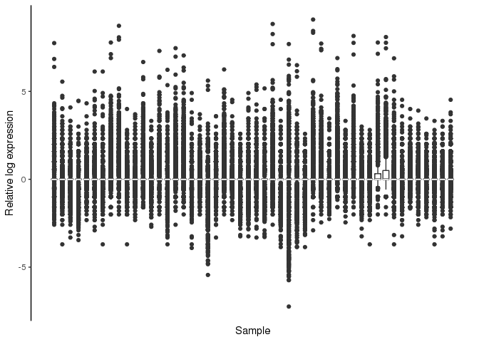
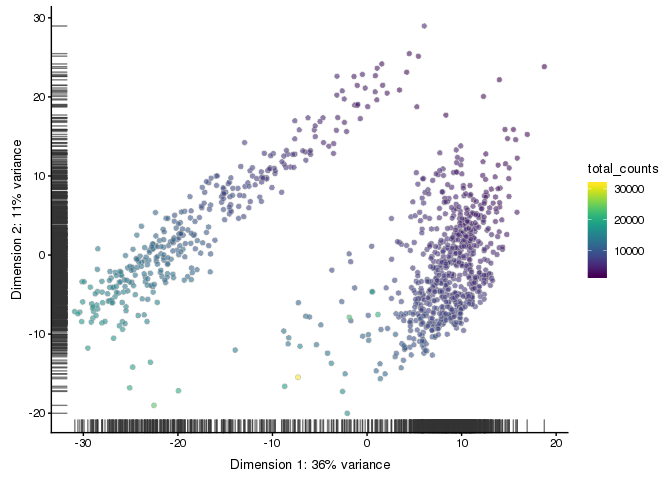
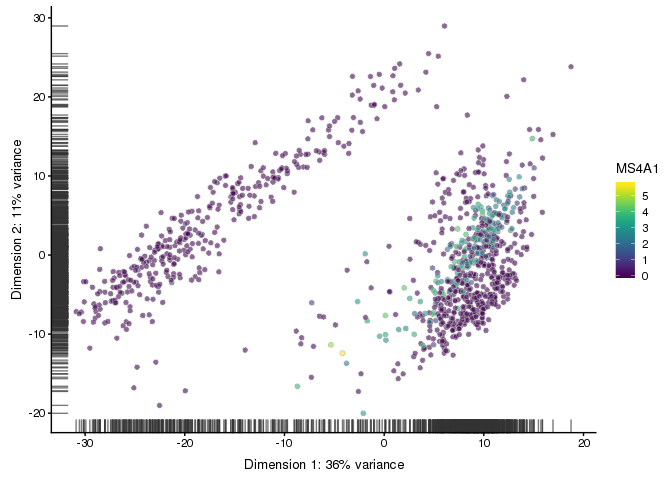
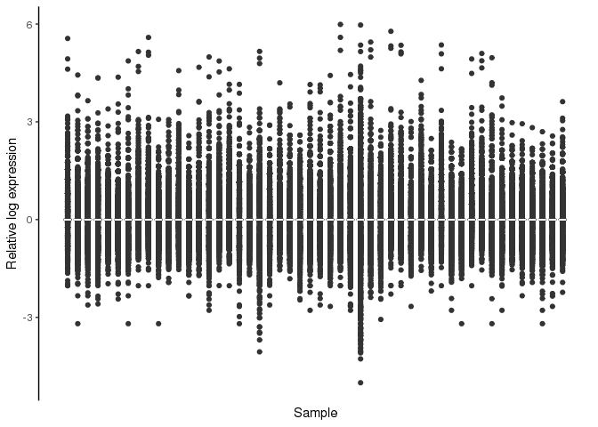
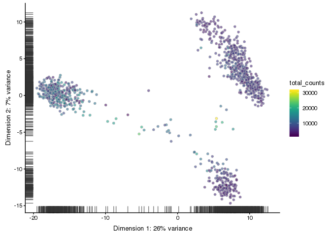
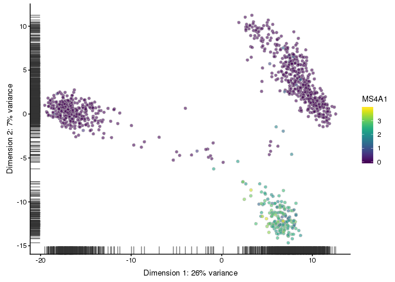
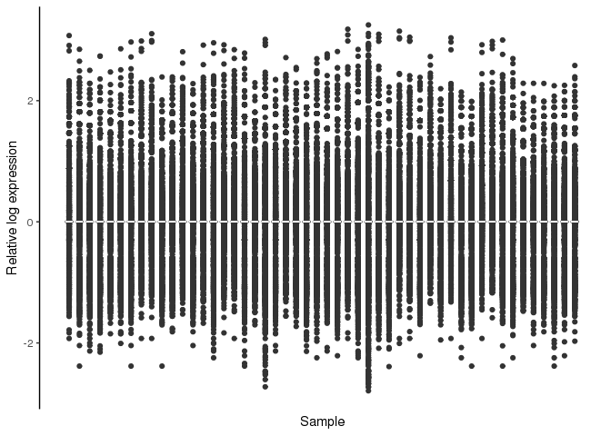
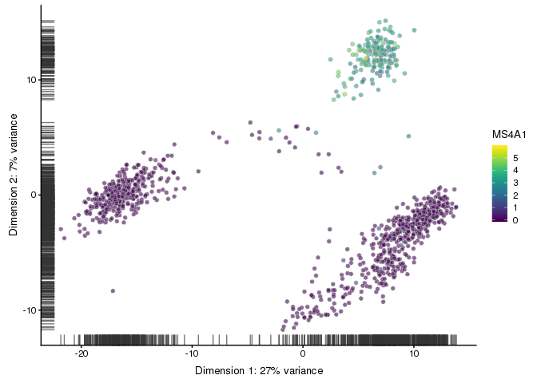
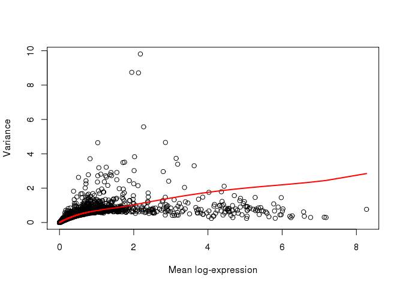
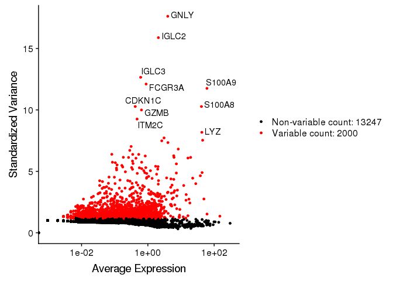

Elixir scRNA-seq course Finland 2019: Normalization and selection of variable genes
================
Heli Pessa
27 May 2019

In this exercise session, we normalize the data and select highly variable genes comparing two analysis packages, scran and Seurat. We use also the scater package for visualization.

``` r
knitr::opts_chunk$set(echo = TRUE)
library(scater)
```

    ## Loading required package: SingleCellExperiment

    ## Loading required package: SummarizedExperiment

    ## Loading required package: GenomicRanges

    ## Loading required package: stats4

    ## Loading required package: BiocGenerics

    ## Loading required package: parallel

    ## 
    ## Attaching package: 'BiocGenerics'

    ## The following objects are masked from 'package:parallel':
    ## 
    ##     clusterApply, clusterApplyLB, clusterCall, clusterEvalQ,
    ##     clusterExport, clusterMap, parApply, parCapply, parLapply,
    ##     parLapplyLB, parRapply, parSapply, parSapplyLB

    ## The following objects are masked from 'package:stats':
    ## 
    ##     IQR, mad, sd, var, xtabs

    ## The following objects are masked from 'package:base':
    ## 
    ##     anyDuplicated, append, as.data.frame, basename, cbind,
    ##     colMeans, colnames, colSums, dirname, do.call, duplicated,
    ##     eval, evalq, Filter, Find, get, grep, grepl, intersect,
    ##     is.unsorted, lapply, lengths, Map, mapply, match, mget, order,
    ##     paste, pmax, pmax.int, pmin, pmin.int, Position, rank, rbind,
    ##     Reduce, rowMeans, rownames, rowSums, sapply, setdiff, sort,
    ##     table, tapply, union, unique, unsplit, which, which.max,
    ##     which.min

    ## Loading required package: S4Vectors

    ## 
    ## Attaching package: 'S4Vectors'

    ## The following object is masked from 'package:base':
    ## 
    ##     expand.grid

    ## Loading required package: IRanges

    ## Loading required package: GenomeInfoDb

    ## Loading required package: Biobase

    ## Welcome to Bioconductor
    ## 
    ##     Vignettes contain introductory material; view with
    ##     'browseVignettes()'. To cite Bioconductor, see
    ##     'citation("Biobase")', and for packages 'citation("pkgname")'.

    ## Loading required package: DelayedArray

    ## Loading required package: matrixStats

    ## 
    ## Attaching package: 'matrixStats'

    ## The following objects are masked from 'package:Biobase':
    ## 
    ##     anyMissing, rowMedians

    ## Loading required package: BiocParallel

    ## 
    ## Attaching package: 'DelayedArray'

    ## The following objects are masked from 'package:matrixStats':
    ## 
    ##     colMaxs, colMins, colRanges, rowMaxs, rowMins, rowRanges

    ## The following objects are masked from 'package:base':
    ## 
    ##     aperm, apply

    ## Loading required package: ggplot2

    ## 
    ## Attaching package: 'scater'

    ## The following object is masked from 'package:S4Vectors':
    ## 
    ##     rename

    ## The following object is masked from 'package:stats':
    ## 
    ##     filter

``` r
library(scran)
library(Seurat)
options(stringsAsFactors = FALSE)
set.seed(32546)
```

The data can be downloaded with the following command, but it is already included in the course repository. This is one of the 10X datasets used also in the QC session.

``` r
system("curl -O http://cf.10xgenomics.com/samples/cell-exp/3.0.0/pbmc_1k_v3/pbmc_1k_v3_filtered_feature_bc_matrix.h5")
```

Read in the data and set up the SingleCellExperiment object.

``` r
# setwd("~/scrna-seq2019/day1/2-normalization/")
pbmc.mat <- Read10X_h5("pbmc_1k_v3_filtered_feature_bc_matrix.h5")
pbmc.sce <- SingleCellExperiment(assays = list(counts = as.matrix(pbmc.mat)))
pbmc.sce <- pbmc.sce[rowSums(counts(pbmc.sce) > 0) > 2,]
isSpike(pbmc.sce, "MT") <- grepl("^MT-", rownames(pbmc.sce))
pbmc.sce <- calculateQCMetrics(pbmc.sce)
colnames(colData(pbmc.sce))
```

    ##  [1] "is_cell_control"                               
    ##  [2] "total_features_by_counts"                      
    ##  [3] "log10_total_features_by_counts"                
    ##  [4] "total_counts"                                  
    ##  [5] "log10_total_counts"                            
    ##  [6] "pct_counts_in_top_50_features"                 
    ##  [7] "pct_counts_in_top_100_features"                
    ##  [8] "pct_counts_in_top_200_features"                
    ##  [9] "pct_counts_in_top_500_features"                
    ## [10] "total_features_by_counts_endogenous"           
    ## [11] "log10_total_features_by_counts_endogenous"     
    ## [12] "total_counts_endogenous"                       
    ## [13] "log10_total_counts_endogenous"                 
    ## [14] "pct_counts_endogenous"                         
    ## [15] "pct_counts_in_top_50_features_endogenous"      
    ## [16] "pct_counts_in_top_100_features_endogenous"     
    ## [17] "pct_counts_in_top_200_features_endogenous"     
    ## [18] "pct_counts_in_top_500_features_endogenous"     
    ## [19] "total_features_by_counts_feature_control"      
    ## [20] "log10_total_features_by_counts_feature_control"
    ## [21] "total_counts_feature_control"                  
    ## [22] "log10_total_counts_feature_control"            
    ## [23] "pct_counts_feature_control"                    
    ## [24] "pct_counts_in_top_50_features_feature_control" 
    ## [25] "pct_counts_in_top_100_features_feature_control"
    ## [26] "pct_counts_in_top_200_features_feature_control"
    ## [27] "pct_counts_in_top_500_features_feature_control"
    ## [28] "total_features_by_counts_MT"                   
    ## [29] "log10_total_features_by_counts_MT"             
    ## [30] "total_counts_MT"                               
    ## [31] "log10_total_counts_MT"                         
    ## [32] "pct_counts_MT"                                 
    ## [33] "pct_counts_in_top_50_features_MT"              
    ## [34] "pct_counts_in_top_100_features_MT"             
    ## [35] "pct_counts_in_top_200_features_MT"             
    ## [36] "pct_counts_in_top_500_features_MT"

Filter out poor quality cells to avoid negative size factors.

``` r
pbmc.sce <- filter(pbmc.sce, pct_counts_MT < 20)
pbmc.sce <- filter(pbmc.sce, 
                   total_features_by_counts > 1000 & 
                     total_features_by_counts < 4100)
```

Create a new assay with unnormalized counts for comparison to post-normalization.

``` r
assay(pbmc.sce, "logcounts_raw") <- log2(counts(pbmc.sce) + 1)
plotRLE(pbmc.sce[,1:50], exprs_values = "logcounts_raw", style = "full")
```



Run PCA and save the result in a new object, as we will overwrite the PCA slot later.

``` r
raw.sce <- runPCA(pbmc.sce, exprs_values = "logcounts_raw")
scater::plotPCA(raw.sce, colour_by = "total_counts")
```

    ## Warning: 'add_ticks' is deprecated.
    ## Use '+ geom_rug(...)' instead.



Plot the expression of the B cell marker MS4A1.

``` r
plotReducedDim(raw.sce, use_dimred = "PCA", by_exprs_values = "logcounts_raw",
               colour_by = "MS4A1")
```

    ## Warning: 'add_ticks' is deprecated.
    ## Use '+ geom_rug(...)' instead.



What do the above plots tell you?

### Normalization: Log

In the default normalization method in Seurat, counts for each cell are divided by the total counts for that cell and multiplied by the scale factor 10 000. This is then log transformed.

Here we use the filtered data from the counts slot of the SCE object to create a Seurat object. After normalization, we convert the result back into a SingleCellExperiment object for comparing plots.

``` r
pbmc.seu <- CreateSeuratObject(counts(pbmc.sce), project = "PBMC")
pbmc.seu <- NormalizeData(pbmc.seu)
pbmc.seu.sce <- as.SingleCellExperiment(pbmc.seu)
pbmc.seu.sce <- calculateQCMetrics(pbmc.seu.sce)
```

Perform PCA and examine the normalization results with plotRLE and plotReducedDim. This time, use "logcounts" as the expression values to plot (or omit the parameter, as "logcounts" is the default value). Check some marker genes, for example GNLY (NK cells) or LYZ (monocytes).

``` r
plotRLE(pbmc.seu.sce[,1:50], style = "full")
```



``` r
pbmc.seu.sce <- runPCA(pbmc.seu.sce)
scater::plotPCA(pbmc.seu.sce, colour_by = "total_counts")
```

    ## Warning: 'add_ticks' is deprecated.
    ## Use '+ geom_rug(...)' instead.



``` r
plotReducedDim(pbmc.seu.sce, use_dimred = "PCA", colour_by = "MS4A1")
```

    ## Warning: 'add_ticks' is deprecated.
    ## Use '+ geom_rug(...)' instead.



### Normalization: scran

The normalization procedure in scran is based on the deconvolution method by Lun et al (2016). Counts from many cells are pooled to avoid the drop-out problem. Pool-based size factors are then “deconvolved” into cell-based factors for cell-specific normalization. Clustering cells prior to normalization is not always necessary but it improves normalization accuracy by reducing the number of DE genes between cells in the same cluster.

``` r
qclust <- quickCluster(pbmc.sce)
pbmc.sce <- computeSumFactors(pbmc.sce, clusters = qclust)
summary(sizeFactors(pbmc.sce))
```

    ##    Min. 1st Qu.  Median    Mean 3rd Qu.    Max. 
    ##  0.1836  0.6380  0.8207  1.0000  1.2021  2.7399

``` r
pbmc.sce <- normalize(pbmc.sce)
```

    ## Warning in .get_all_sf_sets(object): spike-in set 'MT' should have its own
    ## size factors

Examine the results and compare to the log-normalized result. Are they different?

``` r
plotRLE(pbmc.sce[,1:50], exprs_values = "logcounts", exprs_logged = FALSE, 
        style = "full")
```



``` r
pbmc.sce <- runPCA(pbmc.sce)
scater::plotPCA(pbmc.sce, colour_by = "total_counts")
```

    ## Warning: 'add_ticks' is deprecated.
    ## Use '+ geom_rug(...)' instead.


``` r
plotReducedDim(pbmc.sce, use_dimred = "PCA", colour_by = "MS4A1")
```

    ## Warning: 'add_ticks' is deprecated.
    ## Use '+ geom_rug(...)' instead.



### Feature selection: scran

In the scran method for finding HVGs, a trend is first fitted to the technical variances. In the absence of spike-ins, this is done using the whole data, assuming that the majority of genes are not variably expressed. Then, the biological component of the variance for each endogenous gene is computed by subtracting the fitted value of the trend from the total variance.

``` r
fit <- trendVar(pbmc.sce, use.spikes = NA)
decomp <- decomposeVar(pbmc.sce, fit)
top.hvgs <- order(decomp$bio, decreasing = TRUE)
head(decomp[top.hvgs,])
```

    ## DataFrame with 6 rows and 6 columns
    ##                     mean            total              bio
    ##                <numeric>        <numeric>        <numeric>
    ## S100A9   2.1798394106162 9.81200838511402 8.70848113171717
    ## S100A8  1.94717610389369 8.74191022471459 7.73278930922898
    ## LYZ     2.12848173541277 8.71130204756805 7.62859300817667
    ## HLA-DRA 2.26709495525931 5.56946701594201 4.43065009839707
    ## IGKC    1.03117091153778 4.64610433899492 3.94960628330731
    ## CD74    2.85525470083599 4.66046377538451 3.29006358386426
    ##                     tech               p.value                   FDR
    ##                <numeric>             <numeric>             <numeric>
    ## S100A9  1.10352725339686                     0                     0
    ## S100A8  1.00912091548561                     0                     0
    ## LYZ     1.08270903939138                     0                     0
    ## HLA-DRA 1.13881691754493                     0                     0
    ## IGKC    0.69649805568761                     0                     0
    ## CD74    1.37040019152025 6.00496990101363e-272 3.15447280938074e-269

``` r
plot(decomp$mean, decomp$total, xlab = "Mean log-expression", ylab = "Variance")
o <- order(decomp$mean)
lines(decomp$mean[o], decomp$tech[o], col = "red", lwd = 2)
```



We choose genes that have a biological component that is significantly greater than zero, using a false discovery rate (FDR) of 5%.

``` r
hvg.out <- decomp[which(decomp$FDR <= 0.05),]
hvg.out <- hvg.out[order(hvg.out$bio, decreasing=TRUE),]
plotExpression(pbmc.sce, features = rownames(hvg.out)[1:10])
```


### Feature selection: Seurat

The default method in Seurat 3 is variance-stabilizing transformation. A trend is fitted to to predict the variance of each gene as a function of its mean. For each gene, the variance of standardized values is computed across all cells and used to rank the features. By default, 2000 top genes are returned.

``` r
pbmc.seu <- FindVariableFeatures(pbmc.seu, selection.method = "vst")
top10 <- head(VariableFeatures(pbmc.seu), 10)
vplot <- VariableFeaturePlot(pbmc.seu)
LabelPoints(plot = vplot, points = top10, repel = TRUE)
```

    ## When using repel, set xnudge and ynudge to 0 for optimal results

    ## Warning: Transformation introduced infinite values in continuous x-axis



How many of the variable genes detected with scran are included in VariableFeatures in Seurat?

``` r
table(rownames(hvg.out) %in% VariableFeatures(pbmc.seu))
```

    ## 
    ## FALSE  TRUE 
    ##  1973  1119

``` r
sessionInfo()
```

    ## R version 3.5.1 (2018-07-02)
    ## Platform: x86_64-pc-linux-gnu (64-bit)
    ## Running under: CentOS release 6.10 (Final)
    ## 
    ## Matrix products: default
    ## BLAS/LAPACK: /homeappl/appl_taito/opt/mkl/11.3.0/compilers_and_libraries_2016.0.109/linux/mkl/lib/intel64_lin/libmkl_gf_lp64.so
    ## 
    ## locale:
    ##  [1] LC_CTYPE=en_US.UTF-8       LC_NUMERIC=C              
    ##  [3] LC_TIME=en_US.UTF-8        LC_COLLATE=en_US.UTF-8    
    ##  [5] LC_MONETARY=en_US.UTF-8    LC_MESSAGES=en_US.UTF-8   
    ##  [7] LC_PAPER=en_US.UTF-8       LC_NAME=C                 
    ##  [9] LC_ADDRESS=C               LC_TELEPHONE=C            
    ## [11] LC_MEASUREMENT=en_US.UTF-8 LC_IDENTIFICATION=C       
    ## 
    ## attached base packages:
    ## [1] parallel  stats4    stats     graphics  grDevices utils     datasets 
    ## [8] methods   base     
    ## 
    ## other attached packages:
    ##  [1] Seurat_3.0.0                scran_1.10.2               
    ##  [3] scater_1.10.1               ggplot2_3.1.1              
    ##  [5] SingleCellExperiment_1.4.1  SummarizedExperiment_1.12.0
    ##  [7] DelayedArray_0.8.0          BiocParallel_1.16.5        
    ##  [9] matrixStats_0.54.0          Biobase_2.42.0             
    ## [11] GenomicRanges_1.34.0        GenomeInfoDb_1.18.1        
    ## [13] IRanges_2.16.0              S4Vectors_0.20.1           
    ## [15] BiocGenerics_0.28.0        
    ## 
    ## loaded via a namespace (and not attached):
    ##   [1] Rtsne_0.15               ggbeeswarm_0.6.0        
    ##   [3] colorspace_1.4-0         ggridges_0.5.1          
    ##   [5] dynamicTreeCut_1.63-1    XVector_0.22.0          
    ##   [7] BiocNeighbors_1.0.0      listenv_0.7.0           
    ##   [9] npsurv_0.4-0             bit64_0.9-7             
    ##  [11] ggrepel_0.8.0            codetools_0.2-16        
    ##  [13] splines_3.5.1            R.methodsS3_1.7.1       
    ##  [15] lsei_1.2-0               knitr_1.22              
    ##  [17] jsonlite_1.6             ica_1.0-2               
    ##  [19] cluster_2.0.7-1          png_0.1-7               
    ##  [21] R.oo_1.22.0              sctransform_0.2.0       
    ##  [23] HDF5Array_1.10.1         httr_1.4.0              
    ##  [25] compiler_3.5.1           assertthat_0.2.1        
    ##  [27] Matrix_1.2-17            lazyeval_0.2.1          
    ##  [29] limma_3.38.3             htmltools_0.3.6         
    ##  [31] tools_3.5.1              rsvd_1.0.0              
    ##  [33] igraph_1.2.4.1           gtable_0.3.0            
    ##  [35] glue_1.3.1               GenomeInfoDbData_1.2.0  
    ##  [37] RANN_2.6.1               reshape2_1.4.3          
    ##  [39] dplyr_0.8.0.1            Rcpp_1.0.1              
    ##  [41] gdata_2.18.0             ape_5.3                 
    ##  [43] nlme_3.1-137             DelayedMatrixStats_1.4.0
    ##  [45] gbRd_0.4-11              lmtest_0.9-36           
    ##  [47] xfun_0.6                 stringr_1.4.0           
    ##  [49] globals_0.12.4           irlba_2.3.3             
    ##  [51] gtools_3.8.1             statmod_1.4.30          
    ##  [53] future_1.12.0            edgeR_3.24.3            
    ##  [55] zlibbioc_1.28.0          MASS_7.3-51.1           
    ##  [57] zoo_1.8-4                scales_1.0.0            
    ##  [59] rhdf5_2.26.2             RColorBrewer_1.1-2      
    ##  [61] yaml_2.2.0               reticulate_1.12         
    ##  [63] pbapply_1.4-0            gridExtra_2.3           
    ##  [65] stringi_1.2.4            caTools_1.17.1.2        
    ##  [67] bibtex_0.4.2             Rdpack_0.11-0           
    ##  [69] SDMTools_1.1-221.1       rlang_0.3.1             
    ##  [71] pkgconfig_2.0.2          bitops_1.0-6            
    ##  [73] evaluate_0.12            lattice_0.20-38         
    ##  [75] ROCR_1.0-7               purrr_0.3.2             
    ##  [77] Rhdf5lib_1.4.2           labeling_0.3            
    ##  [79] htmlwidgets_1.3          bit_1.1-14              
    ##  [81] cowplot_0.9.4            tidyselect_0.2.5        
    ##  [83] plyr_1.8.4               magrittr_1.5            
    ##  [85] R6_2.3.0                 gplots_3.0.1            
    ##  [87] pillar_1.3.1             withr_2.1.2             
    ##  [89] fitdistrplus_1.0-14      survival_2.43-3         
    ##  [91] RCurl_1.95-4.11          tsne_0.1-3              
    ##  [93] tibble_2.0.1             future.apply_1.2.0      
    ##  [95] hdf5r_1.2.0              crayon_1.3.4            
    ##  [97] KernSmooth_2.23-15       plotly_4.9.0            
    ##  [99] rmarkdown_1.11           viridis_0.5.1           
    ## [101] locfit_1.5-9.1           grid_3.5.1              
    ## [103] data.table_1.12.2        metap_1.1               
    ## [105] digest_0.6.18            tidyr_0.8.2             
    ## [107] R.utils_2.7.0            munsell_0.5.0           
    ## [109] beeswarm_0.2.3           viridisLite_0.3.0       
    ## [111] vipor_0.4.5
