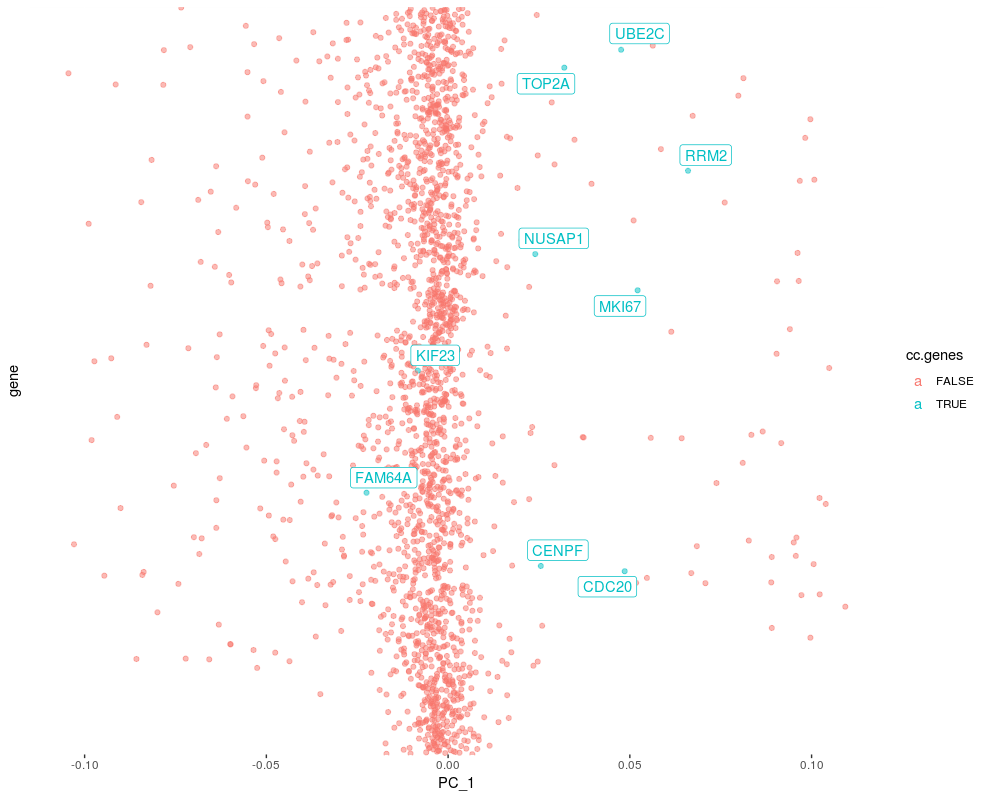
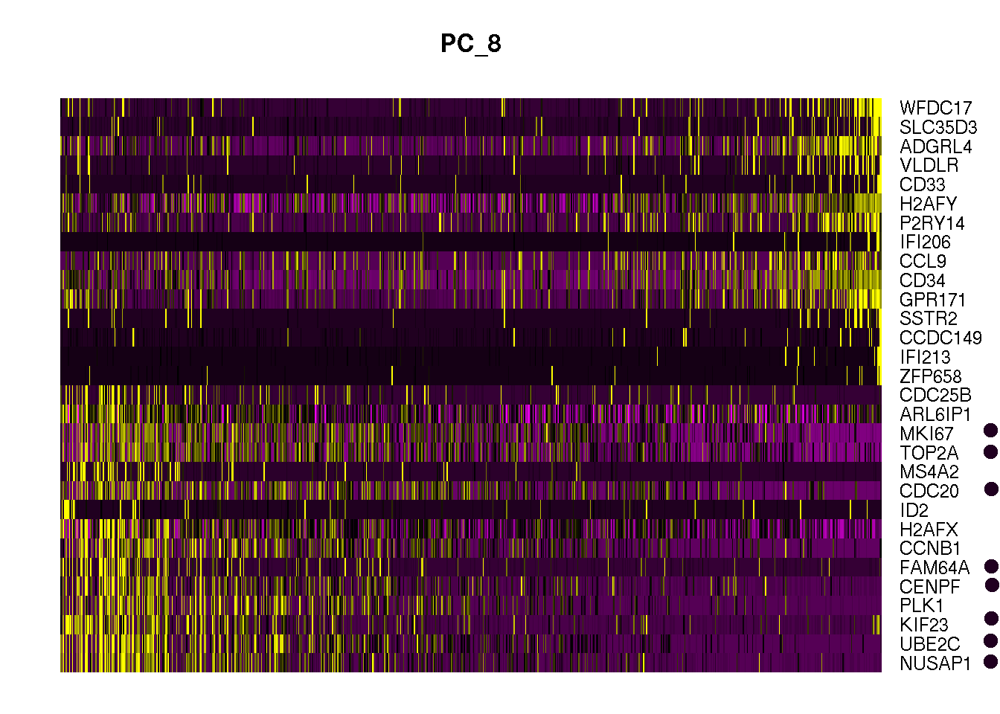
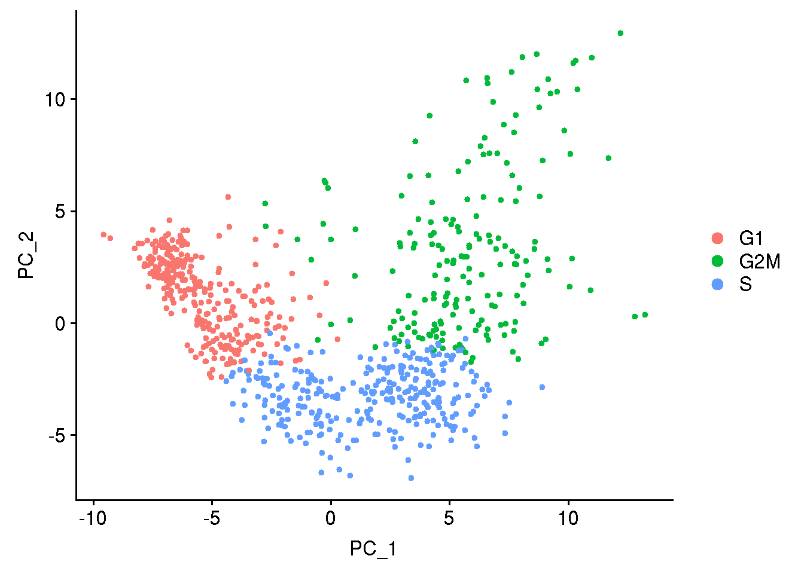
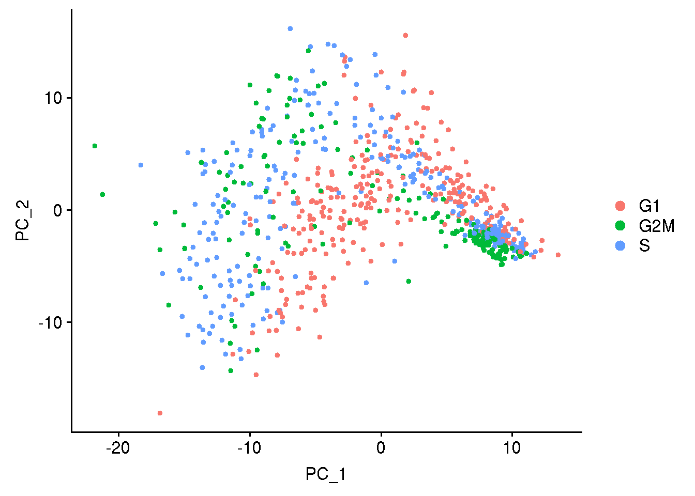
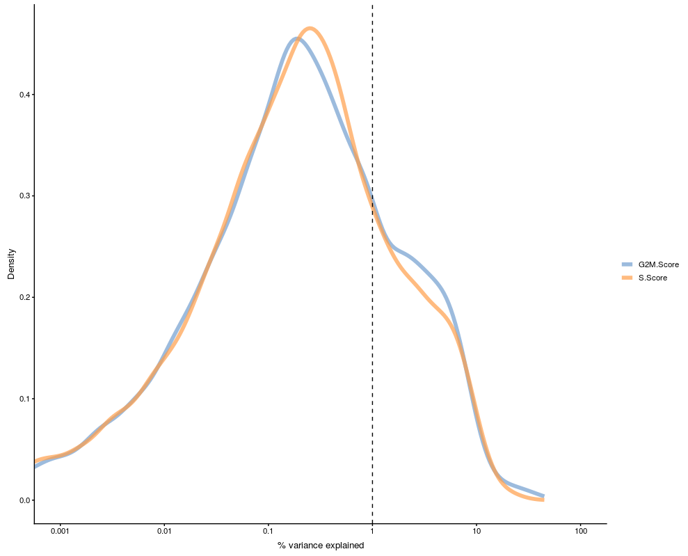

## Load the data

The data is from Seurat tutorial for cell cycle regression. The data is originally in dense matrix format, but it has been converted to sparse matrix similar to the one 10X pipeline generates. It saves a lot of disk space.

```r
suppressMessages( require(Seurat) )
suppressMessages( require(Matrix) )

## Read sparse matrix
data.mat <- Read10X("data/nestorawa")

## Create Seurat object
obj1 <- CreateSeuratObject(counts=data.mat)

```

## Preprocessing

The data has undergone filtering. Thus, we only need to normalize the data and find variable features.

```r
## Normalization
obj1 <- NormalizeData(obj1, verbose = FALSE)
obj1 <- FindVariableFeatures(obj1, 
                             selection.method = "vst",
                             verbose = FALSE)

```

## Scaling

The function `ScaleData` does centering and scaling of data. Furthermore, it regresses out variables if such variables are provided. At this point we do not regress out any variable to see how cell-cycle effect.

```r
obj1 <- ScaleData(obj1, features = rownames(obj1), verbose = FALSE) 

```

## PCA

Now we run PCA using variable features calculated above and check how cell-cycle genes are scored in PC. 

```r
## Run PCA using all variable features
obj1 <- RunPCA(obj1, features = VariableFeatures(obj1))

suppressMessages( require(ggrepel) )
suppressMessages( require(ggplot2) )

## get PCA loadings
lod <- as.data.frame( obj1@reductions$pca@feature.loadings )

## cc genes present in data
cc.genes.present <- rownames( lod[rownames(lod) %in% unlist(cc.genes),] )

## put rownames to gene column
lod$gene <- rownames(lod)
rownames(lod) <- c()

## TRUE if a CC marker in the column cc.gene
lod$cc.genes <- lod$gene %in% cc.genes.present
lod[which(lod$cc.genes == TRUE),'cc.genes.name'] <- lod[which(lod$cc.genes == TRUE),'gene']


## Plot a component to see cc gene score
ggplot(lod, aes(x=PC_1,y=gene, color=cc.genes, label=cc.genes.name) ) + 
  geom_point( alpha=0.5) +
  geom_label_repel()+
  theme(
        axis.text.y=element_blank(),
        axis.ticks.y=element_blank())
```
<!-- -->

## Importance of cell cycle genes in PCs

Genes having PC scores further away from 0, have higher variance. We could rank genes by PC scores in each PC and check ranks of cell cycle markers.

```r

## Take only 30 PCs
lod.rnk <- lod[,1:51]
rownames(lod.rnk) <- lod.rnk$gene
lod.rnk <- lod.rnk[,1:30]

## Check the rank of CC genes in each PCs
dir <- "pos"
apply(lod.rnk, 2, FUN=function(x){
  
  if(dir == "pos"){
    pos <- x[x>=0]
    pos <- pos[order(pos, decreasing = TRUE)]
    which( names(pos) %in% cc.genes.present )
  }else{
    neg <- x[x<0]
    neg <- neg[order(neg)]
    which( names(neg) %in% cc.genes.present )
  }
  
})

```

## Heatmap

In the above output we can see PC8 has cell cycle markers in top 15 list. We can visualize the expression of top 30 genes of PC 8 to see cell cycle genes.

```r
DimHeatmap(obj1, dims = 8, nfeatures = 30)
```
<!-- -->

Lets do cell cycle scoring and look into PCA plot how the cells seperate based on cell cycle phase

```{r message=FALSE, warning=FALSE, paged.print=FALSE}

## cell cycle scoring
obj1 <- CellCycleScoring(obj1, s.features = cc.genes$s.genes, g2m.features = cc.genes$g2m.genes, set.ident = TRUE)

## Create ridge plot
RidgePlot(obj1, features = cc.genes.present, ncol = 3)

obj1 <- ScaleData(obj1, features = rownames(obj1), verbose = FALSE)

## run PCA using cell cycle genes as features
obj1 <- RunPCA(obj1, features = c(cc.genes$s.genes, cc.genes$g2m.genes), verbose = FALSE)

DimPlot(obj1)

```
<!-- -->

Now we regress out the effect coming from cell cycle. We give column name from metadata data frame of `obj1` object. If we want to regress out other variables it should be in the metadata data frame. 

```r

obj2 <- ScaleData(obj1, 
                  vars.to.regress = c("S.Score", "G2M.Score"), 
                  features = rownames(obj1)) 

## load saved object
# obj2 <- readRDS( file = "obj2.RDS" )

obj2 <- RunPCA(obj2, features = VariableFeatures(obj2), verbose=FALSE)

DimPlot(obj2)

```
<!-- -->


## Variance explained by a confounding factor

Using Scater package we can check the effect of confounding factors/variables. Scater calcualtes R-squared for a confounding factor/variable by fitting a line for each gene against the confounding factor/variable. R-squared is the propotion of variance for dependant variable explained by an independent variable.

```r

suppressMessages( require(SingleCellExperiment) )
suppressMessages( require(scater) )
sce <- SingleCellExperiment(assays = list(logcounts = as.matrix(obj1@assays$RNA@counts)), 
                            colData = obj1@meta.data)

#sce <- normalize(sce)
plotExplanatoryVariables(
    sce,
    variables = c("S.Score", "G2M.Score"))


```
<!-- -->

