Quality Control
================

Overview
========

Quality control of data for filtering cells using Seurat and Scater packages.
-----------------------------------------------------------------------------

In this tutorial we will look at different ways of doing filtering and cell and exploring variablility in the data.

The first part is using Seurat (<https://satijalab.org/seurat/>) for visualizing QC-measures and filtering cells. However, we will not go into depth in how to use the Seurat package as this will be covered in other tutorials.

The second part will explore the scater package (<https://bioconductor.org/packages/release/bioc/html/scater.html>) in some more detail. Looking at different ways of visualizing QC-stats and exploring variation in the data.

Dataset
-------

For this tutorial we will use 3 different PBMC datasets from the 10x Genomics website (<https://support.10xgenomics.com/single-cell-gene-expression/datasets>).

-   1k PBMCs using 10x v2 chemistry
-   1k PBMCs using 10x v3 chemistry
-   1k PBMCs using 10x v3 chemistry in combination with cell surface proteins, but disregarding the protein data and only looking at gene expression.

The datsets can be downloaded with these commands:

    curl -O http://cf.10xgenomics.com/samples/cell-exp/3.0.0/pbmc_1k_v2/pbmc_1k_v2_filtered_feature_bc_matrix.h5
    curl -O http://cf.10xgenomics.com/samples/cell-exp/3.0.0/pbmc_1k_v3/pbmc_1k_v3_filtered_feature_bc_matrix.h5
    curl -O http://cf.10xgenomics.com/samples/cell-exp/3.0.0/pbmc_1k_protein_v3/pbmc_1k_protein_v3_filtered_feature_bc_matrix.h5

Load required packages:

``` r
suppressMessages(require(Seurat))
suppressMessages(require(scater))
suppressMessages(require(Matrix))
```

Read data
---------

Here, we use the function Read10X\_h5 to read in the expression matrices.

``` r
v3.1k <- Read10X_h5("data/pbmc_1k_v3_filtered_feature_bc_matrix.h5", use.names = T)
v2.1k <- Read10X_h5("data/pbmc_1k_v2_filtered_feature_bc_matrix.h5", use.names = T)
p3.1k <- Read10X_h5("data/pbmc_1k_protein_v3_filtered_feature_bc_matrix.h5", use.names = T)
```

    ## Genome matrix has multiple modalities, returning a list of matrices for this genome

``` r
# select only gene expression data
p3.1k <- p3.1k$`Gene Expression`
```

Seurat
======

Create Seurat object
--------------------

First, create Seurat objects for each of the datasets, and then merge into one large seurat object.

``` r
sdata.v2.1k <- CreateSeuratObject(v2.1k, project = "v2.1k")
sdata.v3.1k <- CreateSeuratObject(v3.1k, project = "v3.1k")
sdata.p3.1k <- CreateSeuratObject(p3.1k, project = "p3.1k")

# merge into one single seurat object. Add cell ids just in case you have overlapping barcodes between the datasets.
alldata <- merge(sdata.v2.1k, c(sdata.v3.1k,sdata.p3.1k), add.cell.ids=c("v2.1k","v3.1k","p3.1k"))

# also add in a metadata column that indicates v2 vs v3 chemistry
chemistry <- rep("v3",ncol(alldata))
chemistry[Idents(alldata) == "v2.1k"] <- "v2"
alldata <- AddMetaData(alldata, chemistry, col.name = "Chemistry")
alldata
```

    ## An object of class Seurat 
    ## 33538 features across 2931 samples within 1 assay 
    ## Active assay: RNA (33538 features)

``` r
# check number of cells from each sample, is stored in the orig.ident slot of metadata and is autmatically set as active ident.
table(Idents(alldata))
```

    ## 
    ## p3.1k v2.1k v3.1k 
    ##   713   996  1222

### Calculate mitochondrial proportion

Seurat automatically calculates some QC-stats, like number of UMIs and features per cell. Stored in columns nCount\_RNA & nFeature\_RNA of the metadata.

We will manually calculate the proportion of mitochondrial reads and add to the metadata slot.

``` r
mt.genes <- rownames(alldata)[grep("^MT-",rownames(alldata))]
C<-GetAssayData(object = alldata, slot = "counts")

percent.mito <- colSums(C[mt.genes,])/colSums(C)*100
alldata <- AddMetaData(alldata, percent.mito, col.name = "percent.mito")
```

### Calculate ribosomal proportion

In the same manner we will calculate the proportion gene expression that comes from ribosomal proteins. NOTE - add text on why!

``` r
rb.genes <- rownames(alldata)[grep("^RP[SL]",rownames(alldata))]
percent.ribo <- colSums(C[rb.genes,])/colSums(C)*100
alldata <- AddMetaData(alldata, percent.ribo, col.name = "percent.ribo")
```

Plot QC
-------

Now we can plot some of the QC-features as violin plots

``` r
VlnPlot(alldata, features = "nFeature_RNA", pt.size = 0.1) + NoLegend()
```

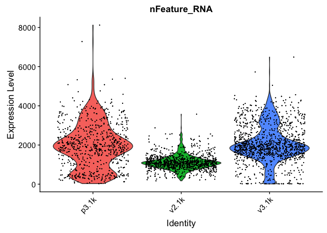

``` r
VlnPlot(alldata, features = "nCount_RNA", pt.size = 0.1) + NoLegend()
```

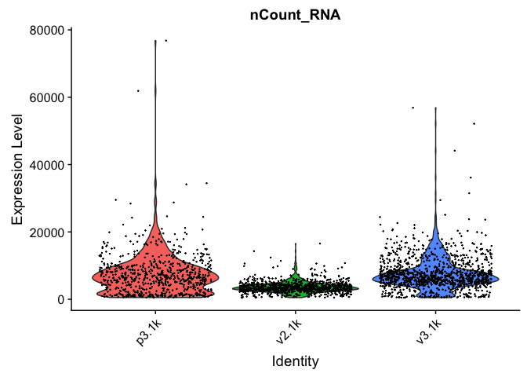

``` r
VlnPlot(alldata, features = "percent.mito", pt.size = 0.1) + NoLegend()
```

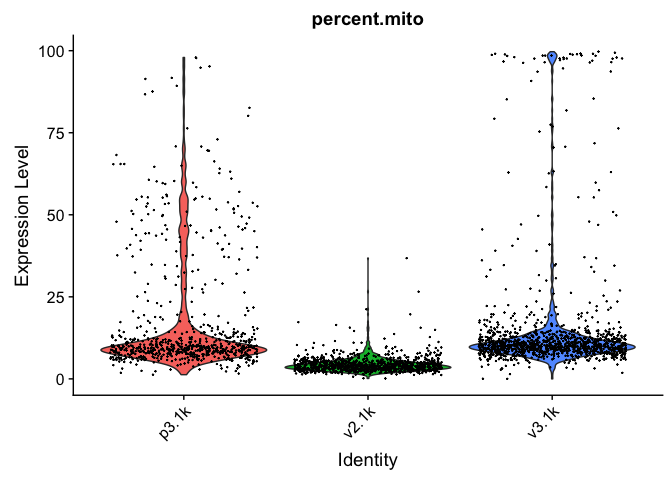

``` r
VlnPlot(alldata, features = "percent.ribo", pt.size = 0.1) + NoLegend()
```

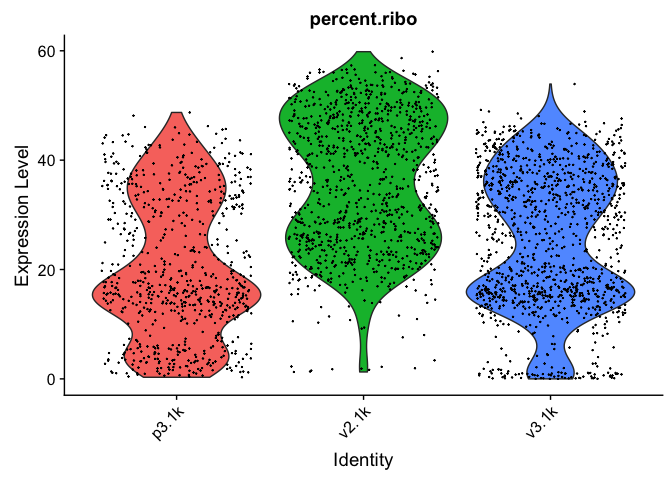

And we can plot the different QC-measures as scatter plots

``` r
FeatureScatter(alldata, feature1 = "nCount_RNA", feature2 = "nFeature_RNA")
```

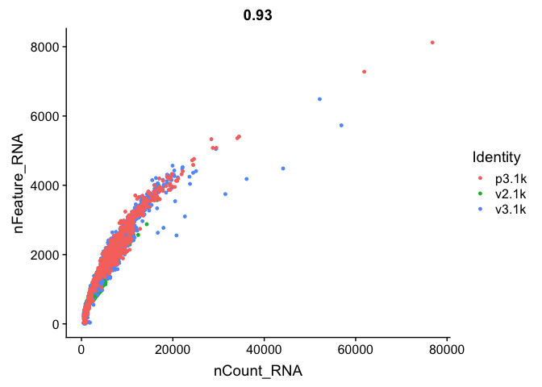

``` r
FeatureScatter(alldata, feature1 = "nFeature_RNA", feature2 = "percent.mito")
```

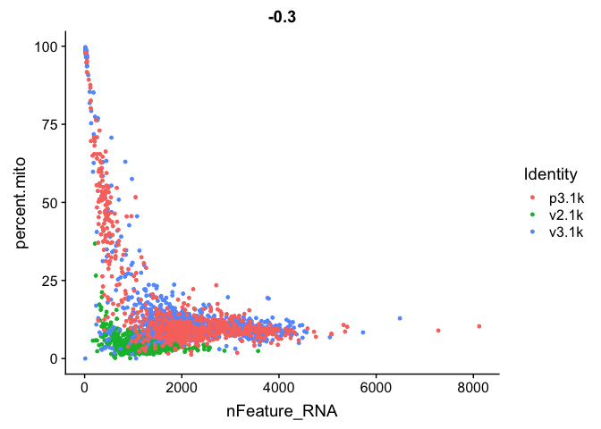

``` r
FeatureScatter(alldata, feature1="percent.ribo", feature2="nFeature_RNA")
```

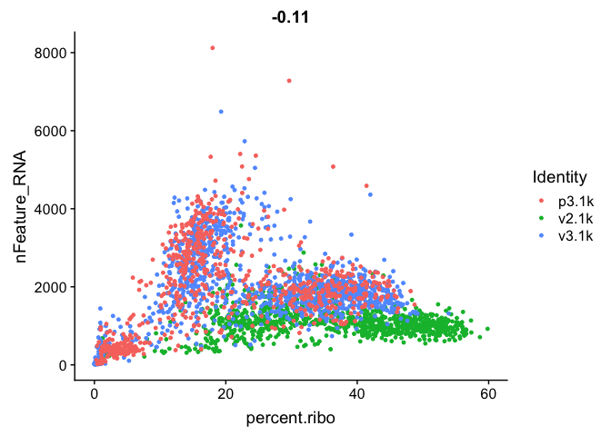

We can also subset the data to only plot one sample.

``` r
FeatureScatter(alldata, feature1 = "nCount_RNA", feature2 = "nFeature_RNA", cells = WhichCells(alldata, expression = orig.ident == "v3.1k") )
```

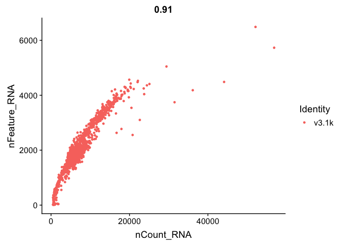

Filtering
---------

### Mitochondrial filtering

We have quite a lot of cells with high proportion of mitochondrial reads. It could be wise to remove those cells, if we have enough cells left after filtering. Another option would be to either remove all mitochondrial reads from the dataset and hope that the remaining genes still have enough biological signal. A third option would be to just regress out the percent.mito variable during scaling.

In this case we have as much as 99.7% mitochondrial reads in some of the cells, so it is quite unlikely that there is much celltype signature left in those.

Looking at the plots, make resonable decisions on where to draw the cutoff. In this case, the bulk of the cells are below 25% mitochondrial reads.

``` r
#select cells with percent.mito < 25
selected <- WhichCells(alldata, expression = percent.mito < 25)
length(selected)
```

    ## [1] 2703

``` r
# and subset the object to only keep those cells
data.filt <- subset(alldata, cells = selected)

# plot violins for new data
VlnPlot(data.filt, features = "percent.mito")
```

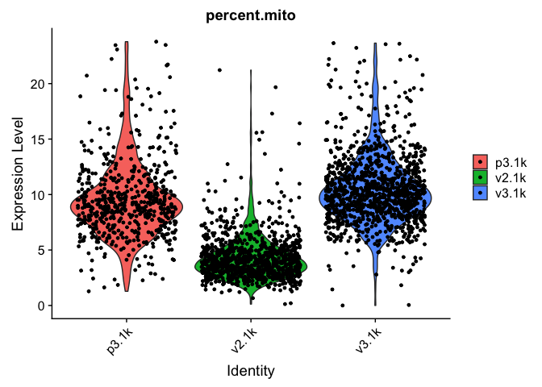

As you can see, there is still quite a lot of variation in percent mito, so it will have to be dealt with in the data analysis.

### Gene detection filtering

Extremely high number of detected genes could indicate doublets. However, depending on the celltype composition in your sample, you may have cells with higher number of genes (and also higher counts) from one celltype.

In these datasets, there is also a clear difference between the v2 vs v3 10x chemistry with regards to gene detection, so it may not be fair to apply the same cutoffs to all of them.

Also, in the protein assay data there is a lot of cells with few detected genes giving a bimodal distribution. This type of distribution is not seen in the other 2 datasets. Considering that they are all pbmc datasets it makes sense to regard this distribution as low quality libraries.

Filter the cells with high gene detection (putative doublets):

``` r
#start with cells with many genes detected.
high.det.v3 <- WhichCells(data.filt, expression = nFeature_RNA > 4100)
high.det.v2 <- WhichCells(data.filt, expression = nFeature_RNA > 2000 & orig.ident == "v2.1k")

# remove these cells
data.filt <- subset(data.filt, cells=setdiff(WhichCells(data.filt),c(high.det.v2,high.det.v3)))

# check number of cells
ncol(data.filt)
```

    ## [1] 2631

Filter the cells with low gene detection (low quality libraries):

``` r
#start with cells with many genes detected.
low.det.v3 <- WhichCells(data.filt, expression = nFeature_RNA < 1000 & orig.ident != "v2.1k")
low.det.v2 <- WhichCells(data.filt, expression = nFeature_RNA < 500 & orig.ident == "v2.1k")

# remove these cells
data.filt <- subset(data.filt, cells=setdiff(WhichCells(data.filt),c(low.det.v2,low.det.v3)))

# check number of cells
ncol(data.filt)
```

    ## [1] 2531

### Plot QC-stats again

Lets plot the same qc-stats another time.

``` r
VlnPlot(data.filt, features = "nFeature_RNA", pt.size = 0.1) + NoLegend()
```

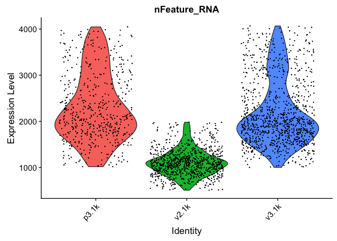

``` r
VlnPlot(data.filt, features = "nCount_RNA", pt.size = 0.1) + NoLegend()
```

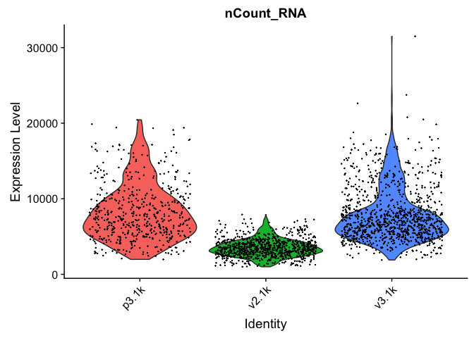

``` r
VlnPlot(data.filt, features = "percent.mito", pt.size = 0.1) + NoLegend()
```

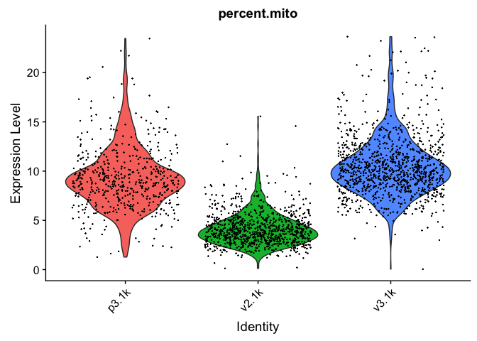

``` r
VlnPlot(data.filt, features = "percent.ribo", pt.size = 0.1) + NoLegend()
```

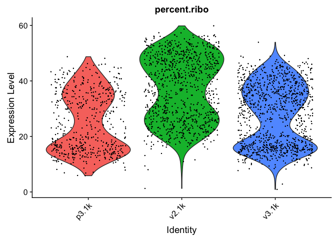

``` r
# and check the number of cells per sample before and after filtering
table(Idents(alldata))
```

    ## 
    ## p3.1k v2.1k v3.1k 
    ##   713   996  1222

``` r
table(Idents(data.filt))
```

    ## 
    ## p3.1k v2.1k v3.1k 
    ##   526   933  1072

Calculate cell-cycle scores
---------------------------

Seurat has a function for calculating cell cycle scores based on a list of know S-phase and G2/M-phase genes.

``` r
data.filt <- CellCycleScoring(
  object = data.filt,
  g2m.features = cc.genes$g2m.genes,
  s.features = cc.genes$s.genes
)

VlnPlot(data.filt, features = c("S.Score","G2M.Score"))
```

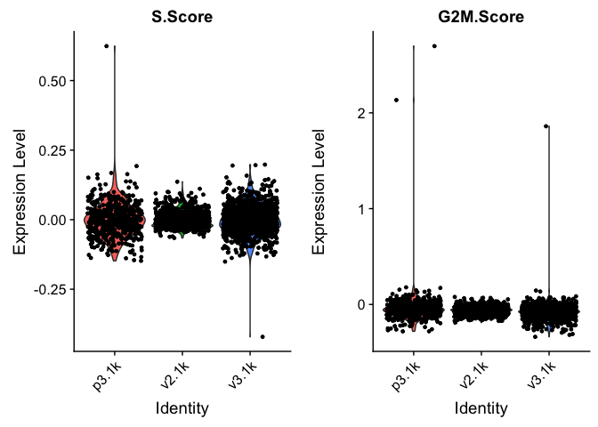

In this case it looks like we only have a few cycling cells in the datasets.

Scater
======

Very similar QC-plots and filtering of cells can be done with the scater package, but since we alredy filtered cells using Seurat we will now just use scater to explore technical bias in the data.

You can either create an SCE object directly from the count matrices, but in this case we can convert directly from Seurat to SCE.

``` r
sce <- as.SingleCellExperiment(data.filt)
```

We have accessor functions to access elements of the SingleCellExperiment object.

-   counts(object): returns the matrix of read counts. As you can see above, if no counts are defined for the object, then the counts matrix slot is simpy NULL.
-   exprs(object): returns the matrix of (log-counts) expression values, in fact accessing the logcounts slot of the object (synonym for logcounts).

For convenience (and backwards compatibility with SCESet) getters and setters are provided as follows: exprs, tpm, cpm, fpkm and versions of these with the prefix “norm\_”)

The SCE object also has slots for:

-   Cell metadata, which can be supplied as a DataFrame object, where rows are cells, and columns are cell attributes (such as cell type, culture condition, day captured, etc.).
-   Feature metadata, which can be supplied as a DataFrame object, where rows are features (e.g. genes), and columns are feature attributes, such as Ensembl ID, biotype, gc content, etc.

Calculate QC-metrics
--------------------

By default, the QC metrics are computed from the count data, but this can be changed through the exprs\_values argument. We can also include information on which genes are mitochondrial in the function call.

``` r
# calculate all qc-metrics
sce <- calculateQCMetrics(sce, feature_controls = list(mito = mt.genes))

# check what all entries are - 
colnames(colData(sce))
```

    ##  [1] "orig.ident"                                    
    ##  [2] "nCount_RNA"                                    
    ##  [3] "nFeature_RNA"                                  
    ##  [4] "Chemistry"                                     
    ##  [5] "percent.mito"                                  
    ##  [6] "percent.ribo"                                  
    ##  [7] "S.Score"                                       
    ##  [8] "G2M.Score"                                     
    ##  [9] "Phase"                                         
    ## [10] "ident"                                         
    ## [11] "is_cell_control"                               
    ## [12] "total_features_by_counts"                      
    ## [13] "log10_total_features_by_counts"                
    ## [14] "total_counts"                                  
    ## [15] "log10_total_counts"                            
    ## [16] "pct_counts_in_top_50_features"                 
    ## [17] "pct_counts_in_top_100_features"                
    ## [18] "pct_counts_in_top_200_features"                
    ## [19] "pct_counts_in_top_500_features"                
    ## [20] "total_features_by_counts_endogenous"           
    ## [21] "log10_total_features_by_counts_endogenous"     
    ## [22] "total_counts_endogenous"                       
    ## [23] "log10_total_counts_endogenous"                 
    ## [24] "pct_counts_endogenous"                         
    ## [25] "pct_counts_in_top_50_features_endogenous"      
    ## [26] "pct_counts_in_top_100_features_endogenous"     
    ## [27] "pct_counts_in_top_200_features_endogenous"     
    ## [28] "pct_counts_in_top_500_features_endogenous"     
    ## [29] "total_features_by_counts_feature_control"      
    ## [30] "log10_total_features_by_counts_feature_control"
    ## [31] "total_counts_feature_control"                  
    ## [32] "log10_total_counts_feature_control"            
    ## [33] "pct_counts_feature_control"                    
    ## [34] "pct_counts_in_top_50_features_feature_control" 
    ## [35] "pct_counts_in_top_100_features_feature_control"
    ## [36] "pct_counts_in_top_200_features_feature_control"
    ## [37] "pct_counts_in_top_500_features_feature_control"
    ## [38] "total_features_by_counts_mito"                 
    ## [39] "log10_total_features_by_counts_mito"           
    ## [40] "total_counts_mito"                             
    ## [41] "log10_total_counts_mito"                       
    ## [42] "pct_counts_mito"                               
    ## [43] "pct_counts_in_top_50_features_mito"            
    ## [44] "pct_counts_in_top_100_features_mito"           
    ## [45] "pct_counts_in_top_200_features_mito"           
    ## [46] "pct_counts_in_top_500_features_mito"

As you can see, scater calculates quite a few different QC-measures for the cells.

Scater also calculates some stats based on the genes:

``` r
colnames(rowData(sce))
```

    ## [1] "is_feature_control"      "is_feature_control_mito"
    ## [3] "mean_counts"             "log10_mean_counts"      
    ## [5] "n_cells_by_counts"       "pct_dropout_by_counts"  
    ## [7] "total_counts"            "log10_total_counts"

We will give examples on how to plot some of these.

### Most expressed features

Let's look at what the top 50 expressed genes are. This can be valuable for detecting genes that are overabundant that may be driving a lot of the variation.

``` r
plotHighestExprs(sce, exprs_values = "counts")
```

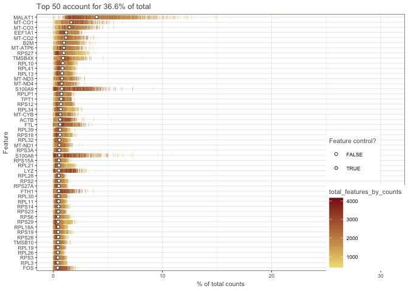

As you can see, MALAT1 corresponds to an average of around 4% of the counts. And in some cells as high as ~30% of the counts. I would consider removing that gene before further analysis and clustering. Also, the mitochondrial genes correspond to a high proportion of the total counts.

### Cumulative expression

Plot the relative proportion of the library size that is accounted for by the most highly expressed features for each cell (default 500 genes). This can help us look for differences in expression distributions between samples.

``` r
# plot each sample separately
plotScater(sce, block1 = "ident", nfeatures = 1000)
```

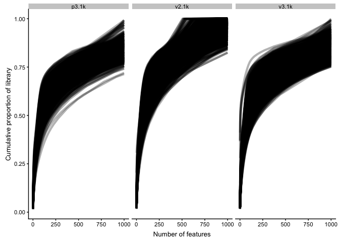

### Plot gene stats

The function plotRowData can plot any of the stats in rowData, for instance mean expressioni vs number of cells with detection.

``` r
plotRowData(sce, x = "n_cells_by_counts", y = "mean_counts")
```

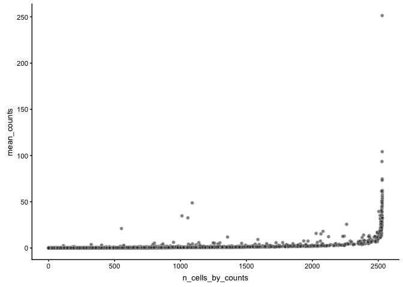

### Plot cell stats

In the same manner plotColData can plot any of the qc-measures for cells.

``` r
p1 <- plotColData(sce, x = "total_counts", 
    y = "total_features_by_counts", colour_by = "ident")
p2 <- plotColData(sce, x = "pct_counts_feature_control",
    y = "total_features_by_counts", colour_by = "ident")
p3 <- plotColData(sce, x = "pct_counts_feature_control",
    y = "pct_counts_in_top_50_features", colour_by = "ident")
multiplot(p1, p2, p3, cols = 2)
```

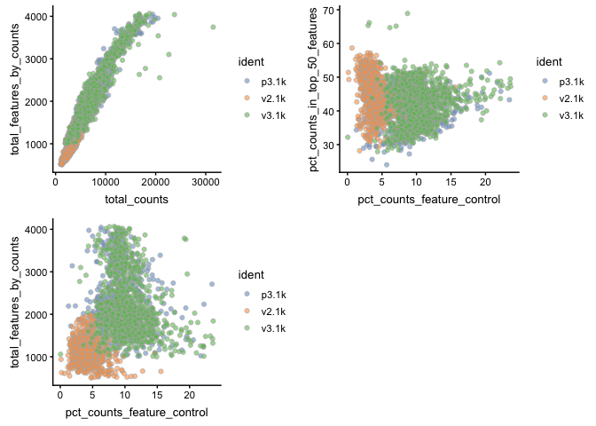

Identify outliers in QC-stats
-----------------------------

On method of identifying low quality cells is to run PCA on all the qc-stats and then identify outliers in PCA space.

``` r
sce <- runPCA(sce, use_coldata = TRUE,
    detect_outliers = TRUE)
```

    ## sROC 0.1-2 loaded

``` r
plotReducedDim(sce, use_dimred="PCA_coldata", colour_by = "ident")
```

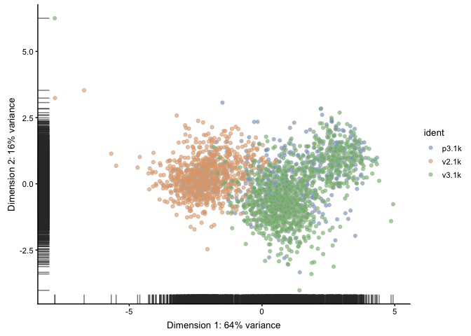

``` r
# check if we have any outliers
table(colData(sce)$outlier)
```

    ## 
    ## FALSE 
    ##  2531

In this case we already filtered out low quality cells and we do not detect any outliers in the QC PCA.

Dimensionality reduction
------------------------

Plot the cells in reduced space and define color/shape/size by different qc-metrics or meta-data entries.

It is adviced to first run functions like `runPCA`, `runTSNE` etc before hand so that they are stored in the SCE object, so that there is no need to rerun those functions each time that you are plotting.

The reduced dimensions can either be plotted with functions like `plotPCA`, `plotTSNE` etc. Or with the fucntion `plotReducedDim` and specifying `use_dimred = "pca"` or similar.

OBS! Before running any dimensionality reduction with a random component, remeber to set the seed so that you can reproduce the exact same

Also, some of these dimensionality reduction functions requires installation of additional R packages.

``` r
# run PCA with 1000 top variable genes
sce <- runPCA(sce, ntop = 1000, exprs_values = "logcounts", ncomponents = 20)

# PCA - with different coloring, first 4 components
# first by sample
plotPCA(sce,ncomponents=4,colour_by="ident")
```

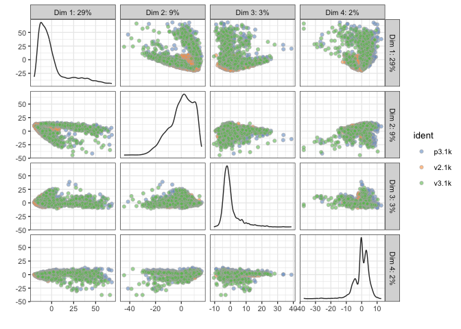

``` r
# then by Celltype
plotPCA(sce,ncomponents=4,colour_by="percent.mito")
```

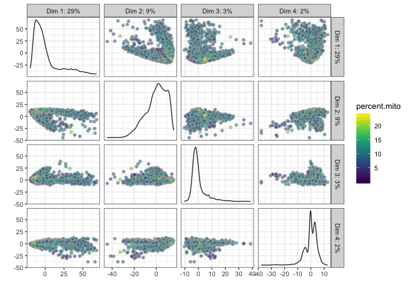

``` r
# Diffusion map, OBS! Requires installation of package destiny to run!
set.seed(1)
sce <- runDiffusionMap(sce, ntop = 1000, ncomponents = 4)
plotDiffusionMap(sce, colour_by="ident",ncomponents=4)
```

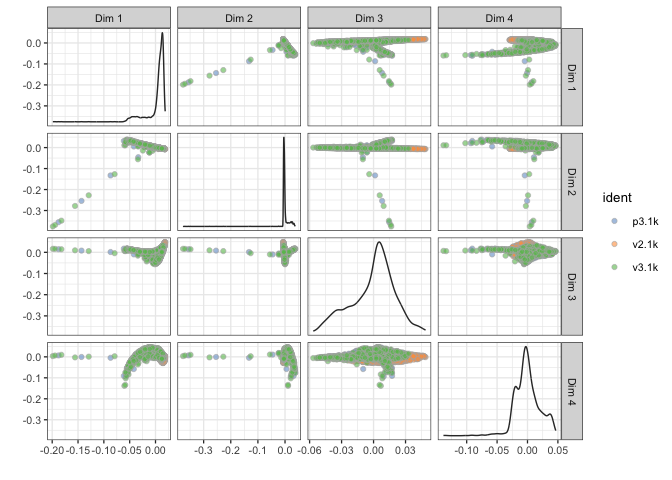

``` r
# tSNE - uses Rtsne function to run tsne, here run with first 10 PCs
set.seed(1)
sce <- runTSNE(sce, ntop = 1000, ncomponents = 2, perplexity = 30, n_dimred = 10)
plotTSNE(sce, colour_by="ident")
```

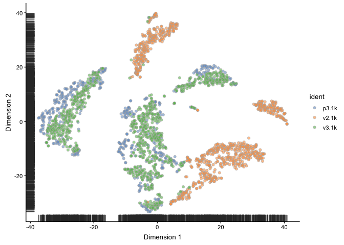

``` r
# UMAP, OBS! Requires installation of package umap to run!
set.seed(1)
sce <- runUMAP(sce)
plotUMAP(object = sce, colour_by="ident")
```

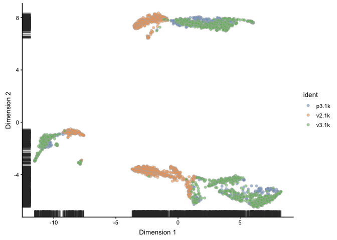

Explanatory factors
-------------------

We can check how much of different factors - like different metadata (e.g samples, timepoints, treatments etc.) or different QC-metrics,

We can investigate the relative importance of different explanatory factors with the plotExplanatoryVariables function. We compute the R2 for each factor in colData(sce) when fitting a linear model regressing expression values for each gene against that factor. This is best done on the log-expression values to reduce the effect of the mean on the variance - hence, we run normalize first.

By default top 10 factors are plotted, but here we select some specific factors.

OBS! This takes a while to calculate and plot.

``` r
plotExplanatoryVariables(sce, variables =  c("ident","Chemistry","pct_counts_mito", "total_features_by_counts", "pct_counts_in_top_50_features", "pct_counts_in_top_500_features", "total_counts", "S.Score","G2M.Score"))
```

    ## Warning: Removed 126585 rows containing non-finite values (stat_density).

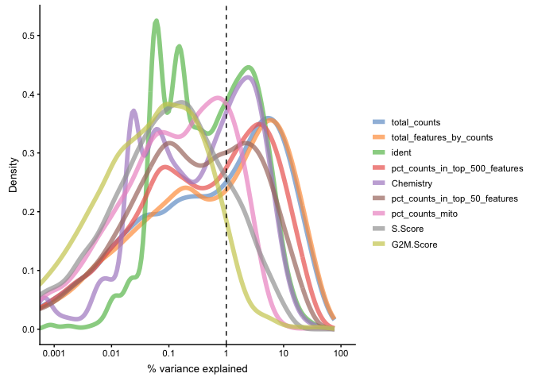

Each line corresponds to one factor and represents the distribution of R2 values across all genes.

Identify PCs that correlate strongly to certain QC or Meta-data values. By default top 10 factors are plotted, but here we select some specific factors.

``` r
# for total_features
plotExplanatoryPCs(sce, variables = c("ident", "Chemistry","pct_counts_mito", "total_features_by_counts", "pct_counts_in_top_50_features", "total_counts","S.Score","G2M.Score"), npcs_to_plot = 20)
```

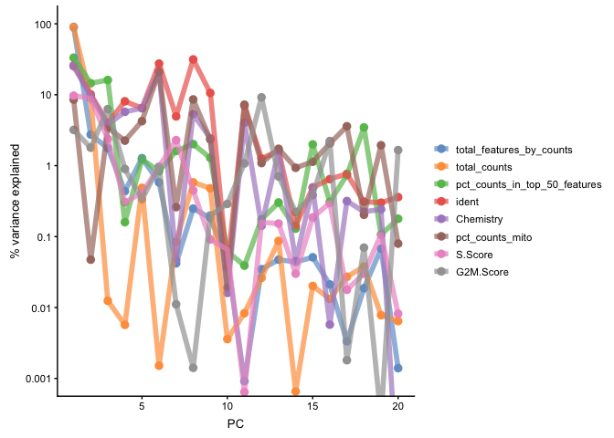

Question: Do you think that you can see some clear batch effects in the data? Do you think that there are any technical biases?

PC1 clearly correlates to the distribution of the data, e.g. the proportion of counts in top 50-500 highly expressed genes, and also to total\_features/total\_counts. Which is a common problem in scRNAseq data. This may be a technical artifact, or a biological features of celltypes with very different sizes and transcriptional landscape..

It is also clear that many of the top PCs (especially PCs 2,3,6,7,8) are largely explained by the different samples (ident) or just by v2 vs v3 (Chemistry).

### Session info

``` r
sessionInfo()
```

    ## R version 3.5.2 (2018-12-20)
    ## Platform: x86_64-apple-darwin15.6.0 (64-bit)
    ## Running under: macOS Mojave 10.14.4
    ## 
    ## Matrix products: default
    ## BLAS: /Library/Frameworks/R.framework/Versions/3.5/Resources/lib/libRblas.0.dylib
    ## LAPACK: /Library/Frameworks/R.framework/Versions/3.5/Resources/lib/libRlapack.dylib
    ## 
    ## locale:
    ## [1] en_US.UTF-8/en_US.UTF-8/en_US.UTF-8/C/en_US.UTF-8/en_US.UTF-8
    ## 
    ## attached base packages:
    ## [1] parallel  stats4    stats     graphics  grDevices utils     datasets 
    ## [8] methods   base     
    ## 
    ## other attached packages:
    ##  [1] Matrix_1.2-17               scater_1.10.1              
    ##  [3] ggplot2_3.1.1               SingleCellExperiment_1.4.1 
    ##  [5] SummarizedExperiment_1.12.0 DelayedArray_0.8.0         
    ##  [7] BiocParallel_1.16.6         matrixStats_0.54.0         
    ##  [9] Biobase_2.42.0              GenomicRanges_1.34.0       
    ## [11] GenomeInfoDb_1.18.2         IRanges_2.16.0             
    ## [13] S4Vectors_0.20.1            BiocGenerics_0.28.0        
    ## [15] Seurat_3.0.0               
    ## 
    ## loaded via a namespace (and not attached):
    ##   [1] reticulate_1.12          R.utils_2.8.0           
    ##   [3] tidyselect_0.2.5         htmlwidgets_1.3         
    ##   [5] grid_3.5.2               trimcluster_0.1-2.1     
    ##   [7] ranger_0.11.2            Rtsne_0.15              
    ##   [9] munsell_0.5.0            destiny_2.12.0          
    ##  [11] codetools_0.2-16         ica_1.0-2               
    ##  [13] umap_0.2.0.0             future_1.12.0           
    ##  [15] sROC_0.1-2               withr_2.1.2             
    ##  [17] colorspace_1.4-1         knitr_1.22              
    ##  [19] ROCR_1.0-7               robustbase_0.93-4       
    ##  [21] vcd_1.4-4                VIM_4.8.0               
    ##  [23] TTR_0.23-4               gbRd_0.4-11             
    ##  [25] listenv_0.7.0            Rdpack_0.11-0           
    ##  [27] labeling_0.3             GenomeInfoDbData_1.2.0  
    ##  [29] cvTools_0.3.2            bit64_0.9-7             
    ##  [31] rhdf5_2.26.2             xfun_0.6                
    ##  [33] ggthemes_4.1.1           diptest_0.75-7          
    ##  [35] R6_2.4.0                 ggbeeswarm_0.6.0        
    ##  [37] robCompositions_2.1.0    rsvd_1.0.0              
    ##  [39] RcppEigen_0.3.3.5.0      mvoutlier_2.0.9         
    ##  [41] hdf5r_1.1.1              flexmix_2.3-15          
    ##  [43] bitops_1.0-6             reshape_0.8.8           
    ##  [45] assertthat_0.2.1         SDMTools_1.1-221        
    ##  [47] scales_1.0.0             nnet_7.3-12             
    ##  [49] beeswarm_0.2.3           gtable_0.3.0            
    ##  [51] npsurv_0.4-0             globals_0.12.4          
    ##  [53] rlang_0.3.4              scatterplot3d_0.3-41    
    ##  [55] splines_3.5.2            lazyeval_0.2.2          
    ##  [57] yaml_2.2.0               reshape2_1.4.3          
    ##  [59] abind_1.4-5              tools_3.5.2             
    ##  [61] zCompositions_1.2.0      gplots_3.0.1.1          
    ##  [63] RColorBrewer_1.1-2       proxy_0.4-23            
    ##  [65] ggridges_0.5.1           Rcpp_1.0.1              
    ##  [67] plyr_1.8.4               zlibbioc_1.28.0         
    ##  [69] purrr_0.3.2              RCurl_1.95-4.12         
    ##  [71] pbapply_1.4-0            viridis_0.5.1           
    ##  [73] cowplot_0.9.4            zoo_1.8-5               
    ##  [75] haven_2.1.0              ggrepel_0.8.0           
    ##  [77] cluster_2.0.8            magrittr_1.5            
    ##  [79] RSpectra_0.14-0          data.table_1.12.2       
    ##  [81] openxlsx_4.1.0           lmtest_0.9-36           
    ##  [83] RANN_2.6.1               truncnorm_1.0-8         
    ##  [85] mvtnorm_1.0-10           fitdistrplus_1.0-14     
    ##  [87] hms_0.4.2                lsei_1.2-0              
    ##  [89] evaluate_0.13            smoother_1.1            
    ##  [91] rio_0.5.16               mclust_5.4.3            
    ##  [93] readxl_1.3.1             gridExtra_2.3           
    ##  [95] compiler_3.5.2           tibble_2.1.1            
    ##  [97] KernSmooth_2.23-15       crayon_1.3.4            
    ##  [99] R.oo_1.22.0              htmltools_0.3.6         
    ## [101] pcaPP_1.9-73             tidyr_0.8.3             
    ## [103] rrcov_1.4-7              MASS_7.3-51.4           
    ## [105] fpc_2.1-11.1             boot_1.3-20             
    ## [107] car_3.0-2                sgeostat_1.0-27         
    ## [109] R.methodsS3_1.7.1        gdata_2.18.0            
    ## [111] metap_1.1                igraph_1.2.4            
    ## [113] forcats_0.4.0            pkgconfig_2.0.2         
    ## [115] foreign_0.8-71           laeken_0.5.0            
    ## [117] sp_1.3-1                 plotly_4.9.0            
    ## [119] vipor_0.4.5              XVector_0.22.0          
    ## [121] bibtex_0.4.2             NADA_1.6-1              
    ## [123] stringr_1.4.0            digest_0.6.18           
    ## [125] sctransform_0.2.0        pls_2.7-1               
    ## [127] tsne_0.1-3               rmarkdown_1.12          
    ## [129] cellranger_1.1.0         DelayedMatrixStats_1.4.0
    ## [131] curl_3.3                 kernlab_0.9-27          
    ## [133] gtools_3.8.1             modeltools_0.2-22       
    ## [135] nlme_3.1-139             jsonlite_1.6            
    ## [137] Rhdf5lib_1.4.3           carData_3.0-2           
    ## [139] viridisLite_0.3.0        pillar_1.3.1            
    ## [141] lattice_0.20-38          GGally_1.4.0            
    ## [143] httr_1.4.0               DEoptimR_1.0-8          
    ## [145] survival_2.44-1.1        xts_0.11-2              
    ## [147] glue_1.3.1               zip_2.0.1               
    ## [149] png_0.1-7                prabclus_2.2-7          
    ## [151] bit_1.1-14               class_7.3-15            
    ## [153] stringi_1.4.3            HDF5Array_1.10.1        
    ## [155] caTools_1.17.1.2         dplyr_0.8.0.1           
    ## [157] irlba_2.3.3              e1071_1.7-1             
    ## [159] future.apply_1.2.0       ape_5.3
