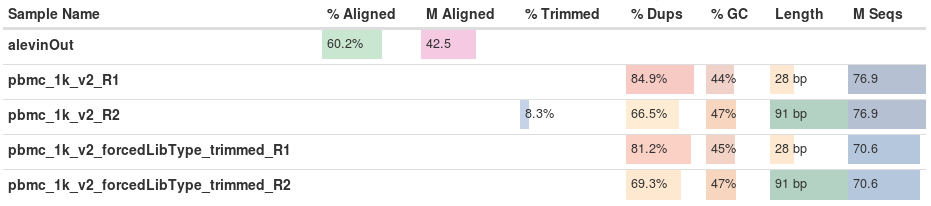
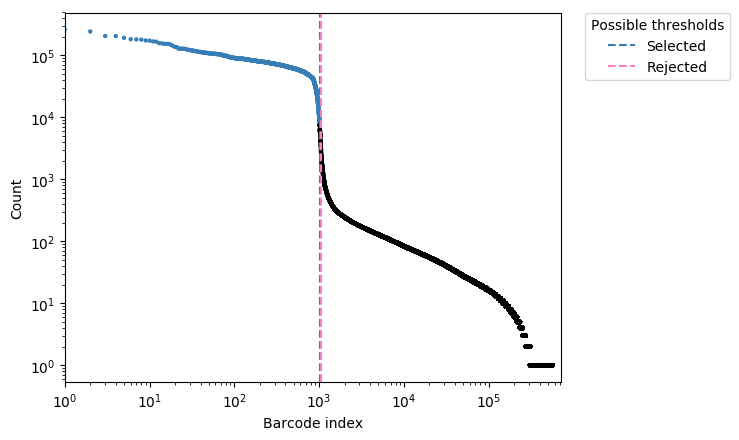
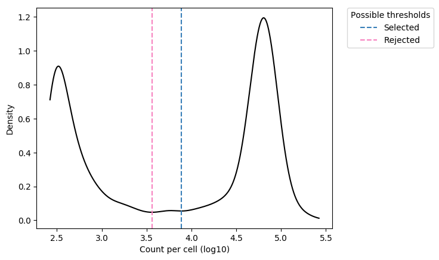
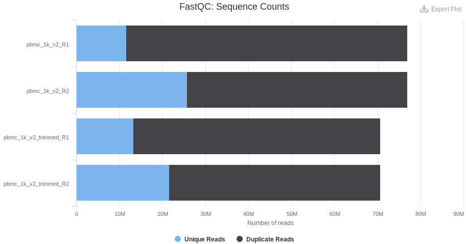
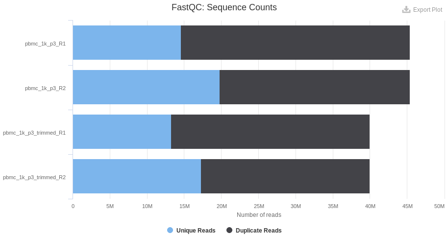
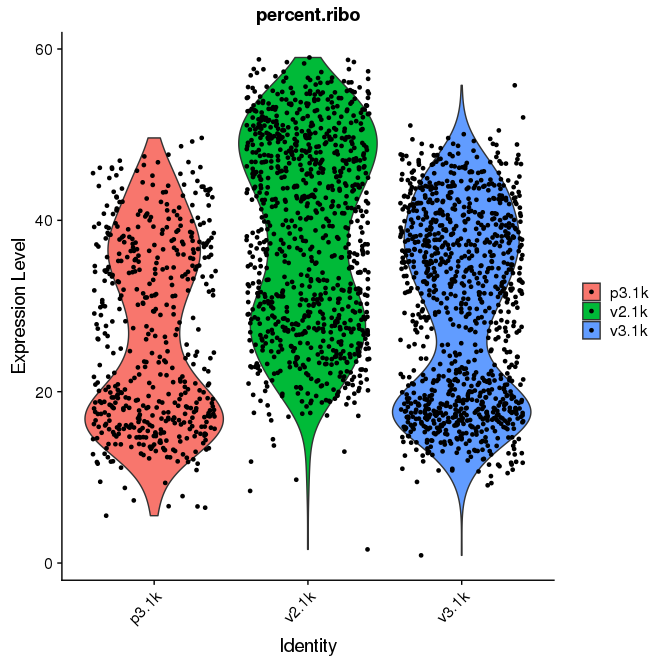
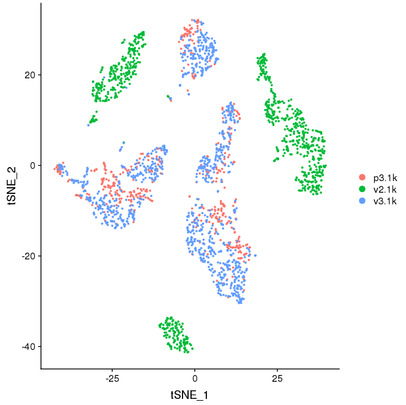

Quality Control - sequencing and mapping
================

Created by: Jules Gilet

Overview
========

#### Quality control of sequencing data from 10x

### Datasets

Three sequencing datasets and their corresponding cellranger qc summaries are downloaded from the 10x genomics website. They have been generated from healthy human peripheral blood mononuclear cells, with the 3' v2 library chemistry (discontinued chemistry), the 3' v3 chemistry (with an improved transcript capture rate within droplets) and a dataset combining transcript and protein quantification with barcoded antibodies (CITE-seq). CITE-seq downstream analyses with not be covered in this lab. The analysis of the different samples is meant to illustrate divergences that can occur across technical batches.

Except otherwise indicated, all the command are executed directly in the shell (bash).

Report summaries and quality control metrics generated by the cellranger pipeline are first downloaded from the 10x website.

```bash
mkdir cellranger_qc
cd cellrager_qc
wget -nH -nd	http://cf.10xgenomics.com/samples/cell-exp/3.0.0/pbmc_1k_v2/pbmc_1k_v2_web_summary.html \
		http://cf.10xgenomics.com/samples/cell-exp/3.0.0/pbmc_1k_v3/pbmc_1k_v3_web_summary.html \
		http://cf.10xgenomics.com/samples/cell-exp/3.0.0/pbmc_1k_protein_v3/pbmc_1k_protein_v3_web_summary.html

wget -nH -nd	http://cf.10xgenomics.com/samples/cell-exp/3.0.0/pbmc_1k_v2/pbmc_1k_v2_metrics_summary.csv \
		http://cf.10xgenomics.com/samples/cell-exp/3.0.0/pbmc_1k_v3/pbmc_1k_v3_metrics_summary.csv \
		http://cf.10xgenomics.com/samples/cell-exp/3.0.0/pbmc_1k_protein_v3/pbmc_1k_protein_v3_metrics_summary.csv
```

The reports are merged in R for an easier comparison.

```r
# R code
v2 <- read.csv("pbmc_1k_v2_metrics_summary.csv")
v3 <- read.csv("pbmc_1k_v3_metrics_summary.csv")
p3 <- read.csv("pbmc_1k_protein_v3_metrics_summary.csv")
res <- data.frame(v2=t(v2), v3=t(v3), p3=t(p3[1:20]))
write.csv(res, 'qc_summaries.csv')
res
                                                       v2         v3         p3
Estimated.Number.of.Cells                             996      1,222        713
Mean.Reads.per.Cell                                77,230     54,502     63,617
Median.Genes.per.Cell                               1,078      1,919      1,930
Number.of.Reads                                76,921,082 66,601,887 45,359,427
Valid.Barcodes                                      96.6%      97.4%      97.1%
Sequencing.Saturation                               90.1%      70.8%      73.3%
Q30.Bases.in.Barcode                                94.0%      94.1%      95.0%
Q30.Bases.in.RNA.Read                               88.3%      90.2%      90.3%
Q30.Bases.in.Sample.Index                           90.1%      91.1%      90.8%
Q30.Bases.in.UMI                                    92.8%      92.7%      93.3%
Reads.Mapped.to.Genome                              92.7%      95.4%      94.9%
Reads.Mapped.Confidently.to.Genome                  90.1%      92.4%      91.6%
Reads.Mapped.Confidently.to.Intergenic.Regions       3.6%       4.8%       5.5%
Reads.Mapped.Confidently.to.Intronic.Regions        22.3%      31.1%      31.8%
Reads.Mapped.Confidently.to.Exonic.Regions          64.1%      56.5%      54.4%
Reads.Mapped.Confidently.to.Transcriptome           60.8%      53.7%      51.3%
Reads.Mapped.Antisense.to.Gene                       1.0%       1.0%       1.1%
Fraction.Reads.in.Cells                             96.1%      94.9%      87.6%
Total.Genes.Detected                               16,063     18,391     17,467
Median.UMI.Counts.per.Cell                          3,358      6,628      6,416

```

About 1 k single cells have been captured per sample, with a similar sequencing depth per cell (~ 50 k RPC to 75 k RPC). However, the samples processed with the V3 chemistry allows the detection of more genes as compared to the v2 (almost 2 times), even with less reads per cell.

Reads mapped to intergenic regions, corresponding to genomic DNA contamination, should typically count for less than 5 %. Reads mapping to intronic regions correspond to detection of unspliced pre-mRNA undergoing maturation, or the consequence of active mechanisms of intron retention. Transcripts containing intronic regions can be used to infer transcriptional dynamics with algorithms such as velocyto (that will be covered on the last day of the workshop).

Typically, 50-60 % of the reads are expected to map to the transcriptome in 10x experiments.

### Further inspection of sequenced data

The fastq files provided by 10x genomics are downloaded for quality control and transcript quantification.

```bash
cd ..
wget -nH -nd	http://cf.10xgenomics.com/samples/cell-exp/3.0.0/pbmc_1k_v2/pbmc_1k_v2_fastqs.tar \
				http://cf.10xgenomics.com/samples/cell-exp/3.0.0/pbmc_1k_v3/pbmc_1k_v3_fastqs.tar \
				http://cf.10xgenomics.com/samples/cell-exp/3.0.0/pbmc_1k_protein_v3/pbmc_1k_protein_v3_fastqs.tar
```

Extraction of the fastq files from the archives.

```bash
for FILE in *.tar
	do tar -xf ${FILE}
done
rm *.tar
```

### fastqs preprocessing

Note that the fastqs containing the 10x index sequences (sample_I1_SX_L00X.fastq.gz) are optional after demultiplexing and sample attribution. Due to the costs, in most of the cases the library indexes are not used to distinguish samples (one sample is processed and sequenced at a time, except on large volume sequencers as Illumina's NovaSeq).

```bash
zcat pbmc_1k_v2_fastqs/pbmc_1k_v2_S1_L001_I1_001.fastq.gz | head -n 24

@A00228:279:HFWFVDMXX:1:1101:5954:1000 1:N:0:NACTCGGA
NACTCGGA
+
#FFFFFFF
@A00228:279:HFWFVDMXX:1:1101:6768:1000 1:N:0:NACTCGGA
NACTCGGA
+
#FFFFFFF
@A00228:279:HFWFVDMXX:1:1101:18430:1000 1:N:0:NACTCGGA
NACTCGGA
+
#FFFFFFF
@A00228:279:HFWFVDMXX:1:1101:24035:1000 1:N:0:NACTCGGA
NACTCGGA
+
#FFFFFFF
@A00228:279:HFWFVDMXX:1:1101:13612:1016 1:N:0:CACTCGGA
CACTCGGA
+
FFFFFFFF
@A00228:279:HFWFVDMXX:1:1101:13720:1016 1:N:0:CACTCGGA
CACTCGGA
+
FFFFFFFF
```

```bash
zcat pbmc_1k_v2_fastqs/pbmc_1k_v2_S1_L001_I1_001.fastq.gz | tail -n 24

@A00228:279:HFWFVDMXX:1:2488:32750:37043 1:N:0:ATGCTCCG
ATGCTCCG
+
FF:FF:FF
@A00228:279:HFWFVDMXX:1:2488:5873:37059 1:N:0:ATGCTCCG
ATGCTCCG
+
FFFFFFFF
@A00228:279:HFWFVDMXX:1:2488:8657:37059 1:N:0:ATGCTCCG
ATGCTCCG
+
FFFFFFFF
@A00228:279:HFWFVDMXX:1:2488:11080:37059 1:N:0:ATGCTCCG
ATGCTCCG
+
F:FFFFFF
@A00228:279:HFWFVDMXX:1:2488:14118:37059 1:N:0:ATGCTCCG
ATGCTCCG
+
F:FFFFFF
@A00228:279:HFWFVDMXX:1:2488:16703:37059 1:N:0:ATGCTCCG
ATGCTCCG
+
FFFFFFFF

```

For clarity and easier manipulation, the fastq files are merged.

```bash
mkdir fastqs
# concatenation of the v2.1k fastqs
cat pbmc_1k_v2_fastqs/pbmc_1k_v2_S1_L00*_R1_001.fastq.gz > fastqs/pbmc_1k_v2_R1.fastq.gz
cat pbmc_1k_v2_fastqs/pbmc_1k_v2_S1_L00*_R2_001.fastq.gz > fastqs/pbmc_1k_v2_R2.fastq.gz
# concatenation of the v3.1k fastqs
cat pbmc_1k_v3_fastqs/pbmc_1k_v3_S1_L00*_R1_001.fastq.gz > fastqs/pbmc_1k_v3_R1.fastq.gz
cat pbmc_1k_v3_fastqs/pbmc_1k_v3_S1_L00*_R2_001.fastq.gz > fastqs/pbmc_1k_v3_R2.fastq.gz
# concatenation of the p3.1k fastqs
cat pbmc_1k_protein_v3_fastqs/pbmc_1k_protein_v3_gex_fastqs/pbmc_1k_protein_v3_gex_S1_L00*_R1_001.fastq.gz > fastqs/pbmc_1k_p3_R1.fastq.gz
cat pbmc_1k_protein_v3_fastqs/pbmc_1k_protein_v3_gex_fastqs/pbmc_1k_protein_v3_gex_S1_L00*_R2_001.fastq.gz > fastqs/pbmc_1k_p3_R2.fastq.gz
```

The number of reads after the merge of the fastq files are consistent with the cellranger summaries.


```bash
NLINES=$(zcat fastqs/pbmc_1k_v2_R1.fastq.gz | wc -l)
expr $NLINES / 4
76921082
```

76.9 M reads for sample pbmc_1k_v2, that is consistent with the cellranger websummary generated by cellranger. We have similar results for the two other samples.

```bash
NLINES=$(zcat fastqs/pbmc_1k_v3_R1.fastq.gz | wc -l)
expr $NLINES / 4
66601887
NLINES=$(zcat fastqs/pbmc_1k_p3_R1.fastq.gz | wc -l)
expr $NLINES / 4
45359427
```

Some cleaning

```bash
rm -r pbmc_1k_v2_fastqs pbmc_1k_v3_fastqs pbmc_1k_protein_v3_fastqs
```

### QC, trimming and transcript quantification

We use the [Ikura pipeline](https://github.com/juugii/ikura) for further QC, quality-based trimming and transcript quantification.

```bash
mkdir ikura
cd ikura
```

```bash
ikura -1 /storage1/courses/ELIXIR/workOnCourse/fastqs/pbmc_1k_v2_R1.fastq.gz -2 /storage1/courses/ELIXIR/workOnCourse/fastqs/pbmc_1k_v2_R2.fastq.gz -n 1500 -o pbmc_1k_v2 -i /storage1/annotations/ikura/human/genecode_GRCh38p12/ikuraIndex_gencodeGRCh38p12_release29
ikura -1 /storage1/courses/ELIXIR/workOnCourse/fastqs/pbmc_1k_v3_R1.fastq.gz -2 /storage1/courses/ELIXIR/workOnCourse/fastqs/pbmc_1k_v3_R2.fastq.gz -n 1500 -o pbmc_1k_v3 -i /storage1/annotations/ikura/human/genecode_GRCh38p12/ikuraIndex_gencodeGRCh38p12_release29
ikura -1 /storage1/courses/ELIXIR/workOnCourse/fastqs/pbmc_1k_p3_R1.fastq.gz -2 /storage1/courses/ELIXIR/workOnCourse/fastqs/pbmc_1k_p3_R2.fastq.gz -n 1500 -o pbmc_1k_p3 -i /storage1/annotations/ikura/human/genecode_GRCh38p12/ikuraIndex_gencodeGRCh38p12_release29
```

Note that R1 from the v2 sample provided by 10x is longer than necessary (28 nt). R1 has a 16 nt cell barcode and a 10 nt UMI barcode, according to the corresponding [10x technical note](https://teichlab.github.io/scg_lib_structs/data/CG000108_AssayConfiguration_SC3v2.pdf). The two last nucleotides in R1 are composed of T in more that 98 %, indicating that remaining nucleotides likely come from the poly(dT) tail. Ikura will auto-detect these fastq files as coming from the v3 chemistry and will still execute normally without any impact on the quality of the process.

The whole process takes 47 to 74 minutes per sample (8 cores, 4 GB of RAM).

```bash
#v2
[...]
total execution time (min):  74
# v3
[...]
total execution time (min):  67
#p3
[...]
total execution time (min):  47
```


### Sequencing quality

Based on stringent quality filters, typically 8-15 % of the sequenced reads can contains ambiguous nucleotides (low base calling score, PHRED score < 30) that can be safely discarded from the analyses. The fraction of low quality reads can also be estimated from the cellranger web summaries with the 'Q30.Bases.in.Barcode' and 'Q30.Bases.in.RNA.Read' stats. In case of any technical issue during the sequencing itself, the fraction of poor quality reads can dramatically go up.



The percent of reads aligned to the reference transcriptome with salmon engine is very similar to that of STAR (the mapping engine used by cellranger). Compare the 'Reads.Mapped.Confidently.to.Transcriptome' for the v2 sample. Typically 50-60 % of the reads are expected to align on the (spliced) transcriptome, and 15-25 % to intronic regions.

The call calling (identification of droplets containing true cells) is based on the density of reads per droplet.




On the density histogram, droplets with high UMI content correspond to true cells, while droplets with poor UMI content (left side of the density plot) likely correspond to the capture of cellular debris or ambient mRNA, and should be discarded.

The number of true cells identified with Ikura can be found with:

```bash
grep "Selected" ikura/pbmc_1k_v2/cell_calling/filteringPlot_pbmc_1k_v2_cell_thresholds.tsv
## 1015	Selected
grep "Selected" ikura/pbmc_1k_v3/cell_calling/filteringPlot_pbmc_1k_v3_cell_thresholds.tsv
## 1179	Selected
grep "Selected" ikura/pbmc_1k_p3/cell_calling/filteringPlot_pbmc_1k_p3_cell_thresholds.tsv
## 552	Selected
```

The fraction of duplicated reads can be used to estimate if the sequencing depth is appropriate. In a given experiment, if most (> 99 %) of the UMIs are sequenced twice, it indicates that almost all of the existing transcripts are read: a deeper sequencing is useless as the same UMIs will be read again and again. By contrast, if most of the UMIs are read only once, the probability of remaining unsequenced transcripts in the library is high. Depending of the application, a complementary sequencing can be recommended to detect lowly expressed genes (eg. cytokines). The sequencing saturation (as defined by 10x) or the level of duplicated reads is espected to be at last 60-80 % in most applications.



As a comparison, the level of duplicated reads is lower in the p3 sample: a complementary sequencing can allow the detection of additional lowly expressed genes. However, the number of detected genes per cell is twice higher than the v2 chemistry and enough for a proper classification of the cells.



Note that in case of important variations in the sequencing depth between samples (eg. a delta of 25 % or more in the level of duplicated reads), the difference in term of gene sensitivity can lead to very strong batch effects (some genes can only be detected in the context of a deep sequencing). Subsampling of the data generally perform very well in the resolving of such batch effects.

### For internal discussion - downstream analysis in Seurat

The following section is a demonstration of the compatibility of ikura output with the second part of the QC lab.

```r
# R code
# The fastest way to load the data is
mat <- readRDS('pbmc_1k_v3/outs/ikuraEmat.rds')
# or alternatively
mat2 <- Read10X('pbmc_1k_v3/outs')
dim(mat)
[1] 19870  1179
dim(mat2)
[1] 19870  1179
# seurat object can then be created with
seu <- CreateSeuratObject(mat, min.cells=5, min.features=500)
```

Validation of the integration of the data with the second part of the qc course.

```r
# R code
v3.1k <- Read10X("pbmc_1k_v3/outs")
v2.1k <- Read10X("pbmc_1k_v2/outs")
p3.1k <- Read10X("pbmc_1k_p3/outs")

sdata.v2.1k <- CreateSeuratObject(v2.1k, project = "v2.1k")
sdata.v3.1k <- CreateSeuratObject(v3.1k, project = "v3.1k")
sdata.p3.1k <- CreateSeuratObject(p3.1k, project = "p3.1k")

alldata <- merge(sdata.v2.1k, c(sdata.v3.1k,sdata.p3.1k), add.cell.ids=c("v2.1k","v3.1k","p3.1k"))
chemistry <- rep("v3",ncol(alldata))
chemistry[Idents(alldata) == "v2.1k"] <- "v2"
alldata <- AddMetaData(alldata, chemistry, col.name = "Chemistry")
alldata

## An object of class Seurat 
## 19870 features across 2746 samples within 1 assay 
## Active assay: RNA (19870 features)

table(Idents(alldata))

## p3.1k v2.1k v3.1k 
##   552  1015  1179 

mt.genes <- rownames(alldata)[grep("^MT-",rownames(alldata))]
C<-GetAssayData(object = alldata, slot = "counts")
percent.mito <- Matrix::colSums(C[mt.genes,])/Matrix::colSums(C)*100
alldata <- AddMetaData(alldata, percent.mito, col.name = "percent.mito")
rb.genes <- rownames(alldata)[grep("^RP[SL]",rownames(alldata))]
percent.ribo <- Matrix::colSums(C[rb.genes,])/Matrix::colSums(C)*100
alldata <- AddMetaData(alldata, percent.ribo, col.name = "percent.ribo")

selected <- WhichCells(alldata, expression = percent.mito < 25)
length(selected)

## [1] 2656

data.filt <- subset(alldata, cells = selected)
high.det.v3 <- WhichCells(data.filt, expression = nFeature_RNA > 4100)
high.det.v2 <- WhichCells(data.filt, expression = nFeature_RNA > 2000 & orig.ident == "v2.1k")

# remove these cells
data.filt <- subset(data.filt, cells=setdiff(WhichCells(data.filt),c(high.det.v2,high.det.v3)))
# check number of cells

ncol(data.filt)

## [1] 2570

low.det.v3 <- WhichCells(data.filt, expression = nFeature_RNA < 1000 & orig.ident != "v2.1k")
low.det.v2 <- WhichCells(data.filt, expression = nFeature_RNA < 500 & orig.ident == "v2.1k")

# remove these cells
data.filt <- subset(data.filt, cells=setdiff(WhichCells(data.filt),c(low.det.v2,low.det.v3)))

# check number of cells
ncol(data.filt)
## [1] 2493
```

We can compare the number of cell before and after quality filtering.

```r
table(Idents(alldata))

# ikura - prior filtering

## p3.1k v2.1k v3.1k 
##   552  1015  1179 

table(Idents(data.filt))

# ikura - after filtering

## p3.1k v2.1k v3.1k 
##   506   922  1065 
```

After cell calling, Ikura generate an expression matrix with less cells as compared to cellranger. However, after appropriate quality filters in downstream analysis, the number of cells of good quality are equivalent. Thus Ikura is more stringeant and permforms better in the robust identification of cell that will be easier to identify and classify.

As a point of comparison, here is the number of cells prior and after filtering of expression matrices generated by cellranger (downloaded from 10x website).

```r
# R code
# cellranger - prior filtering
    ## p3.1k v2.1k v3.1k 
    ##   713   996  1222

# cellranger - after filtering

    ## p3.1k v2.1k v3.1k 
    ##   526   933  1072
```

The batch effect due to both higher ribosomal content and differences between the v2/v3 chemistries is still visible, all other comments are valid.
Basic analysis for data visualization.

```r
# R code, basic Seurat processing for data visualization
seu <- data.filt
seu <- NormalizeData(seu)
seu <- ScaleData(seu, features=rownames(seu))
seu <- RunPCA(seu, features=rownames(seu))
seu <- FindNeighbors(seu, dim)
seu <- FindNeighbors(seu, dims=1:10)
seu <- FindClusters(seu, resolution=0.5)
seu <- RunTSNE(seu, reduction='pca', dims=1:10)
seu <- RunUMAP(seu, reduction='pca', dims=1:10)
DimPlot(seu, reduction='tsne', group.by='orig.ident')
VlnPlot(seu, 'percent.ribo', group.by='orig.ident')
```


