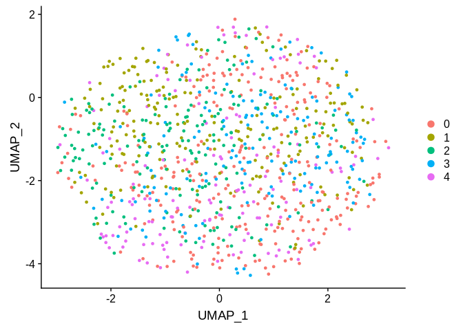
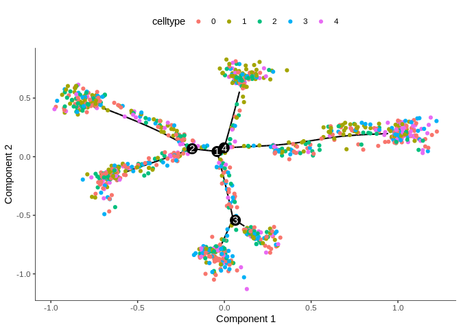
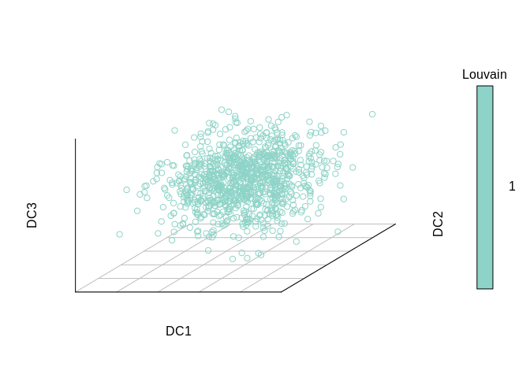

```r
# a synthetic expression matrix is generated (see the introduction lecture on day 1)
# the extraDistr package is required to model zero-inflated negative binomial
# distributions
# we simulate a sparse matrix of 1000 cells with 25000 genes
```

## Data generation and loading


```r
# emat <- Matrix::Matrix(data=extraDistr::rzinb(25000*1000, 50, 0.95, 0.75), nrow=25000, ncol=1000, sparse=TRUE)
# saveRDS(emat, file='random_sparse_emat.rds')

# for simplicity a rds file of the random matrix is provided

emat <- readRDS('random_sparse_emat.rds')
dim(emat)
```

```
## [1] 25000  1000
```

```r
emat[1:5,1:5]
```

```
## 5 x 5 sparse Matrix of class "dgCMatrix"
##       cell1 cell2 cell3 cell4 cell5
## gene1     .     .     .     .     .
## gene2     .     1     .     1     .
## gene3     1     1     .     .     .
## gene4     .     .     2     .     .
## gene5     .     .     .     .     3
```

## Clustering of the articifial dataset


```r
# we use Seurat to partition data into clusters
library(Seurat)

seu <- CreateSeuratObject(as.matrix(emat), min.features=500, min.cells=5)
seu <- NormalizeData(seu)
seu <- FindVariableFeatures(seu)
seu <- ScaleData(seu)
```

```
## Centering and scaling data matrix
```

```r
seu <- RunPCA(seu)
```

```
## PC_ 1 
## Positive:  gene20314, gene17384, gene20945, gene616, gene13605, gene18900, gene18200, gene22553, gene22181, gene6418 
## 	   gene24488, gene2066, gene14477, gene7766, gene1275, gene13840, gene15681, gene20093, gene13206, gene9891 
## 	   gene24784, gene20690, gene9270, gene4210, gene21770, gene24460, gene15971, gene5556, gene22101, gene873 
## Negative:  gene9902, gene19435, gene24242, gene7785, gene15666, gene9825, gene3651, gene18071, gene10109, gene8008 
## 	   gene24555, gene8843, gene12021, gene24720, gene16169, gene13767, gene1309, gene17351, gene22988, gene17977 
## 	   gene24393, gene5177, gene12532, gene21934, gene1675, gene20844, gene2642, gene12215, gene19144, gene14621 
## PC_ 2 
## Positive:  gene9965, gene16064, gene21847, gene24366, gene4210, gene7452, gene7419, gene19821, gene1322, gene16175 
## 	   gene7751, gene23857, gene9625, gene14186, gene8319, gene20130, gene14349, gene20638, gene22517, gene10824 
## 	   gene1955, gene15599, gene3369, gene2564, gene19634, gene13353, gene20218, gene13203, gene20098, gene24596 
## Negative:  gene2675, gene22623, gene23674, gene16016, gene5144, gene8377, gene16436, gene20449, gene1675, gene1528 
## 	   gene2508, gene557, gene9023, gene12287, gene22442, gene21235, gene20249, gene5222, gene15709, gene19225 
## 	   gene16216, gene24439, gene15110, gene9004, gene8042, gene23884, gene3251, gene10808, gene9202, gene8225 
## PC_ 3 
## Positive:  gene8581, gene14721, gene1991, gene409, gene11972, gene18297, gene9735, gene19923, gene561, gene8030 
## 	   gene19121, gene23323, gene18553, gene6038, gene15116, gene16836, gene14929, gene22769, gene15944, gene2118 
## 	   gene17450, gene15030, gene18946, gene15670, gene11403, gene18478, gene12793, gene17675, gene16584, gene6306 
## Negative:  gene12079, gene10225, gene10840, gene19991, gene24443, gene16446, gene13115, gene14814, gene11780, gene7258 
## 	   gene24801, gene14568, gene3511, gene22579, gene9464, gene3577, gene19569, gene9071, gene10333, gene22589 
## 	   gene12068, gene5255, gene4028, gene18199, gene13082, gene9159, gene3857, gene5959, gene22046, gene5944 
## PC_ 4 
## Positive:  gene15681, gene7279, gene20952, gene5591, gene14780, gene9965, gene17734, gene17665, gene19991, gene15337 
## 	   gene7208, gene3812, gene12701, gene3976, gene12688, gene11647, gene21156, gene22247, gene17588, gene8456 
## 	   gene12858, gene556, gene15140, gene14267, gene4836, gene6577, gene11972, gene13205, gene9902, gene23896 
## Negative:  gene353, gene3764, gene4999, gene16991, gene335, gene16878, gene9050, gene10996, gene4929, gene23125 
## 	   gene21934, gene19821, gene16019, gene6655, gene14759, gene5273, gene19932, gene11781, gene3189, gene18703 
## 	   gene4748, gene3, gene4665, gene8282, gene1204, gene15603, gene2774, gene14485, gene3843, gene19398 
## PC_ 5 
## Positive:  gene513, gene6568, gene17937, gene23694, gene11315, gene10250, gene441, gene6706, gene23172, gene5234 
## 	   gene21735, gene14357, gene2737, gene7280, gene32, gene14700, gene11035, gene15030, gene15552, gene11175 
## 	   gene21240, gene9700, gene2931, gene4266, gene15197, gene1288, gene22623, gene12198, gene2066, gene24881 
## Negative:  gene11875, gene18946, gene22973, gene12705, gene971, gene3919, gene21985, gene9818, gene23301, gene13994 
## 	   gene15712, gene18855, gene10193, gene13484, gene22054, gene19142, gene3322, gene15603, gene772, gene19461 
## 	   gene6978, gene15281, gene11019, gene14659, gene6577, gene371, gene21045, gene16685, gene3822, gene7258
```

```r
seu <- FindNeighbors(seu)
```

```
## Computing nearest neighbor graph
```

```
## Computing SNN
```

```r
seu <- FindClusters(seu)
```

```
## Modularity Optimizer version 1.3.0 by Ludo Waltman and Nees Jan van Eck
## 
## Number of nodes: 1000
## Number of edges: 37283
## 
## Running Louvain algorithm...
## Maximum modularity in 10 random starts: 0.4440
## Number of communities: 5
## Elapsed time: 0 seconds
```

```r
seu <- RunUMAP(seu, dims=1:20)
DimPlot(seu, reduction='umap')
```

<!-- -->

```r
head(seu@meta.data)
```

```
##          orig.ident nCount_RNA nFeature_RNA RNA_snn_res.0.8
## cell1 SeuratProject      16382         5732               0
## cell2 SeuratProject      17032         5927               0
## cell3 SeuratProject      16630         5823               4
## cell4 SeuratProject      16243         5675               1
## cell5 SeuratProject      16146         5701               2
## cell6 SeuratProject      16523         5803               0
##       seurat_clusters
## cell1               0
## cell2               0
## cell3               4
## cell4               1
## cell5               2
## cell6               0
```

```r
meta <- seu@meta.data
```

## Monocle/DDRTree model


```r
# creation of a cell dataset object for monocle TI
library(monocle)

pDat <- data.frame(cell=colnames(emat), celltype=meta$seurat_clusters, stringsAsFactors=FALSE)
fDat <- data.frame(gene_short_name=rownames(emat), stringsAsFactors=FALSE)
head(fDat)
```

```
##   gene_short_name
## 1           gene1
## 2           gene2
## 3           gene3
## 4           gene4
## 5           gene5
## 6           gene6
```

```r
head(pDat)
```

```
##    cell celltype
## 1 cell1        0
## 2 cell2        0
## 3 cell3        4
## 4 cell4        1
## 5 cell5        2
## 6 cell6        0
```

```r
rownames(fDat) <- rownames(emat)
rownames(pDat) <- colnames(emat)
library(monocle)
cds <- newCellDataSet(as.matrix(emat), phenoData=Biobase::AnnotatedDataFrame(pDat), featureData=Biobase::AnnotatedDataFrame(fDat))
cds
```

```
## CellDataSet (storageMode: environment)
## assayData: 25000 features, 1000 samples 
##   element names: exprs 
## protocolData: none
## phenoData
##   sampleNames: cell1 cell2 ... cell1000 (1000 total)
##   varLabels: cell celltype Size_Factor
##   varMetadata: labelDescription
## featureData
##   featureNames: gene1 gene2 ... gene25000 (25000 total)
##   fvarLabels: gene_short_name
##   fvarMetadata: labelDescription
## experimentData: use 'experimentData(object)'
## Annotation:
```

```r
# notmalisation and detection of 'genes' that are expressed in many 'cells'
cds <- estimateSizeFactors(cds)
cds <- estimateDispersions(cds)
```

```
## Removing 1289 outliers
```

```r
cds <- detectGenes(cds, min_expr=0.1)
print(head(fData(cds)))
```

```
##       gene_short_name num_cells_expressed
## gene1           gene1                 229
## gene2           gene2                 245
## gene3           gene3                 227
## gene4           gene4                 244
## gene5           gene5                 242
## gene6           gene6                 228
```

```r
expressed_genes <- row.names(subset(fData(cds), num_cells_expressed >= 250))
length(expressed_genes)
```

```
## [1] 2012
```

```r
# differential expression testing: it is possible to find some DE 'genes' from random data
diff_test_res <- differentialGeneTest(cds[ expressed_genes, ], fullModelFormulaStr="~ celltype")
ordering_genes <- row.names(subset(diff_test_res, pval < 0.05))
length(ordering_genes)
```

```
## [1] 105
```

```r
# inference of the DDRTree model according to these ordering genes
cds <- setOrderingFilter(cds, ordering_genes)
cds <- reduceDimension(cds, max_components = 2, method='DDRTree')
cds <- orderCells(cds)
plot_cell_trajectory(cds, color_by="celltype")
```

<!-- -->

```r
# the model articially create a couple of branches with group of cell clusters
# on the tips
```

## Diffusion map model


```r
# as a comparison we will use diffusion map on random data
library(scran)
library(destiny)

sce <- SingleCellExperiment(assays=list(counts=emat, logcounts=log1p(emat)))
sce <- normalize(sce)
```

```
## Warning in .local(object, ...): using library sizes as size factors
```

```r
dm <- DiffusionMap(sce)
```

```
## Warning in duplicated(data): Sparse Matrix support is not yet implemented
## properly. Later errors might occur because `duplicated.Matrix` does not
## return the truth.
```

```
## Warning in find_knn(imputed_data, k, distance = distance): find_knn does
## not yet support sparse matrices, converting data to a dense matrix.
```

```r
plot(dm)
```

<!-- -->

```r
# There is no clear structure in the data, even in the firsts eigen vectors (diffusion components)

sessionInfo()
```

```
## R version 3.5.1 (2018-07-02)
## Platform: x86_64-conda_cos6-linux-gnu (64-bit)
## Running under: Pop!_OS 19.04
## 
## Matrix products: default
## BLAS/LAPACK: /home/main/Documents/project_scRNA/lib/R/lib/libRblas.so
## 
## locale:
##  [1] LC_CTYPE=fr_FR.UTF-8       LC_NUMERIC=C              
##  [3] LC_TIME=fr_FR.UTF-8        LC_COLLATE=fr_FR.UTF-8    
##  [5] LC_MONETARY=fr_FR.UTF-8    LC_MESSAGES=fr_FR.UTF-8   
##  [7] LC_PAPER=fr_FR.UTF-8       LC_NAME=C                 
##  [9] LC_ADDRESS=C               LC_TELEPHONE=C            
## [11] LC_MEASUREMENT=fr_FR.UTF-8 LC_IDENTIFICATION=C       
## 
## attached base packages:
##  [1] splines   stats4    parallel  stats     graphics  grDevices utils    
##  [8] datasets  methods   base     
## 
## other attached packages:
##  [1] destiny_2.12.0              scran_1.10.1               
##  [3] SingleCellExperiment_1.4.0  SummarizedExperiment_1.12.0
##  [5] DelayedArray_0.8.0          matrixStats_0.54.0         
##  [7] GenomicRanges_1.34.0        GenomeInfoDb_1.18.1        
##  [9] IRanges_2.16.0              S4Vectors_0.20.1           
## [11] BiocParallel_1.16.6         monocle_2.10.0             
## [13] DDRTree_0.1.5               irlba_2.3.3                
## [15] VGAM_1.0-6                  ggplot2_3.1.1              
## [17] Biobase_2.42.0              BiocGenerics_0.28.0        
## [19] Seurat_3.0.0                Matrix_1.2-17              
## 
## loaded via a namespace (and not attached):
##   [1] reticulate_1.12          R.utils_2.8.0           
##   [3] tidyselect_0.2.5         htmlwidgets_1.3         
##   [5] grid_3.5.1               combinat_0.0-8          
##   [7] ranger_0.11.1            docopt_0.6.1            
##   [9] Rtsne_0.15               munsell_0.5.0           
##  [11] codetools_0.2-16         ica_1.0-2               
##  [13] statmod_1.4.30           future_1.12.0           
##  [15] withr_2.1.2              colorspace_1.4-1        
##  [17] fastICA_1.2-0            knitr_1.23              
##  [19] ROCR_1.0-7               robustbase_0.93-5       
##  [21] vcd_1.4-4                VIM_4.8.0               
##  [23] TTR_0.23-4               gbRd_0.4-11             
##  [25] listenv_0.7.0            Rdpack_0.10-1           
##  [27] labeling_0.3             slam_0.1-43             
##  [29] GenomeInfoDbData_1.2.1   pheatmap_1.0.12         
##  [31] rhdf5_2.26.2             ggthemes_4.2.0          
##  [33] R6_2.4.0                 ggbeeswarm_0.6.0        
##  [35] rsvd_1.0.0               RcppEigen_0.3.3.5.0     
##  [37] locfit_1.5-9.1           bitops_1.0-6            
##  [39] assertthat_0.2.1         SDMTools_1.1-221.1      
##  [41] scales_1.0.0             nnet_7.3-12             
##  [43] beeswarm_0.2.3           gtable_0.3.0            
##  [45] npsurv_0.4-0             globals_0.12.4          
##  [47] rlang_0.3.4              scatterplot3d_0.3-41    
##  [49] lazyeval_0.2.2           yaml_2.2.0              
##  [51] reshape2_1.4.3           abind_1.4-5             
##  [53] tools_3.5.1              gplots_3.0.1.1          
##  [55] RColorBrewer_1.1-2       proxy_0.4-22            
##  [57] dynamicTreeCut_1.63-1    ggridges_0.5.1          
##  [59] Rcpp_1.0.1               plyr_1.8.4              
##  [61] zlibbioc_1.28.0          purrr_0.3.2             
##  [63] RCurl_1.95-4.12          densityClust_0.3        
##  [65] pbapply_1.4-0            viridis_0.5.1           
##  [67] cowplot_0.9.4            zoo_1.8-5               
##  [69] haven_2.1.0              ggrepel_0.8.1           
##  [71] cluster_2.0.9            magrittr_1.5            
##  [73] data.table_1.12.2        openxlsx_4.1.0          
##  [75] lmtest_0.9-36            RANN_2.6                
##  [77] fitdistrplus_1.0-14      hms_0.4.2               
##  [79] lsei_1.2-0               evaluate_0.13           
##  [81] smoother_1.1             rio_0.5.16              
##  [83] sparsesvd_0.1-4          readxl_1.3.1            
##  [85] gridExtra_2.3            HSMMSingleCell_1.2.0    
##  [87] compiler_3.5.1           scater_1.10.1           
##  [89] tibble_2.1.1             KernSmooth_2.23-15      
##  [91] crayon_1.3.4             R.oo_1.22.0             
##  [93] htmltools_0.3.6          tidyr_0.8.3             
##  [95] MASS_7.3-51.4            boot_1.3-22             
##  [97] car_3.0-2                R.methodsS3_1.7.1       
##  [99] gdata_2.18.0             metap_1.1               
## [101] igraph_1.2.4.1           forcats_0.4.0           
## [103] pkgconfig_2.0.2          foreign_0.8-71          
## [105] laeken_0.5.0             sp_1.3-1                
## [107] plotly_4.8.0             vipor_0.4.5             
## [109] XVector_0.22.0           bibtex_0.4.2            
## [111] stringr_1.4.0            digest_0.6.19           
## [113] sctransform_0.2.0        tsne_0.1-3              
## [115] rmarkdown_1.13           cellranger_1.1.0        
## [117] edgeR_3.24.3             DelayedMatrixStats_1.4.0
## [119] curl_3.3                 gtools_3.8.1            
## [121] nlme_3.1-140             jsonlite_1.6            
## [123] Rhdf5lib_1.4.3           carData_3.0-2           
## [125] BiocNeighbors_1.0.0      viridisLite_0.3.0       
## [127] limma_3.38.3             pillar_1.4.0            
## [129] lattice_0.20-38          httr_1.4.0              
## [131] DEoptimR_1.0-8           survival_2.44-1.1       
## [133] glue_1.3.1               xts_0.11-1              
## [135] qlcMatrix_0.9.7          zip_2.0.1               
## [137] FNN_1.1.3                png_0.1-7               
## [139] class_7.3-15             stringi_1.4.3           
## [141] HDF5Array_1.10.1         caTools_1.17.1.2        
## [143] dplyr_0.8.1              e1071_1.7-0             
## [145] future.apply_1.1.0       ape_5.3
```


---
title: "random_traj.r"
author: "main"
date: "Tue May 28 14:13:18 2019"
---
