Trajectory inference
====================

Created by: Jules GILET

Overview
========

Transcriptional trajectories will be inferred from data by Nestorowa, Hamey et al. ([Blood, 2016](https://www.ncbi.nlm.nih.gov/pmc/articles/PMC5305050/))
The dataset consists in 1600 hematopoietic stem and progenitor cells from mouse bone marrow (sequenced using the SMARTseq2 technology).
Using flow cytometry and index sorting, 12 HSPC of different phenotypes (about 10 cells each) have been included in the dataset, and will be used in this lab as a biological prior for the identification of the root and the branches in the transcriptional trajectory models.


## Datasets


```bash
# see data_download.sh script

# (bash:)

mkdir data && cd data
wget -nH -nd    http://blood.stemcells.cam.ac.uk/data/nestorowa_corrected_log2_transformed_counts.txt.gz \
http://blood.stemcells.cam.ac.uk/data/nestorowa_corrected_population_annotation.txt.gz
wget -nH -nd ftp://ftp.ncbi.nlm.nih.gov/geo/series/GSE81nnn/GSE81682/suppl/GSE81682%5FHTSeq%5Fcounts%2Etxt%2Egz

gunzip *
cd ..
```

## Part I - Monocle2/DDRtree


```r
# Inference done with Monocle2/DDRtree available via Bioconductor

library(monocle)
library(biomaRt)

# data loading

# The authors provide an expression matrix that has been filtered (highly expressed genes, high quality cells)
# scaled and log-normalized. An annotation table is also provided, with each cell type labelled according to
# the immunophenotyping done by flow cytometry.

lognorm <- t(read.table('data/nestorowa_corrected_log2_transformed_counts.txt', sep=" ", header=TRUE))
anno_table <- read.table('data/nestorowa_corrected_population_annotation.txt')

# To infer a trajectory with Monocle2/DDRtree, using non-normalized UMI-based counts is highly recommended,
# as Monocle2 will scale and normalize the data internaly and is especting data ditributed according to a negative binomial.

# The count matrix has been downloaded and will be used for Monocle2.

counts <- read.table('data/GSE81682_HTSeq_counts.txt', sep="\t", header=TRUE, row.names='ID')

counts[1:5,1:5]
```

```
##                    HSPC_007 HSPC_013 HSPC_019 HSPC_025 HSPC_031
## ENSMUSG00000000001        0        7        1      185        2
## ENSMUSG00000000003        0        0        0        0        0
## ENSMUSG00000000028        4        1        2        4        3
## ENSMUSG00000000031        0        0        0        0        0
## ENSMUSG00000000037        0        0        0        0        0
```

```r
dim(counts)
```

```
## [1] 46175  1920
```

```r
lognorm[1:5,1:5]
```

```
##                HSPC_001 HSPC_002 HSPC_003 HSPC_004 HSPC_006
## X1110032F04Rik 0.000000 0.000000 0.000000 0.000000 0.000000
## X1110059E24Rik 0.000000 0.000000 2.795189 1.326478 7.348663
## X1300017J02Rik 0.000000 0.000000 0.000000 0.000000 0.000000
## X1600014C10Rik 0.000000 2.238601 0.000000 1.326478 4.946766
## X1700017B05Rik 1.225439 2.238601 1.989360 2.005685 0.000000
```

```r
dim(lognorm)
```

```
## [1] 3991 1645
```

```r
# Note that the count matrix is not filtered, and genes are labelled
# according to ensembl gene IDs. We will first filter the matrix according to the authors choices
# (ie. we keep the cells and genes present in the lognorm matrix) and we will map the gene official symbols.

# we filter the counts to keep only high quality cells

counts <- counts[ , colnames(lognorm) ]
dim(counts)
```

```
## [1] 46175  1645
```

```r
# we create a annotation data frame to label the cell types
# as defined by the authors
pDat <- data.frame(cell=colnames(counts), celltype='undefined', stringsAsFactors=FALSE)
rownames(pDat) <- pDat$cell
pDat[ rownames(anno_table), 2] <- as.character(anno_table$celltype)
head(pDat)
```

```
##              cell  celltype
## HSPC_001 HSPC_001 undefined
## HSPC_002 HSPC_002 undefined
## HSPC_003 HSPC_003 undefined
## HSPC_004 HSPC_004 undefined
## HSPC_006 HSPC_006 undefined
## HSPC_008 HSPC_008 undefined
```

```r
# we create a feature annotation data frame
# that will contain gene informations and matching symbols and ID
# The genes IDs in the counts matrix are annotated using the biomaRt Bioconductor package
mart <- biomaRt::useDataset("mmusculus_gene_ensembl", biomaRt::useMart("ensembl"))
genes_table <- biomaRt::getBM(attributes=c("ensembl_gene_id", "external_gene_name"), values=rownames(counts), mart=mart)
rownames(genes_table) <- genes_table$ensembl_gene_id
head(genes_table)
```

```
##                       ensembl_gene_id external_gene_name
## ENSMUSG00000064372 ENSMUSG00000064372              mt-Tp
## ENSMUSG00000064371 ENSMUSG00000064371              mt-Tt
## ENSMUSG00000064370 ENSMUSG00000064370            mt-Cytb
## ENSMUSG00000064369 ENSMUSG00000064369              mt-Te
## ENSMUSG00000064368 ENSMUSG00000064368             mt-Nd6
## ENSMUSG00000064367 ENSMUSG00000064367             mt-Nd5
```

```r
fDat <- genes_table[ rownames(counts), ]
# to be consistent with Monocle naming conventions
colnames(fDat) <- c('ensembl_gene_id', 'gene_short_name')
head(fDat)
```

```
##                       ensembl_gene_id gene_short_name
## ENSMUSG00000000001 ENSMUSG00000000001           Gnai3
## ENSMUSG00000000003 ENSMUSG00000000003            Pbsn
## ENSMUSG00000000028 ENSMUSG00000000028           Cdc45
## ENSMUSG00000000031 ENSMUSG00000000031             H19
## ENSMUSG00000000037 ENSMUSG00000000037           Scml2
## ENSMUSG00000000049 ENSMUSG00000000049            Apoh
```

```r
# we can now use this table to filter the genes
# in the counts matrix that are highly expressed
# according to the quality filters used by the authors

fDat <- fDat[ fDat$gene_short_name %in% rownames(lognorm), ]

# and we finally keep in the counts matrix only these genes

counts <- counts[ rownames(fDat), ]
dim(counts)
```

```
## [1] 3823 1645
```

```r
dim(fDat)
```

```
## [1] 3823    2
```

```r
dim(pDat)
```

```
## [1] 1645    2
```

```r
# we build a cell dataset object
# in an appropriate format for monocle
# default method for modeling the expression values is VGAM::negbinomial.size()
# and adapted to counts

cds <- newCellDataSet(as.matrix(counts), phenoData=Biobase::AnnotatedDataFrame(pDat), featureData=Biobase::AnnotatedDataFrame(fDat))
cds
```

```
## CellDataSet (storageMode: environment)
## assayData: 3823 features, 1645 samples 
##   element names: exprs 
## protocolData: none
## phenoData
##   sampleNames: HSPC_001 HSPC_002 ... Prog_852 (1645 total)
##   varLabels: cell celltype Size_Factor
##   varMetadata: labelDescription
## featureData
##   featureNames: ENSMUSG00000000001 ENSMUSG00000000028 ...
##     ENSMUSG00000107235 (3823 total)
##   fvarLabels: ensembl_gene_id gene_short_name
##   fvarMetadata: labelDescription
## experimentData: use 'experimentData(object)'
## Annotation:
```

```r
# the monocle cds object is built
# and ready for trajectory inference
dir.create('monocle', showWarnings=FALSE)
saveRDS(cds, 'monocle/cds_hematopoiesis.rds')

# Monocle2 preprocess
# normalization and scaling
cds <- estimateSizeFactors(cds)
cds <- estimateDispersions(cds)
```

```
## Removing 18 outliers
```

```r
# no need for further filtering, the expression matrix has already be filtered
# we find the genes that are expressed
cds <- detectGenes(cds, min_expr=0.1)
print(head(fData(cds)))
```

```
##                       ensembl_gene_id gene_short_name num_cells_expressed
## ENSMUSG00000000001 ENSMUSG00000000001           Gnai3                1613
## ENSMUSG00000000028 ENSMUSG00000000028           Cdc45                1438
## ENSMUSG00000000056 ENSMUSG00000000056            Narf                1333
## ENSMUSG00000000058 ENSMUSG00000000058            Cav2                 577
## ENSMUSG00000000078 ENSMUSG00000000078            Klf6                1560
## ENSMUSG00000000127 ENSMUSG00000000127             Fer                 578
```

```r
# we identify genes that are expressed in at least 10 cells
expressed_genes <- row.names(subset(fData(cds), num_cells_expressed >= 10))
length(expressed_genes)
```

```
## [1] 3804
```

```r
print(head(pData(cds)))
```

```
##              cell  celltype Size_Factor num_genes_expressed
## HSPC_001 HSPC_001 undefined   3.0636805                2046
## HSPC_002 HSPC_002 undefined   0.3118432                1787
## HSPC_003 HSPC_003 undefined   1.3305898                2210
## HSPC_004 HSPC_004 undefined   0.6452131                2097
## HSPC_006 HSPC_006 undefined   0.6569689                2183
## HSPC_008 HSPC_008 undefined   0.7325496                2030
```

```r
# Identification of the ordering genes by differential testing (likelihood ratio test)
# ie. genes that are presumed to be important in the differentiation
# process captured in the sample. We used the cell types identified by the authors
# to define the ordering genes by DE testing. Alternatively, a classical approach
# consist in clustering the cells, then identify markers genes per clusters.

diff_test_res <- differentialGeneTest(cds[ expressed_genes, ], fullModelFormulaStr="~ celltype")
ordering_genes <- row.names(subset(diff_test_res, qval < 0.01))
length(ordering_genes)
```

```
## [1] 682
```

```r
# we mark the genes that will be used for the ordering 
cds <- setOrderingFilter(cds, ordering_genes)

# We use the DDRTree algorithm to infer a trajectory with potential branching
# points.
cds <- reduceDimension(cds, max_components = 2, method='DDRTree')
cds <- orderCells(cds)
plot_cell_trajectory(cds, color_by="celltype")
```

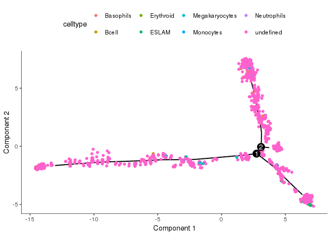<!-- -->

```r
# changing the cell color
cell_colors <- c('lightblue','blue','red','black','orange','yellow','turquoise','lightgrey')
plot_cell_trajectory(cds, color_by="celltype") + scale_color_manual(values=cell_colors)
```

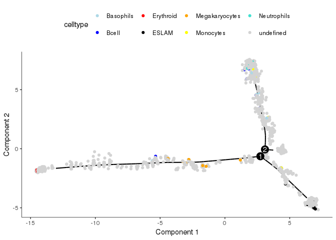<!-- -->

```r
# The most imamture HSC in the sample express E-Slam
# we will define the root of this model according to this subset of cells
table(pData(cds)$State, pData(cds)$celltype)[,"ESLAM"]
```

```
##  1  2  3  4  5 
##  0  0  0  0 10
```

```r
# The state 4 defines the root
# We define the root in the model
cds <- orderCells(cds, root_state = 4)
# The pseudotime is now defined by the distance to the root
plot_cell_trajectory(cds, color_by = "Pseudotime")
```
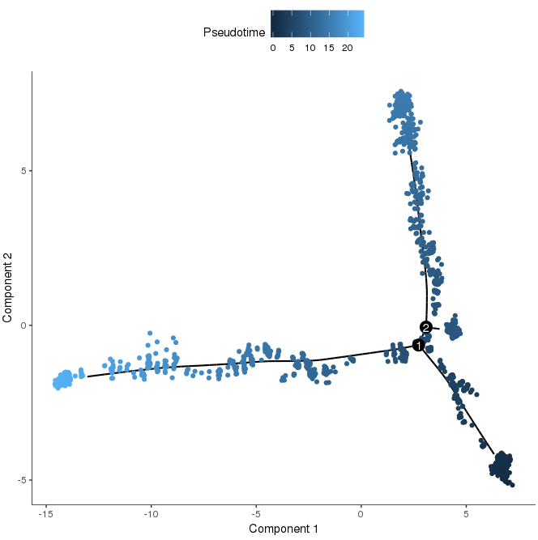<!-- -->

```
# Differential expression testing per branch
# We look at the genes that are differentially expressed
# according to the pseudotime model this time
diff_test_res <- differentialGeneTest(cds[ ordering_genes, ], fullModelFormulaStr = "~sm.ns(Pseudotime)")
sig_gene_names <- row.names(subset(diff_test_res, qval < 0.1))
plot_pseudotime_heatmap(cds[ sig_gene_names[1:50], ], num_clusters = 3, cores=4, show_rownames=TRUE)

# Differential expression per branch is done with a specific test
# Branched expression analysis modeling (BEAM). The test compares
# two models with a likelihood ratio test for branch-dependent expression.
# The full model is the product of smooth Pseudotime and the Branch a cell
# is assigned to. The reduced model just includes Pseudotime.
# We look for genes involved in the erythroid pathway
BEAM_res <- BEAM(cds, branch_point = 1, cores = 4)
```

```r
BEAM_res <- BEAM_res[order(BEAM_res$qval),]
BEAM_res <- BEAM_res[,c("gene_short_name", "pval", "qval")]
head(BEAM_res)
```

```
##                    gene_short_name pval qval
## ENSMUSG00000004655            Aqp1    0    0
## ENSMUSG00000006389             Mpl    0    0
## ENSMUSG00000016494            Cd34    0    0
## ENSMUSG00000018819            Lsp1    0    0
## ENSMUSG00000020649            Rrm2    0    0
## ENSMUSG00000021998            Lcp1    0    0
```

```r
plot_genes_branched_heatmap(cds[row.names(BEAM_res)[1:50]], branch_point = 1, num_clusters = 3, cores=4, use_gene_short_name=TRUE, show_rownames=TRUE)
```

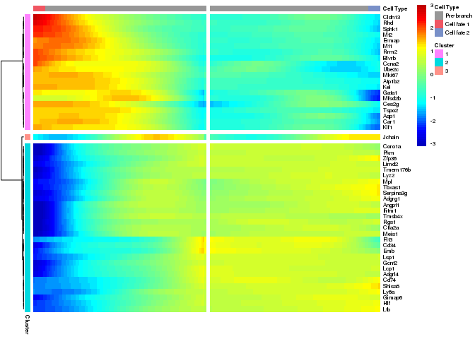<!-- -->

```r
# There is a clear separation between genes that are involved in the erythroid
# differentiation (eg. Gata1) on the left (cell fate1)
# with genes involved in the leukocyte differentiation (eg. Sell, Ccl9)

plot_genes_branched_pseudotime(cds[row.names(BEAM_res)[1:5]], branch_point = 1, color_by = "celltype", ncol = 1)  + scale_color_manual(values=cell_colors)
```

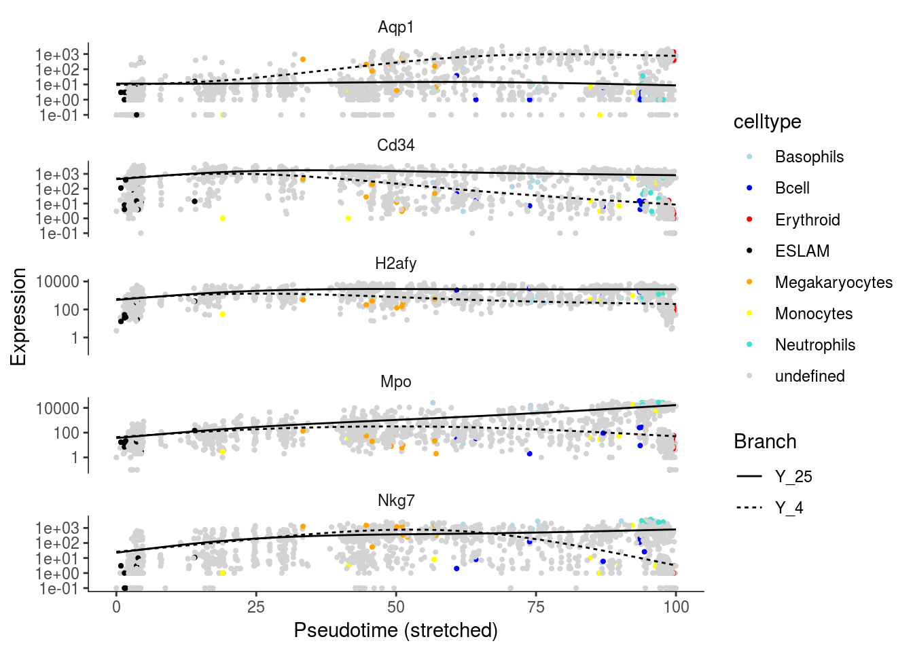<!-- -->

```r
#
```

## Part II - Diffusion map


```r
# Analysis and inference done with the destiny package available via Bioconductor

# Trajectory inference by diffusion map an diffusion pseudotime

library(destiny)
library(ggplot2)

# data loading
# we now will directly use the filtered, scaled, log-normalised expression matrix
# provided by the authors of the article
lognorm <- t(read.table('data/nestorowa_corrected_log2_transformed_counts.txt', sep=" ", header=TRUE))
lognorm[1:5,1:5]
```

```
##                HSPC_001 HSPC_002 HSPC_003 HSPC_004 HSPC_006
## X1110032F04Rik 0.000000 0.000000 0.000000 0.000000 0.000000
## X1110059E24Rik 0.000000 0.000000 2.795189 1.326478 7.348663
## X1300017J02Rik 0.000000 0.000000 0.000000 0.000000 0.000000
## X1600014C10Rik 0.000000 2.238601 0.000000 1.326478 4.946766
## X1700017B05Rik 1.225439 2.238601 1.989360 2.005685 0.000000
```

```r
# We load the annotation of cell types that has been defined
# using flow cytometry and index sorting.
# The cell subsets (final differentiation stages) will be used
# to validate the trajectory model
anno_table <- read.table('data/nestorowa_corrected_population_annotation.txt')
pDat <- data.frame(cell=colnames(lognorm), celltype='undefined', stringsAsFactors=FALSE)
rownames(pDat) <- pDat$cell
pDat[ rownames(anno_table), 2] <- as.character(anno_table$celltype)

# we build an expression set object for an easier integration with destiny
eset <- Biobase::ExpressionSet(lognorm, phenoData=Biobase::AnnotatedDataFrame(pDat))
eset
```

```
## ExpressionSet (storageMode: lockedEnvironment)
## assayData: 3991 features, 1645 samples 
##   element names: exprs 
## protocolData: none
## phenoData
##   sampleNames: HSPC_001 HSPC_002 ... Prog_852 (1645 total)
##   varLabels: cell celltype
##   varMetadata: labelDescription
## featureData: none
## experimentData: use 'experimentData(object)'
## Annotation:
```

```r
# the expression set is ready for inference with destiny
dir.create('destiny', showWarnings=FALSE)
saveRDS(cds, 'destiny/eset_hematopoiesis.rds')

# diffusion map
dmap <- DiffusionMap(eset)
# the process takes less than 60 seconds

# We look at the global model

plot.DiffusionMap(dmap)
```

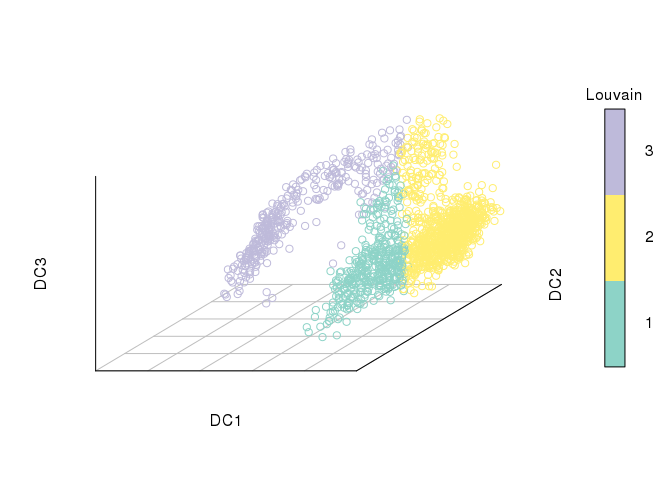<!-- -->

```r
plot.DiffusionMap(dmap, dims=c(1,2))
```

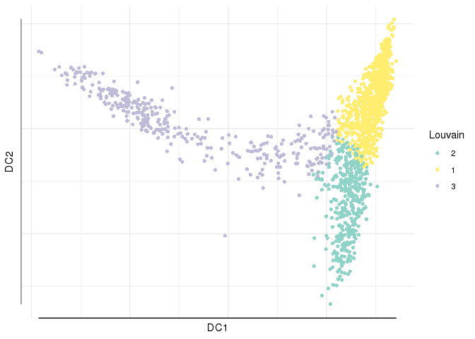<!-- -->

```r
plot.DiffusionMap(dmap, dims=c(2,3))
```

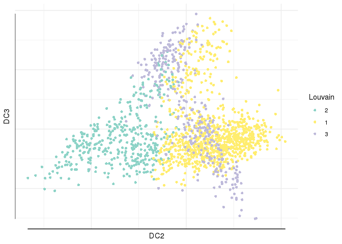<!-- -->

```r
plot.DiffusionMap(dmap, dims=c(1,3))
```

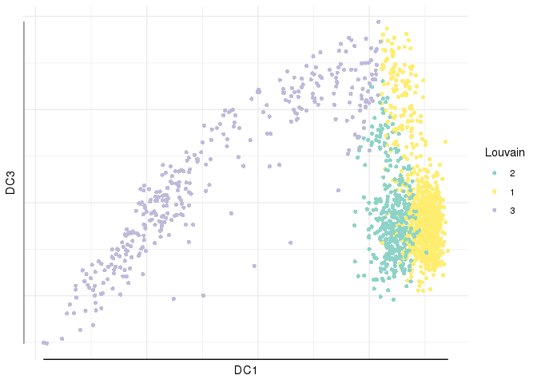<!-- -->

```r
# components 1-2 describe well the branching process between erythroid (red) and myeloid/lymphoid (white) lineages

# we use ggplot2 to have a better rendering and project the cell labels
# as defined by flow cytometry experiment and index sorting

qplot(DC1, DC2, data=dmap, colour=celltype) + scale_color_manual(values=c('lightblue','brown','red','black','orange','yellow','blue','lightgrey')) + theme(panel.grid.major = element_blank(), panel.grid.minor = element_blank(), panel.background = element_blank(), axis.line = element_line(colour = "black"))
```

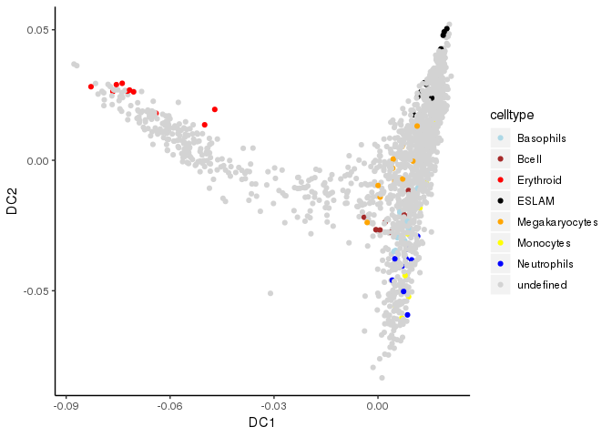<!-- -->

```r
# Pseudotime inference by diffusion:
# the transcriptional distance between cells is estimated by
# random walk along a neighborhood graph.
# The resulting "transcriptional" transition probability
# between cells is used to infer a pseudo-time scale of the differentiation process.

# we first define a root cell (origin) for the model
# we find the index of a ESLAM positive cells
which(anno_table$celltype=="ESLAM")
```

```
##  [1] 19 20 21 22 23 24 25 26 27 28
```

```r
# we use this cell as a starting point

dpt <- DPT(dmap, tips=19)
plot(dpt)
```

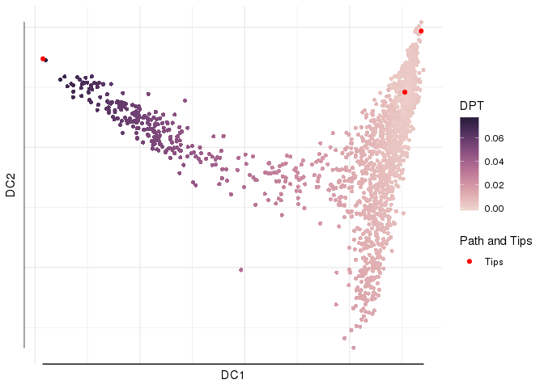<!-- -->

```r
# We can project the level of expression of known marker genes on
# the trajectory model

# Procr / Endothelial protein C is a marker of HSC subsets
plot(dpt, col_by='Procr', pal=viridis::magma)
```

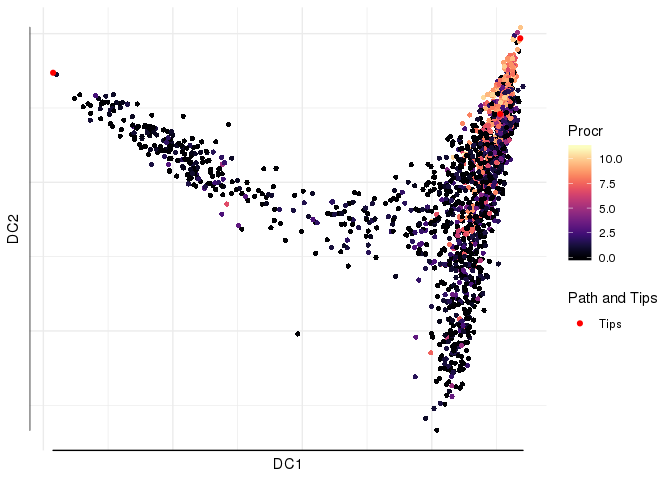<!-- -->

```r
# Gata1 is a key TF of the erythroid lineage
plot(dpt, col_by='Gata1', pal=viridis::magma)
```

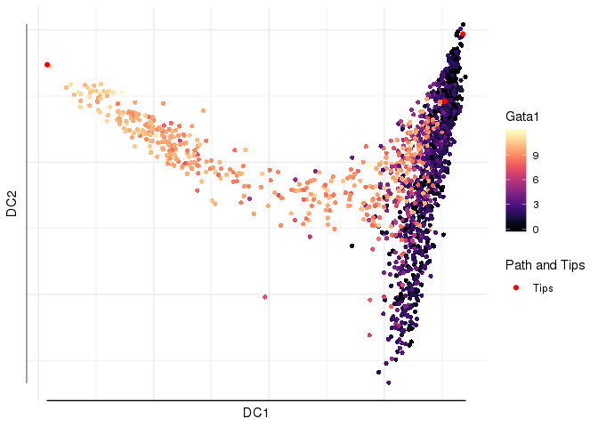<!-- -->

```r
# cathepsin G is a marker of neutrophils
plot(dpt, col_by='Ctsg', pal=viridis::magma)
```

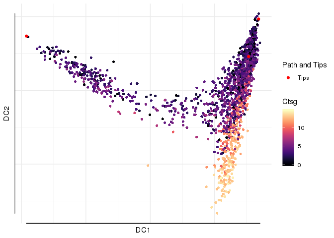<!-- -->

```r
sessionInfo()
```

```
## R version 3.5.3 (2019-03-11)
## Platform: x86_64-pc-linux-gnu (64-bit)
## Running under: CentOS Linux 7 (Core)
## 
## Matrix products: default
## BLAS/LAPACK: /home/jgilet/.local/OpenBLAS/OpenBLAS-0.3.5/lib/libopenblas_haswellp-r0.3.5.so
## 
## locale:
##  [1] LC_CTYPE=fr_FR.utf8       LC_NUMERIC=C             
##  [3] LC_TIME=fr_FR.utf8        LC_COLLATE=fr_FR.utf8    
##  [5] LC_MONETARY=fr_FR.utf8    LC_MESSAGES=fr_FR.utf8   
##  [7] LC_PAPER=fr_FR.utf8       LC_NAME=C                
##  [9] LC_ADDRESS=C              LC_TELEPHONE=C           
## [11] LC_MEASUREMENT=fr_FR.utf8 LC_IDENTIFICATION=C      
## 
## attached base packages:
##  [1] splines   stats4    parallel  stats     graphics  grDevices utils    
##  [8] datasets  methods   base     
## 
## other attached packages:
##  [1] destiny_2.12.0      biomaRt_2.38.0      monocle_2.10.1     
##  [4] DDRTree_0.1.5       irlba_2.3.3         VGAM_1.1-1         
##  [7] ggplot2_3.1.1       Biobase_2.42.0      BiocGenerics_0.28.0
## [10] Matrix_1.2-17      
## 
## loaded via a namespace (and not attached):
##   [1] Rtsne_0.15                  colorspace_1.4-1           
##   [3] RcppEigen_0.3.3.5.0         class_7.3-15               
##   [5] rio_0.5.16                  XVector_0.22.0             
##   [7] GenomicRanges_1.34.0        proxy_0.4-23               
##   [9] ggrepel_0.8.1               bit64_0.9-7                
##  [11] AnnotationDbi_1.44.0        ranger_0.11.2              
##  [13] docopt_0.6.1                robustbase_0.93-5          
##  [15] knitr_1.22                  cluster_2.0.9              
##  [17] pheatmap_1.0.12             compiler_3.5.3             
##  [19] httr_1.4.0                  assertthat_0.2.1           
##  [21] lazyeval_0.2.2              limma_3.38.3               
##  [23] htmltools_0.3.6             prettyunits_1.0.2          
##  [25] tools_3.5.3                 igraph_1.2.4.1             
##  [27] gtable_0.3.0                glue_1.3.1                 
##  [29] GenomeInfoDbData_1.2.0      RANN_2.6.1                 
##  [31] reshape2_1.4.3              dplyr_0.8.0.1              
##  [33] ggthemes_4.1.1              Rcpp_1.0.1                 
##  [35] carData_3.0-2               slam_0.1-45                
##  [37] cellranger_1.1.0            lmtest_0.9-37              
##  [39] xfun_0.6                    laeken_0.5.0               
##  [41] stringr_1.4.0               openxlsx_4.1.0             
##  [43] XML_3.98-1.19               DEoptimR_1.0-8             
##  [45] zoo_1.8-5                   zlibbioc_1.28.0            
##  [47] MASS_7.3-51.4               scales_1.0.0               
##  [49] VIM_4.8.0                   hms_0.4.2                  
##  [51] SummarizedExperiment_1.12.0 RColorBrewer_1.1-2         
##  [53] yaml_2.2.0                  curl_3.3                   
##  [55] memoise_1.1.0               gridExtra_2.3              
##  [57] fastICA_1.2-1               stringi_1.4.3              
##  [59] RSQLite_2.1.1               highr_0.8                  
##  [61] S4Vectors_0.20.1            e1071_1.7-1                
##  [63] TTR_0.23-4                  densityClust_0.3           
##  [65] boot_1.3-22                 zip_2.0.1                  
##  [67] BiocParallel_1.16.6         GenomeInfoDb_1.18.2        
##  [69] rlang_0.3.4                 pkgconfig_2.0.2            
##  [71] matrixStats_0.54.0          bitops_1.0-6               
##  [73] qlcMatrix_0.9.7             evaluate_0.13              
##  [75] lattice_0.20-38             purrr_0.3.2                
##  [77] labeling_0.3                bit_1.1-14                 
##  [79] tidyselect_0.2.5            plyr_1.8.4                 
##  [81] magrittr_1.5                R6_2.4.0                   
##  [83] IRanges_2.16.0              combinat_0.0-8             
##  [85] DelayedArray_0.8.0          DBI_1.0.0                  
##  [87] pillar_1.4.0                haven_2.1.0                
##  [89] foreign_0.8-71              withr_2.1.2                
##  [91] xts_0.11-2                  scatterplot3d_0.3-41       
##  [93] abind_1.4-5                 RCurl_1.95-4.12            
##  [95] sp_1.3-1                    nnet_7.3-12                
##  [97] tibble_2.1.1                crayon_1.3.4               
##  [99] car_3.0-2                   rmarkdown_1.12             
## [101] viridis_0.5.1               progress_1.2.0             
## [103] grid_3.5.3                  readxl_1.3.1               
## [105] data.table_1.12.2           blob_1.1.1                 
## [107] FNN_1.1.3                   forcats_0.4.0              
## [109] HSMMSingleCell_1.2.0        vcd_1.4-4                  
## [111] sparsesvd_0.1-4             digest_0.6.18              
## [113] munsell_0.5.0               viridisLite_0.3.0          
## [115] smoother_1.1
```

